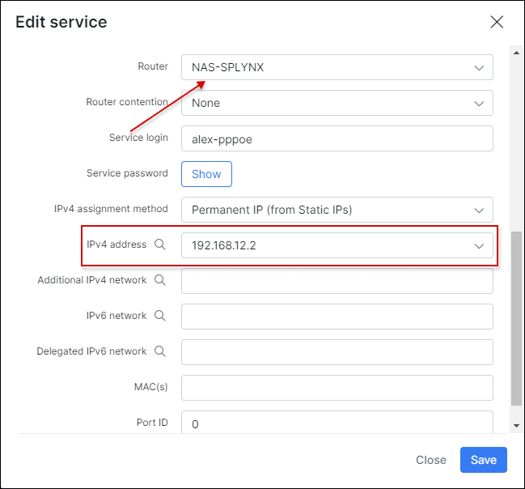
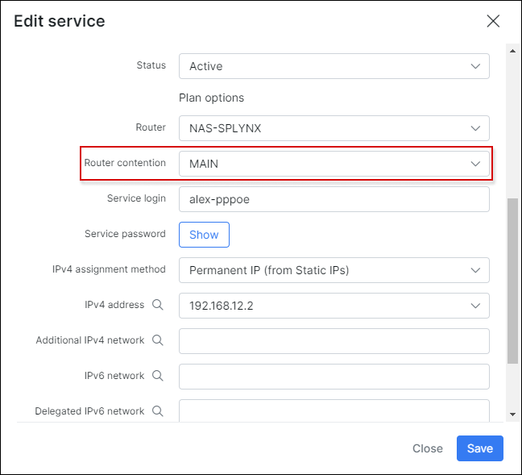

Mikrotik queue speed limits
==========

Queues for speed limitation on Mikrotik RoutersOS could be created by Splynx using API.

To set it up, Mikrotik API should be enabled on router and in Splynx router settings. To create a Simple queue rule we have to enable Shaping on the router in settings and setup Shaping type to "Simple queue".

Configuration is shown below on screenshot:

When both things are enabled, it's useful to create a special admin account for Splynx, which will be used for API login to routers and making changes there. You can create an admin API or with other name and assign him to special access group for API login:

To create rules on router, the router should be selected in service of customer. API queuing works only with permanent IP address assignments:

After saving the settings a simple queue for customer will be added to router:

If FUP rule is applied, the queue speeds will be updated via API automatically.

### Simple Queue tree shaping

The Simple queue type of shaping doesn't provide the way how to put customers under one shared plan or make contention per router.

For achieving contention setup we need to change the Shaping type to Simple Queue Tree.

Then Splynx creates a tree design of queues, where tariff plan queue is always a Parent for client's queues:

If we apply per router contention, then as a first step it's needed to define the router max. speed for upload and download:

And then choose the sector value on Internet service:

After saving, Splynx will push the rules to router:

\* Please **don't combine** sectors contetion with Plan contetion, it will overcomplicate the queue setup and Mikrotik will not handle it well.

### PCQ shaping

In versions of RouterOS before 6 simple queue were not optimized and that's why one of popular solutions for shaping was PCQ shaping using address-list. To enable this type of shaping in Splynx, change the shaping type in Splynx → router settings:

Please note: in PCQ shaping contentions and FUP policies don't work.

### Double queues issue

If you have Radius and API queueu enabled, Splynx will create two queues - one via API and another one is created by Radius server via attribute. This is not correct and one queue should be removed.

You can disable the API queue and leave automatic Radius queue.

Or if you want to use API queues, then under `Config → Networking → Radius settings` it's possible to remove rate-limit attributes and Radius server will not create automatic queues when customer connects his device. Just delete the lines `Mikrotik-Rate-Limit = {{ }}` in Rate-limit attributes, COA attributes and FUP attributes:

To get more information about bandwidth management options please read the tutorials - [FUP bandwidth management](networking/fup/fup.md) and [contentions in Splynx](networking/contentions/contentions.md).
