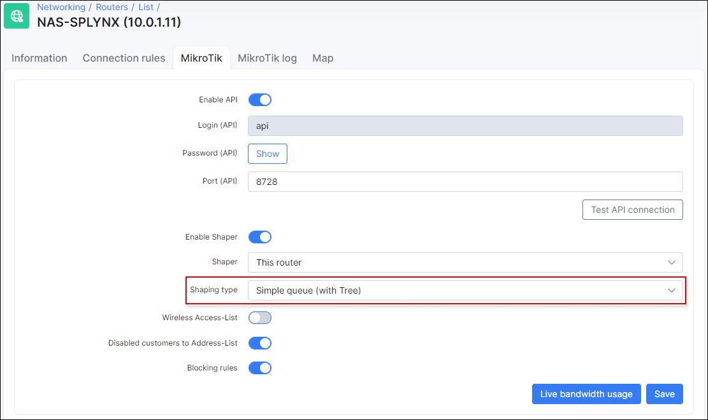

Mikrotik queue speed limits
==========

Queues for speed limitations on the Mikrotik RoutersOS can be created by Splynx using API.

To set this up, Mikrotik API should be enabled on the router and in Splynx router settings. To create a Simple queue rule we have to enable Shaping on the router in settings and set the Shaping type to "Simple queue".

The Configuration is shown on the image below:

When both things are enabled, it is necessary to create a special admin account for Splynx, which will be used for API login to routers and for making changes to the router. You can create an admin named API or with another name and assign the admin to a special access group for API login:

To create rules on the router, the router should be selected in the service of the customer. Please note that API queuing only works with permanent/static IP address assignments:

After saving these settings, a simple queue for the customer will be added to the router:

If a FUP rule is applied, the queue speeds will be updated via API, automatically.

### Simple Queue tree shaping

The Simple queue type of shaping does not provide a way to put customers under one shared plan or to create contentions per router.

To successfully setup contentions, we need to change the Shaping type to "Simple Queue (with Tree)".

Then Splynx will create a tree design of queues, where tariff plan queues are always the Parent for client's queues:

If we apply per router contentions, the first step is to define the router max. speed for upload and download:

Then choose the router contention on the Internet service:

After saving these settings, Splynx will push the rules to router:

\* Please **don't combine** router contentions with Plan contetions, this will overcomplicate the queue setup and the Mikrotik will not handle this well.

### PCQ shaping

Versions before Mikrotik RouterOS v.6, simple queues were not optimized and that is why one of the popular solutions for shaping was PCQ shaping, using address-list. To enable this type of shaping in Splynx, change the shaping type in Splynx router settings to "PCQ (Address-List)":

Please note, in PCQ shaping, contentions and FUP policies do not work.

### Double queues issue

If you have Radius and API queues enabled, Splynx will create two queues - one via API and the other by the Radius server via attributes. This is not correct and one of the queues should be removed.

You can disable the API queue and leave automatic Radius queues enabled, or if you want to use API queues, then under `Config → Networking → Radius` (NAS Config (MikroTik), then click on `Load` → MikroTik Configuration) you can simply remove rate-limit attributes and the Radius server will not create automatic queues when the customer connects their device. Simply delete the lines `Mikrotik-Rate-Limit = {{ }}` in Rate-limit attributes, COA attributes and FUP attributes:

For more information on the different bandwidth management options, please read the following tutorials: [FUP bandwidth management](networking/bandwidth_management/fup/fup.md) and [contentions in Splynx](networking/bandwidth_management/contentions/contentions.md).
