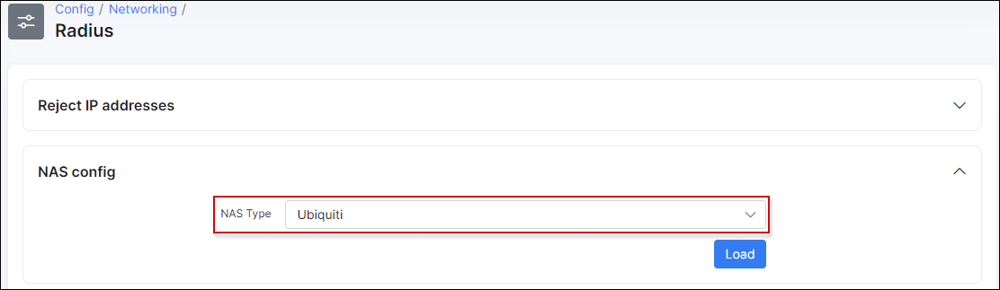

Radius based speed limits
==========

Configuration of Radius based speed limitation is simple in Splynx. It's already enabled for different types of vendors. The limitation works that way:

    Customer is connecting his device to the ISP network via PPPoE or DHCP or Hotspot
    Router sends Access-request to Splynx Radius server
    Splynx Radius server sends back to router Access-accept message if customer is in DB and get internet service. In that response Radius adds attributes called "rate-limit". The rate-limit attribute sets the download and upload speed for customer.

Each vendor has own rate limit attribute format.For example, Mikrotik-Rate-Limit for Mikrotik routers, WISPr-Bandwidth-Max-Down for setting download speed on Ubiquiti routers, Cisco-Avpair rate-limit for Cisco routers etc.

Rate limit attributes are preconfigured in Splynx. You can find them in `Config → Networking → Radius` section. Please choose the vendor from the list and load Radius attributes settings:

The list of attributes is available in text boxes. Attributes can be changed or new attributes can be added.

When customer is connected to router, the speed limitation is created. It depends on vendor, how to limit the speed. For example, in Mikrotik router one dynamic queue with customer's interface or IP address is added:

To find out how to customise Radius for advanced configuration, please follow to documentation page - [Radus server customisation](networking/radius_customization/radius_customization.md)

### Double queues issue

If you have Radius and API queueu enabled, Splynx will create two queues - one via API and second is created by Radius server via attribute. This is not correct and one queue should be removed.

You can disable the API queue and leave automatic Radius queue.

Or if you want to use API queues, then under `Config → Networking → Radius` settings it's possible to remove rate-limit attributes and Radius server will not create automatic queues when customer connects his device. Just delete the lines `Mikrotik-Rate-Limit = {{ }}` in Rate-limit attributes, COA attributes and FUP attributes:

To get more information about bandwidth management options please read the tutorials - [FUP bandwidth management](networking/fup/fup.md) and [contentions in Splynx](networking/contentions/ccontentions.md)
