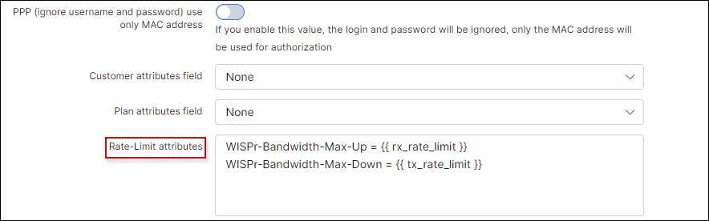

Radius based speed limits
==========

The configuration of Radius based speed limitations is simple in Splynx, as it is already enabled for different types of vendors. The limitations works as follows:

    The Customer connects his device to the ISP's network via PPPoE, DHCP or Hotspot
    The Router sends Access-requests to the Splynx Radius server
    The Splynx Radius server sends a Access-accept message back to router, if the customer is in the Database and receives an internet service. In the response, the Radius server also adds attributes called "rate-limit". The rate-limit attribute sets the download and upload speeds for the customer.

Each vendor has its own rate limit attribute formats. For example, "Mikrotik-Rate-Limit" for Mikrotik routers, "WISPr-Bandwidth-Max-Down" for setting download speeds on Ubiquiti routers, "Cisco-Avpair rate-limit" for Cisco routers, etc.

Rate limit attributes are preconfigured in Splynx and can be found in the `Config → Networking → Radius` section. Please choose the vendor from the list relevant to you and load Radius attributes settings:

The list of attributes are available in the designated text boxes. Attributes can be changed or new attributes can be added here.

When a customer is connected to the router, the speed limitation is created. Depending on how the vendor limits the speeds. For example, on Mikrotik routers, one dynamic queue with the customer's interface or IP address is added:

For more information on how to customize Radius for advanced configurations, please visit our  [Radus server customisation](networking/radius_customization/radius_customization.md) page.

### Double queues issue

If you have Radius and API queues enabled, Splynx will create two queues - one via API and the other by the Radius server via attributes. This is not correct and one of the queues should be removed.

You can disable the API queue and leave automatic Radius queues enabled, or if you want to use API queues, then under `Config → Networking → Radius → Configuration` you can simply remove rate-limit attributes and the Radius server will not create automatic queues when the customer connects their device. Simply delete the lines `Mikrotik-Rate-Limit = {{ }}` in Rate-limit attributes, COA attributes and FUP attributes:

For more information on the different bandwidth management options, please read the following tutorials - [FUP bandwidth management](networking/bandwidth_management/fup/fup.md) and [contentions in Splynx](networking/bandwidth_management/contentions/contentions.md)
