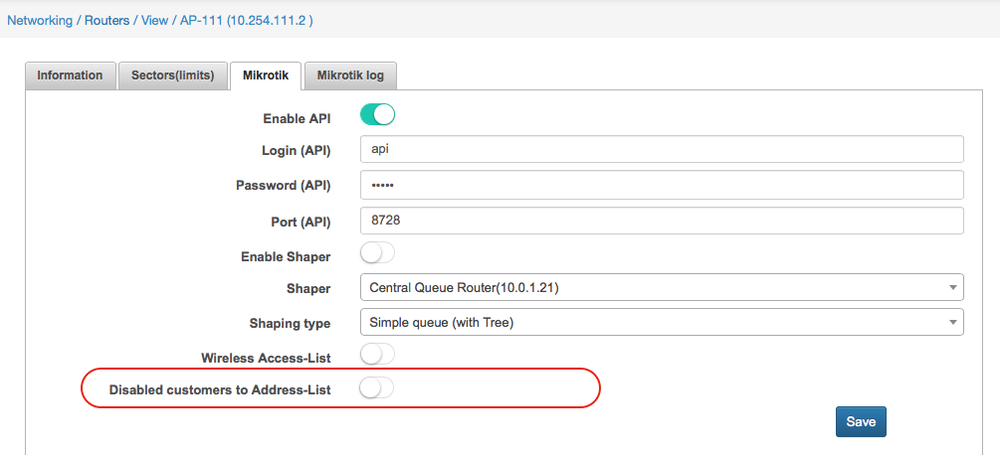
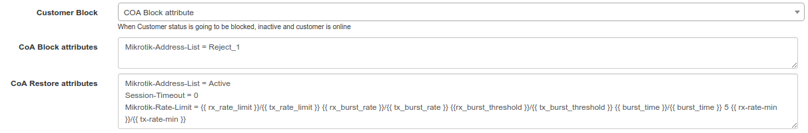
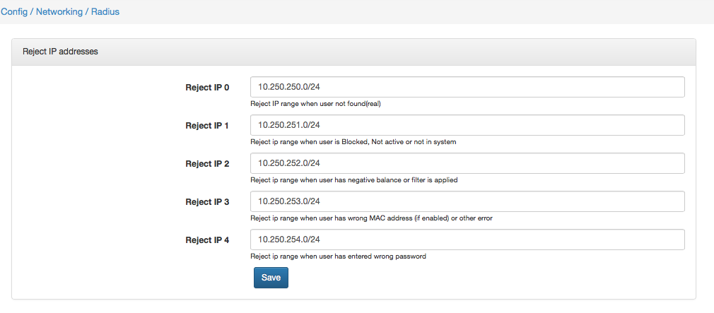
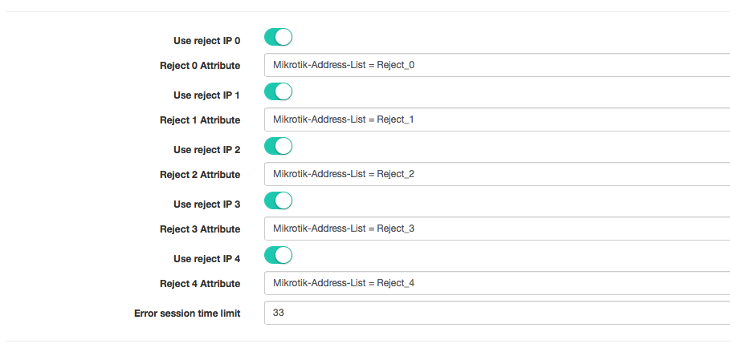

Blocking customers in Splynx
==========

Splynx blocks non-paying customers automatically. Administrator can block the customer manually as well. When customer's status is changed to **Blocked** or **Inactive**, Splynx sends a command to the router to block him. By default, Splynx does not cut the service, but places the IP address of the end user into the address-list or gives him the IP address from the special IP pool for blocked customers. The administrator can create firewall rules that will block or redirect non-payers to a special page.

There are 3 types of blocking scenarios:

## 1. Mikrotik API blocking

This method is useful if you do not use Radius authorization. Splynx uses Mikrotik API to operate a router.

### 1.1 Credentials

#### Action

Customer's credentials will be removed from the router. (Hotspot users, PPP secrets, firewall rules)

#### Settings
* **Enable API** = on
* **Disabled customers to Address-List** = off

### 1.2 Address lists

#### Action
IP address will be added to Mikrotik address list:

* **SpLBL_blocked** - if customer's status is **Blocked**.
* **SpLBL_new** - if customer's status is **New**.
* **SpLBL_active** - if customer's status is **Active**, but service is blocked due to [FUP](../bandwidth_management/fup/fup.md) blocking rule or [CAP](,,.bandwidth_management/capped_plans/capped_plans.md) blocking rule.

#### Settings
* **Enable API** = on
* **Disabled customers to Address-List** = off

---
#### Blocking rules examples

`/ip firewall filter add chain=forward src-address-list=SpLBL_blocked action=drop comment="Splynx default blocking rule"``

``/ip firewall filter add chain=forward src-address-list=SpLBL_new action=drop comment="Splynx default blocking rule"``

``/ip firewall filter add chain=forward src-address-list=SpLBL_active action=drop comment="Splynx default blocking rule"``

``/ip firewall filter add chain=forward dst-address-list=SpLBL_blocked action=drop comment="Splynx default blocking rule"``

``/ip firewall filter add chain=forward dst-address-list=SpLBL_new action=drop comment="Splynx default blocking rule"``

``/ip firewall filter add chain=forward dst-address-list=SpLBL_active action=drop comment="Splynx default blocking rule"``

## Raadius CoA blocking

#### Action
Radius server (Splynx) will send blocking attribute(s) to the Router via Change Of Authorization (CoA) Radius packet.

#### Settings
* **Customer Block* = COA Block attribute.
* **CoA Block attributes** = your attributes.
  By default, this field contains "Mikrotik-Address-List = Reject_1".
* **CoA Restore attributes** = your attributes.

   If you put IP address to the Address-List in the previous field (**CoA Block attributes**), here you should put IP address into another Address-List.
  Otherwise, IP address will remain in the previous Address-List and session will be still blocked.
* **FUP Block** = COA Block attribute.
* **FUP CoA Block attributes** = your attributes.
* **FUP CoA Restore attributes** = your attributes.

#### Blocking rules examples
``/ip firewall filter add chain=forward src-address-list=Reject_1 action=drop comment="Splynx default blocking rule"``

## 3. Radius session disconnection

The difference between Radius CoA block and session blocking is that with CoA, session is not disconnected, while with session blocking, session is disconnected and User has to reconnect his device.

#### Action
Disconnection of the session.

#### Settings
* **Customer Block** = Block.
* **FUP Block** = Block.

#### Blocking rules examples
``/ip firewall filter add chain=forward src-address-list=Reject_0 action=drop comment="Splynx default blocking rule"``

``/ip firewall filter add chain=forward src-address-list=Reject_1 action=drop comment="Splynx default blocking rule"``

``/ip firewall filter add chain=forward src-address-list=Reject_2 action=drop comment="Splynx default blocking rule"``

``/ip firewall filter add chain=forward src-address-list=Reject_3 action=drop comment="Splynx default blocking rule"``

``/ip firewall filter add chain=forward src-address-list=Reject_4 action=drop comment="Splynx default blocking rule"``

## Reject IP addresses

By default, Radius allows connection (sends Radius-Accept) even if there is an authorization error. In the case of authorization errors, Radius will assign IP address from reject address pools (lists). By default, these pools are 10.250.25x.0/24. Pools can be configured on the page `Config -> Networking -> Radius`, as shown on the screenshot below:

Due to specific authorization errors, customer's device will receive IP address from the specific reject pool:

* **Reject IP 0** - when User is not found (in fact, this Customer does not exist).
* **Reject IP 1** - when User is blocked, not active or not in system (when customer's status is not active).
* **Reject IP 2** - when User has negative balance or filter is applied.
* **Reject IP 3** - when User has wrong MAC address (if enabled) or other error.
* **Reject IP 4** - when User has entered wrong password.

Also, rejected IP address will be added to Mikrotik Address-List with name Reject_x. Names of the Address-Lists are configurable on `Config -> Networking -> Radius`

 If you want to prohibit connections (send the Radius-Reject packets) in case of authorization errors, just disable **Use reject IP x**

## Special blocking pages

Splynx has 4 default blocking pages under:
http://yoursplynxurl:8101,
http://yoursplynxurl:8102,
http://yoursplynxurl:8103,
http://yoursplynxurl:8104

These are simple HTML files, which you can change via command line inside your Splynx installation (via SSH). In the folder ``/var/www/splynx/web/errors/`` there are folders 1,2,3,4 that are corresponding to ports 8101, 8102, 8103 and 8104

Example of default blocking page is shown below:

Example of how this page can be customized:

If you use Mikrotik routers, these are 2 firewall rules to redirect all TCP traffic to the blocking webpage and to cut all other traffic, like Peer-to-peer connections (redirect them to router itself):

`/ip firewall nat add action=dst-nat chain=dstnat protocol=tcp src-address-list=Reject_1 to-addresses=10.0.1.158 to-ports=8101`

`/ip firewall nat add action=redirect chain=dstnat src-address-list=Reject_1`

There is another approach how to redirect customer; you can use Mikrotik Proxy server to redirect all HTTP traffic to Splynx customer's portal:

IP 10.0.1.16 is the router's WAN IP address.
`/ip proxy`

`set enabled=yes`

/ip proxy access`

`add action=allow disabled=no dst-host=10.0.1.6 dst-port=80`

`add action=deny disabled=no dst-port=80 redirect-to=10.0.1.16/portal/`

`add action=deny`

`/ip firewall filter`

`add action=drop chain=forward comment="Block All" disabled=yes log-prefix="" src-address-list=Reject_1`

`add action=accept chain=block comment="Users need DNS to work" dst-port=53 protocol=udp`

`add action=accept chain=block comment="Make port 80 to work" dst-port=80 protocol=tcp`

`add action=drop chain=block comment="Block everything else for blocked users"`

`add action=jump chain=forward comment="Redirect blocked users to the block chain" jump-target=disconnected src-address-list=Reject_1`

All methods of Splynx user blocking you can find on our video tutorials:

#### Mikrotik API blocking of non payers
<iframe frameborder=0 height=270 width=350 allowfullscreen src="https://www.youtube.com/embed/chq1Dy664vo?wmode=opaque">Video on youtube</iframe>

#### Radius COA blocking of non payers
<iframe frameborder=0 height=270 width=350 allowfullscreen src="https://www.youtube.com/embed/Css9qRRZVBE?wmode=opaque">Video on youtube</iframe>

#### Radius code disconnect (session reset)
<iframe frameborder=0 height=270 width=350 allowfullscreen src="https://www.youtube.com/embed/7VfzZEiht5M?wmode=opaque">Video on youtube</iframe>

#### Radius reject IP pool assignment
<iframe frameborder=0 height=270 width=350 allowfullscreen src="https://www.youtube.com/embed/tlxLktyNNWQ?wmode=opaque">Video on youtube</iframe>
