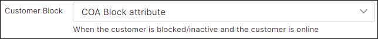

Blocking of customers in Splynx
==========

Splynx has the ability to block non-paying customers automatically, however, administrators can block customers manually as well. When a customer's status is changed to "New" or "Blocked", Splynx sends a command to the router to block the respective customer. By default, Splynx does not cut the service, but places the IP address of the end-user into the address-list or gives him an IP address from the special IP pool for blocked customers. You just need to create the necessary firewall rules that block or redirects defaulters to a special page.


# Mikrotik API
This method is useful if you do not use Radius authorization. Splynx uses Mikrotik API to execute commands on a router.

Pay special attention to next options:


* **Disabled customers to Address-List** - with this option disabled credentials (hotspot users, PPP secrets, firewall rules and DHCP leases) of blocked customer will be removed from the router. When enabled - credentials of blocked customer will be placed to one of the address lists:

  - **SpLBL_blocked** - when the customer is blocked in Splynx it will be placed to this address list:

  

  - **SpLBL_new** - when the customer has a service but status is "new":

  

* **Blocking rules** - enable/disable blocking on a router. With this option disabled customers will be connected even if the status is "New" or "Blocked".


Rules what will be uploaded to a router can be configured under [`Config -> Networking -> Mikrotik API`](../../configuration/network/mikrotik_api/mikrotik_api.md):


Be careful with updating of "Filter rules" as it can change behavior of blocking.

---
# Radius blocking
Radius also provides the ability to block users in several ways.


>Settings from the screenshots above can be found under `Config / Networking / Radius` -> NAS config / NAS Type = Mikrotik -> click on the "Load" button.


## 1. Change of Authorization (CoA) packet

In this case customer's session does not brake.
To use this method of blocking select **COA Block attribute** for the **Customer Block** field.




When the customer becomes blocked, Splynx sends a CoA packet to the router with attributes specified in the **CoA Block attributes** field.

The same attributes for [FUP](networking/bandwidth_management/fup/fup.md):


By default, The field **CoA Block attributes** contains the attribute **Mikrotik-Address-List = Reject_1**. Having received such an attribute, the router adds the customer's IP to the **Reject_1** list.
The session is not interrupted, which allows, if necessary, open access to local resources without changing the customer's IP address.

> <icon class="image-icon"></icon> If you put an IP address to the Address-List via **CoA Block attributes**, you should also put the IP address into another Address-List via **CoA Restore attributes**. Otherwise, the IP address will remain in the previous Address-List and the session will be still blocked.

> <icon class="image-icon"></icon> Turn on the **Radius incoming** on the mikrotik to process the CoA packets.


## Reject IP pools
In this case customers get an IP from  one of reject IP pools:


By default, Radius allows connection (sends Radius-Accept) even if there is an authorization error. In the case of authorization errors, Radius will assign an IP address from reject address pools (lists). By default, these pools are 10.250.x.0/20. Pools can be configured in `Config -> Networking -> Radius`, as shown on the screenshot below:


* **Reject IP 0** - when the customer is not found in Splynx;

* **Reject IP 1** - when the customer is blocked (when the customer's status is not active);

* **Reject IP 2** - when the customer has a negative balance or a filter rule (FUP) is applied;

* **Reject IP 3** - MAC address error (if enabled) or some other error not mentioned in this list;

* **Reject IP 4** - when the customer has entered wrong password.


For using Reject pools:

* Set the value **Block** for the **Customer Block** field:

  

* Enable the **Use reject IP**, as shown in the screenshot below:

  

 >In addition, you can change the attributes for each reject pool.

 Example: blocked customer in Splynx is under Reject 1 pool on a router:

 


## Drop customer's session

In this case customer's connection will be interrupted and prohibits further connections.

* Set the value **Block** for the **Customer Block** field:

  

* Disable the **Use reject IP** as shown in the screenshot below.


----
# Special blocking pages

Splynx has 4 default blocking pages:

* http://your.splynx.url:8101
* http://your.splynx.url:8102
* http://your.splynx.url:8103
* http://your.splynx.url:8104

These are simple HTML files, which you can change via command line within your Splynx server (via SSH). In the folder ``/var/www/splynx/web/errors/`` there are folders labeled 1,2,3,4 that are corresponding to ports 8101, 8102, 8103 and 8104.

An example of the default blocking page is shown below:


# Effective blocking
Often, providers just block customers by simply dropping all packets from the customers in the router's firewall.
In addition to the fact that it is difficult for the customer to understand, the network is broken or blocked, customer's devices also in this case start to work less responsively since different software can constantly try to connect to the internet.

### What can be done for effective blocking?


#### Provide access to the customer portal for blocked clients
* If the provider, when customers contact technical support, sends debtors to the portal, over time, some customers will become accustomed to entering the portal if there are problems with the network.
This fact can also serve as an additional tool for quick network diagnostics. In the future, this may reduce the number of calls to technical support.
* A person who found out that he is blocked for non-payment after payment will be able to independently track the flow of money to the account.

#### All HTTP traffic of blocked customers should be redirected to the customer's portal or stub page
* When a blocked customer tries to open any web page using the HTTP protocol, they will see a portal or a stub page that shows what could be the problem (no money, wrong password, etc.).
* Most modern OS's has a mechanism for detecting the state of the internet.
The OS checks the network access when connected, if the system detects a stub page, it notifies the user about it by opening the stub page in a separate window/frame, displaying a notification in the notification panel, etc.

### Can we redirect the blocked customers from HTTPS to HTTP website?

It's not possible to do over SSL-encrypted connection, the redirection only works over HTTP. HTTPS traffic cannot be redirected to HTTP one, there will be the SSL encryption error and the connection rejection as a necessary measure. In such case end-user should try to access different site.
**HTTP Strict Transport Security (HSTS)** is a web security policy mechanism that helps to protect websites against man-in-the-middle attacks such as protocol downgrade attacks and cookie hijacking.

The best solution is to send many notification messages via SMS/Email, so then customer will not be surprised when one day the Internet will not work.
*SMS* can be configured in `Config → Main → SMS` and *Email* config is in `Config → Main → Email`. Also, it's necessary to enable *Blocking wave* notification in `Config → Finance → Notification` and select a template.


#### DNS
When the DNS service does not work, the customer's computer spends about 10 seconds on each DNS request until it realizes that the Internet does not work.
```
time host wikipedia.org
;; connection timed out; no servers could be reached
real    0m10,031s
```
Some software will constantly try to connect, often at this point, the program interface may freeze.

A good solution is to set up your own caching DNS server, the traffic to which users will not limit.
This is generally a good way to increase web responsiveness for all customers at a minimal cost.

If you use external DNS servers, you can limit the amount of traffic for them.
Having added a burst at the beginning is useful during system boot.


#### For all other traffic, we will respond that the network is blocked
###### by sending ICMP packet type 3 code 9. *"3/9 Communication with Destination Network is Administratively Prohibited".*

This solution will remove all other delays, since the program sending the request will immediately be refused, instead of waiting for an answer for a while, and then trying again.

## Practice
###### An example of setting up all of the above on MikroTik.

This is a universal example that covers all types of locks, if you are sure that you do not need any of them, you can skip the relevant rules.


### WebProxy settings
###### proxy is used to correctly redirect the user to the portal or page stub
**192.168.208.239** is the IP of an example splynx server. Don't forget to change it to your IP.

```
/ip proxy> set enabled=yes port=8080,8101,8102,8103,8104
/ip proxy access add dst-address=192.168.208.239 dst-port=80 action=allow
/ip proxy access add src-address=!192.168.208.239 dst-port=80 local-port=8080 action=deny redirect-to="192.168.208.239/portal"
/ip proxy access add src-address=!192.168.208.239 dst-port=80 local-port=8101 action=deny redirect-to="192.168.208.239:8101"
/ip proxy access add src-address=!192.168.208.239 dst-port=80 local-port=8102 action=deny redirect-to="192.168.208.239:8102"
/ip proxy access add src-address=!192.168.208.239 dst-port=80 local-port=8103 action=deny redirect-to="192.168.208.239:8103"
/ip proxy access add src-address=!192.168.208.239 dst-port=80 local-port=8104 action=deny redirect-to="192.168.208.239:8104"
/ip proxy access add dst-port="" action=deny

```


### Firewall settings
#### NAT
All these rules redirect HTTP traffic to the appropriate stub pages.
If you want, in some cases, to redirect the customer to the customer's portal, use **to-ports=8080** for the necessary rules.

```
# For mikrotik API
/ip firewall nat add chain=dstnat action=redirect protocol=tcp dst-port=80 to-ports=8102  src-address-list=SpLBL_blocked comment="Blocked -> 8102"
/ip firewall nat add chain=dstnat action=redirect protocol=tcp dst-port=80 to-ports=8101  src-address-list=SpLBL_new comment="new -> 8101"

# If you're using radius
/ip firewall nat add chain=dstnat action=redirect protocol=tcp dst-port=80 to-ports=8101  src-address-list=Reject_0 comment="user not found"
/ip firewall nat add chain=dstnat action=redirect protocol=tcp dst-port=80 to-ports=8101  src-address-list=Reject_1 comment="blocked, not active or not in system"
/ip firewall nat add chain=dstnat action=redirect protocol=tcp dst-port=80 to-ports=8102  src-address-list=Reject_2 comment="negative balance or FUP/CAP"
/ip firewall nat add chain=dstnat action=redirect protocol=tcp dst-port=80 to-ports=8104  src-address-list=Reject_3 comment="wrong MAC"
/ip firewall nat add chain=dstnat action=redirect protocol=tcp dst-port=80 to-ports=8103  src-address-list=Reject_4 comment="wrong password"
```


#### Filter rules
If there are any resources that you want to keep available for blocked customers, add them to the address list labelled "white-resource"
```
/ip firewall filter add chain=forward action=jump jump-target=Blocked dst-address-list=!white-resource src-address-list=SpLBL_blocked
/ip firewall filter add chain=forward action=jump jump-target=Blocked dst-address-list=!white-resource src-address-list=SpLBL_new

/ip firewall filter add chain=forward action=jump jump-target=Blocked dst-address-list=!white-resource src-address-list=Reject_0
/ip firewall filter add chain=forward action=jump jump-target=Blocked dst-address-list=!white-resource src-address-list=Reject_1
/ip firewall filter add chain=forward action=jump jump-target=Blocked dst-address-list=!white-resource src-address-list=Reject_2
/ip firewall filter add chain=forward action=jump jump-target=Blocked dst-address-list=!white-resource src-address-list=Reject_3
/ip firewall filter add chain=forward action=jump jump-target=Blocked dst-address-list=!white-resource src-address-list=Reject_4

/ip firewall filter add chain=Blocked action=accept protocol=udp dst-port=53 dst-limit=2,0,src-address/1m40s
/ip firewall filter add chain=Blocked action=accept protocol=tcp dst-address=192.168.208.239 dst-port=80,8101,8102,8103,8104
/ip firewall filter add chain=Blocked action=reject reject-with=icmp-admin-prohibited dst-limit=10,0,src-address/1m40s
/ip firewall filter add chain=Blocked action=drop
```


