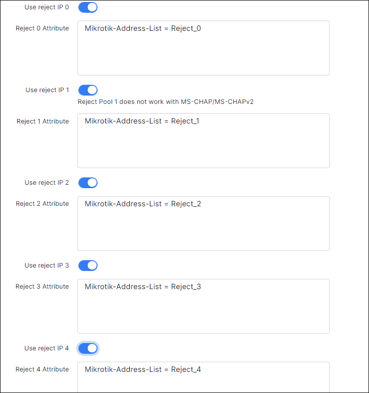
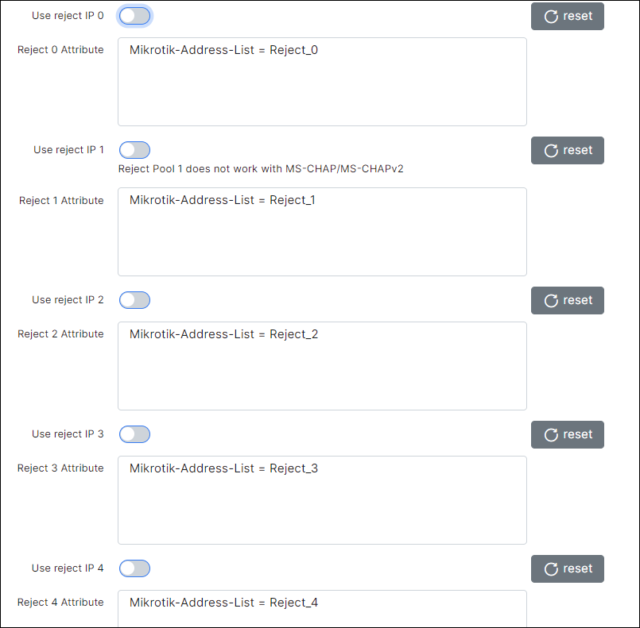

Blocking customers in Splynx
==========

Splynx blocks non-paying customers automatically. Administrator can block the customer manually as well. When customer's status is changed to **Blocked** or **Inactive**, Splynx sends a command to the router to block him. By default, Splynx does not cut the service, but places the IP address of the end user into the address-list or gives him the IP address from the special IP pool for blocked customers. You just need to create the necessary firewall rules that block or redirect defaulters to a special page.


# Mikrotik API
This method is useful if you do not use Radius authorization. Splynx uses Mikrotik API to operate a router.

Pay attention to the option ***Disabled customers to Address-List***.
It changes the blocking behavior.


When the option is **disabled** <icon class="image-icon"></icon> credentials of blocked customers are removed from the router (hotspot users, PPP secrets, firewall rules and DHCP leases).

When this option is **enabled** <icon class="image-icon"></icon> blocked customers are added to one of address list:
* **SpLBL_blocked** - for customers whose status is ***Blocked***. And for customers with ***Active*** status, when service is blocked due to [FUP](networking/bandwidth_management/fup/fup.md) or [CAP](networking/bandwidth_management/capped_plans/capped_plans.md) blocking rule.
* **SpLBL_new** - for customers whose status is ***New***.


---
# Radius
Radius also provides the ability to block users in several ways.


>Settings from the screenshots below you can find by opening `Config / Networking / Radius` -> NAS config / NAS Type = Mikrotik -> click on load button.


## Change of Authorization (CoA) packet
###### (customer's session does not break)
To use CoA select **COA Block attribute** for the **Customer Block** field.


When a customer becomes blocked, the splynx sends a CoA packet to the router with attributes specified in the **CoA Block attributes** field.


The same attributes for [FUP](networking/bandwidth_management/fup/fup.md):


By default, The field **CoA Block attributes** contains the attribute **Mikrotik-Address-List = Reject_1**. Having received such an attribute, the router adds the customer's IP to the **Reject_1** list.
The session is not interrupted, which allows, if necessary, open access to local resources without changing the customer's IP address.

> <icon class="image-icon"></icon> If you put IP address to the Address-List via **CoA Block attributes**, you also should put IP address into another Address-List via **CoA Restore attributes**. Otherwise, IP address will remain in the previous Address-List and session will be still blocked.

> <icon class="image-icon"></icon> Turn on the **Radius incoming** on the mikrotik to process the CoA packets.


## Reject IP pools
###### customers get ip from reject ip pool

By default, Radius allows connection (sends Radius-Accept) even if there is an authorization error. In the case of authorization errors, Radius will assign IP address from reject address pools (lists). By default, these pools are 10.250.x.0/20. Pools can be configured on the page `Config -> Networking -> Radius`, as shown on the screenshot below:


* **Reject IP 0** - when User is not found (in fact, this Customer does not exist).
* **Reject IP 1** - when User is blocked, not active or not in system (when customer's status is not active).
* **Reject IP 2** - when User has negative balance or filter is applied.
* **Reject IP 3** - when User has wrong MAC address (if enabled) or other error.
* **Reject IP 4** - when User has entered wrong password.

<br>
For using Reject pools:

* Set the value **Block** for the **Customer Block** field.
  

* Enable the **Use reject IP**, as shown in the screenshot below.

  

 ><icon class="image-icon"></icon> In addition, you can change the attribute for each reject pool.


## Drop customer's session
###### interrupts customer session and prohibits further connection
* Set the value **Block** for the **Customer Block** field.
  

* Disable the **Use reject IP** as shown in the screenshot below.




----
# Special blocking pages

Splynx has 4 default blocking pages under:
* http://your.splynx.url:8101
* http://your.splynx.url:8102
* http://your.splynx.url:8103
* http://your.splynx.url:8104

These are simple HTML files, which you can change via command line inside your Splynx installation (via SSH). In the folder ``/var/www/splynx/web/errors/`` there are folders 1,2,3,4 that are corresponding to ports 8101, 8102, 8103 and 8104.

Example of default blocking page is shown below:


Example of how this page can be customized:


# Effective blocking
Often, providers just block customers by simply dropping all packets from the customers in the router's firewall.
In addition to the fact that it is difficult for the customer to understand, the network is broken or blocked, customer's devices also in this case start to work less responsively, since different software can constantly try to connect to the internet.

### What can be done for effective blocking?


#### Provide access to the customer portal for blocked clients
* If the provider, when customers contacting technical support, sends debtors to the portal, over time, some customers will become accustomed to entering the portal if there are problems with the network.
This fact can also serve as an additional tool for quick network diagnostics. In the future, this may reduce the number of calls to technical support.
* A person who found out that he is blocked for non-payment, after payment will be able to independently track the flow of money to the account.

#### All HTTP traffic of blocked customers should be redirected to the customer's portal or stub page
* When blocked customer try to open any web page using the HTTP protocol, he will see a portal or a stub page that says what could be the problem (no money, wrong password, etc.).
* Most modern OS has mechanism for detecting state of internet.
The OS checks the network access when connected, if the system detects a stub page, it notifies the user about it by opening the stub page in a separate window/frame, displaying a notification in the notification panel, etc.

For example, Ubuntu

   


#### DNS
When the dns service does not work, the customer's computer spends about 10 seconds on each dns request until it realizes that the Internet does not work.
```
time host wikipedia.org
;; connection timed out; no servers could be reached
real	0m10,031s
```
Some software is constantly trying to connect, often at this point the program interface may freeze.

A good solution is to set up your own caching dns server, the traffic to which for users will not limit.
This is generally a good way to increase web responsiveness for all customers at minimal cost.

If you use external DNS servers, you can limit the amount of traffic for them.
Having adding a burst at the beginning is useful during system boot.


#### For all other traffic, we will respond that the network is blocked
###### by sending ICMP packet type 3 code 9. *"3/9 Communication with Destination Network is Administratively Prohibited".*

This solution will remove all other delays, since the program sending the request will immediately be refused, instead of waiting for an answer for a while, and then trying again.

Below 2 screenshots, with an attempt to open the website, they display the time after which the browser showed that the website is not available.

***7ms*** *(icmp3/9)* **vs** ***91645ms*** *(drop rule)*

###### DROP


###### ICMP 3/9


## Practice
###### An example of setting up all of the above on mikrotik.

This is a universal example that covers all types of locks, if you are sure that you do not need any of them, you can skip the relevant rules.


### WebProxy settings
###### proxy is used to correctly redirect the user to the portal or page stub
**192.168.208.239** is the ip of my splynx server. Don't forget to change it to your ip.

```
/ip proxy> set enabled=yes port=8080,8101,8102,8103,8104
/ip proxy access add dst-address=192.168.208.239 dst-port=80 action=allow
/ip proxy access add src-address=!192.168.208.239 dst-port=80 local-port=8080 action=deny redirect-to="192.168.208.239/portal"
/ip proxy access add src-address=!192.168.208.239 dst-port=80 local-port=8101 action=deny redirect-to="192.168.208.239:8101"
/ip proxy access add src-address=!192.168.208.239 dst-port=80 local-port=8102 action=deny redirect-to="192.168.208.239:8102"
/ip proxy access add src-address=!192.168.208.239 dst-port=80 local-port=8103 action=deny redirect-to="192.168.208.239:8103"
/ip proxy access add src-address=!192.168.208.239 dst-port=80 local-port=8104 action=deny redirect-to="192.168.208.239:8104"
/ip proxy access add dst-port="" action=deny

```


### Firewall settings
#### NAT
All these rules redirect HTTP traffic to the appropriate stub pages.
If you want in some cases to redirect the customer to the customer's portal, use **to-ports=8080** for the necessary rules.

```
# For mikrotik API
/ip firewall nat add chain=dstnat action=redirect protocol=tcp dst-port=80 to-ports=8102  src-address-list=SpLBL_blocked comment="Blocked -> 8102"
/ip firewall nat add chain=dstnat action=redirect protocol=tcp dst-port=80 to-ports=8101  src-address-list=SpLBL_new comment="new -> 8101"

# If you're using radius
/ip firewall nat add chain=dstnat action=redirect protocol=tcp dst-port=80 to-ports=8101  src-address-list=Reject_0 comment="user not found"
/ip firewall nat add chain=dstnat action=redirect protocol=tcp dst-port=80 to-ports=8101  src-address-list=Reject_1 comment="blocked, not active or not in system"
/ip firewall nat add chain=dstnat action=redirect protocol=tcp dst-port=80 to-ports=8102  src-address-list=Reject_2 comment="negative balance or FUP/CAP"
/ip firewall nat add chain=dstnat action=redirect protocol=tcp dst-port=80 to-ports=8104  src-address-list=Reject_3 comment="wrong MAC"
/ip firewall nat add chain=dstnat action=redirect protocol=tcp dst-port=80 to-ports=8103  src-address-list=Reject_4 comment="wrong password"
```


#### Filter rules
If there are any resources that you want to keep available for blocked customers, add them to the address list with the name "white-resource"
```
/ip firewall filter add chain=forward action=jump jump-target=Blocked dst-address-list=!white-resource src-address-list=SpLBL_blocked
/ip firewall filter add chain=forward action=jump jump-target=Blocked dst-address-list=!white-resource src-address-list=SpLBL_new

/ip firewall filter add chain=forward action=jump jump-target=Blocked dst-address-list=!white-resource src-address-list=Reject_0
/ip firewall filter add chain=forward action=jump jump-target=Blocked dst-address-list=!white-resource src-address-list=Reject_1
/ip firewall filter add chain=forward action=jump jump-target=Blocked dst-address-list=!white-resource src-address-list=Reject_2
/ip firewall filter add chain=forward action=jump jump-target=Blocked dst-address-list=!white-resource src-address-list=Reject_3
/ip firewall filter add chain=forward action=jump jump-target=Blocked dst-address-list=!white-resource src-address-list=Reject_4

/ip firewall filter add chain=Blocked action=accept protocol=udp dst-port=53 dst-limit=2,0,src-address/1m40s
/ip firewall filter add chain=Blocked action=accept protocol=tcp dst-address=192.168.208.239 dst-port=80,8101,8102,8103,8104
/ip firewall filter add chain=Blocked action=reject reject-with=icmp-admin-prohibited dst-limit=10,0,src-address/1m40s
/ip firewall filter add chain=Blocked action=drop
```


