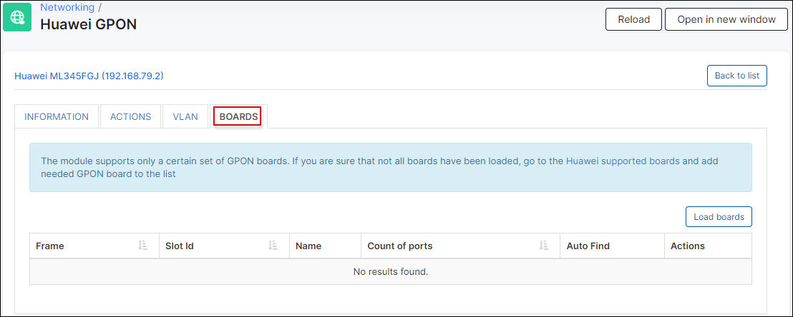
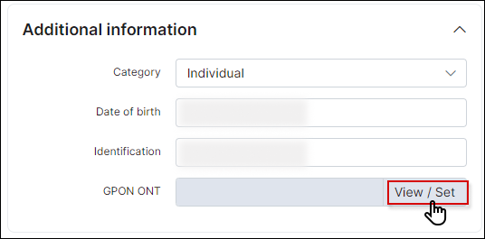
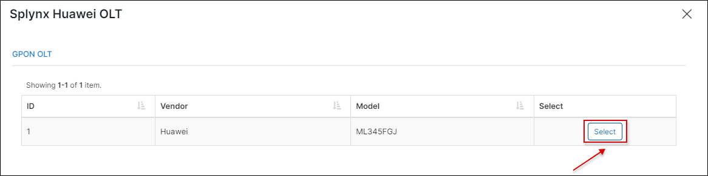

Huawei GPON
==========


We have added to Splynx a module to manage Huawei GPON from splynx.

For using Huawei GPON you should install it like addon:
```
apt update
apt install splynx-huawei-olt
```

or oyu can install it from Web UI:

*Config -> Integrations -> Add-ons:*


To add an OLT, go to Networking → Huawei GPON, it needs IP, ssh port, and login/pass. Also it's so important to set correctly the UPLINK BOARD and the UPLINK INTERFACE.


After the OLT is added, we have a menu with 4 different pages.

* **Information**
* **Actions**
* **VLAN**
* **Boards**


**Informartion** - Where you can edit the OLT details.


**Actions** - From actions you can apply the config to the OLT, Set Vlans, Set Uplink, Sync Tariffs or Sync Profiles. It's also possible to run a command.


**VLAN** - From where you can manage vlan and edit their name and vlan number.


**Boards** - From boards is posible to run autofind of boards, and enable auto find on ports from splynx.




Once that config is completed, we can find the and assign the ONT to the customer from the customer information page.




First select the OLT where the customer is connected.



The click, on autofind to discover the diferent ONT from the OLT, it will display the availanle customer units with detalied information, so we can select the correct one.


Then ONT will be added and we can check the status or delete it.


This guide is also explained in the following video, step by step.

<iframe frameborder=0 height=270 width=350 allowfullscreen src="https://www.youtube.com/embed/1rG-kEyk3cE?wmode=opaque">Video on youtube</iframe>
