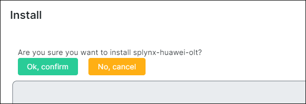
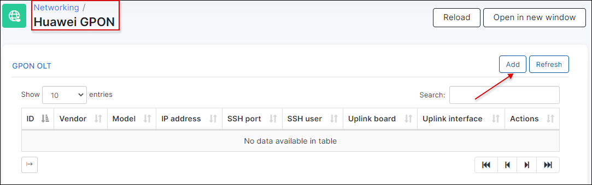
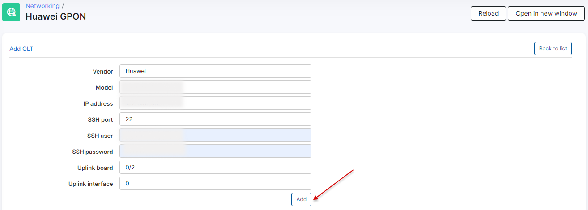
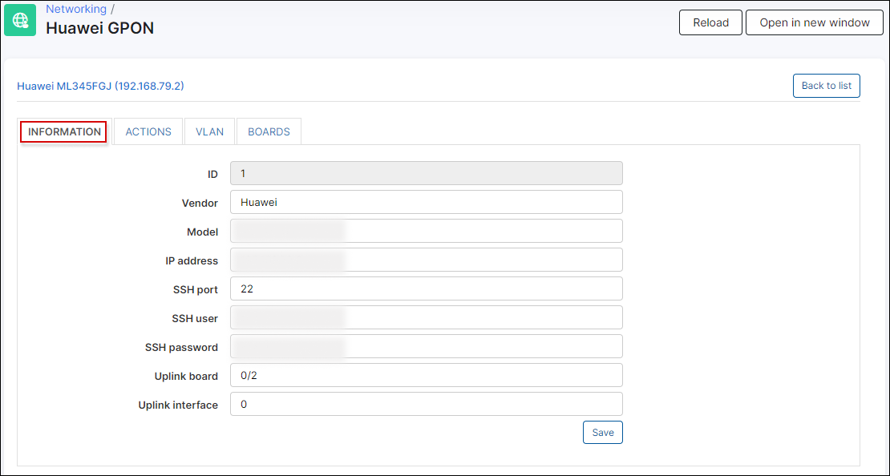

Huawei GPON
==========

In Splynx, we have the ability to manage a Huawei GPON from within Splynx.

To use the Splynx Huawei GPON management system, it is necessary to install the module as you would install an addon in Splynx:

From the CLI of your server, you can run the following commands:

```
apt update
apt install splynx-huawei-olt
```

Alternatively, you can install it from the Web UI:

 Navigate to *Config -> Integrations -> Add-ons:*


Locate the "splynx-huawei-olt" addon and click on the install button:


Click on "OK, Confirm" to begin the installation process:



To add an OLT, navigate to `Networking → Huawei GPON`, the IP, ssh port, and login/password are required to add the device. Also, it is of great importance to set the UPLINK BOARD and the UPLINK INTERFACE correctly.





After the OLT is added, we will be presented with a menu containing four different pages.

* **Information**
* **Actions**
* **VLAN**
* **Boards**


**Informartion** - You can edit the OLT details here.




**Actions** - Allows you to apply the config to the OLT, Set Vlans, Set Uplinks, Sync Tariffs or Sync Profiles. It is also possible to run commands.


**VLAN** - You can manage vlans and edit their names and vlan numbers here.


**Boards** - Here it is possible to run a auto find of boards, and enable auto find on the ports from splynx.


Once this configuration is completed, we can assign the ONT to the customer from the customer's information page.


First select the OLT where the customer is connected.


Then click on the auto-find button to discover the different ONT's from the OLT, this will display the available customer units with detailed information, so that we can select the correct one.


Then ONT will be added and we can check the status or delete it.


Please view the video below for a step-by-step tutorial of the guide above:

<iframe frameborder=0 height=270 width=350 allowfullscreen src="https://www.youtube.com/embed/1rG-kEyk3cE?wmode=opaque">Video on youtube</iframe>
