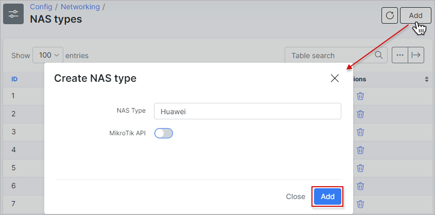
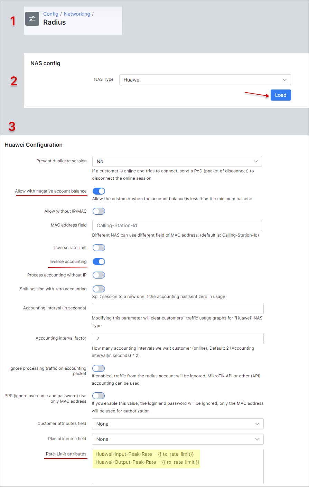

Huawei NE (NetEngine) Radius configuration
=====================================

In this article, we’ll show how to configure the Huawei NE20 and Huawei NE40 router with the Radius server. We will be using Splynx Radius server to authenticate PPPoE customers connecting to Huawei BRAS.

Here is the OS version of HUAWEI NE20E- where tests have been made:

```
radius-server group splynx
radius-server shared-key-cipher 12345
radius-server authentication 10.0.0.1 1812 weight 0
radius-server accounting 10.0.0.1 1813 weight 0
undo radius-server user-name domain-included
radius-attribute hw-user-password simple coa-request
```

```
authentication-scheme radius
accounting-scheme radius
accounting interim interval 3
```

First of all, the Radius server data should be configured. 10.0.0.1 is the IP address of the Radius server, and 12345 is a secret.

```
radius-server group splynx
radius-server shared-key-cipher 12345
radius-server authentication 10.0.0.1 1812 weight 0
radius-server accounting 10.0.0.1 1813 weight 0
undo radius-server user-name domain-included
radius-attribute hw-user-password simple coa-request
```

```
authentication-scheme radius
accounting-scheme radius
accounting interim interval 3
```

When this is configured, we can set up a domain – settings that will be used for customer’s authentication. We can define a Pool of IP addresses that Huawei will assign to users, or the IPs can be assigned to end-user sessions by Splynx Radius server.

```
domain pppoe
authentication-scheme radius
accounting-scheme radius
radius-server group splynx
ip-pool my_pool
```

And if we use the pool `my_pool`, it’s needed to define a pool. It’s configured under the NAT section together with IP addresses that will be used as public IPs for NAT/PAT translations:

```
nat instance my_nat id 1
nat address-group address group-id 1 109.205.245.1 109.205.245.10
ip pool my_pool bas local
gateway 192.168.0.1 255.255.255.0
section 0 192.168.0.10 172.16.200.100
dns-server 8.8.8.8
```

Then we add the `bas` settings – activate PPPoE server on physical interface or VLAN.

```
interface GigabitEthernet0/0/0.50
user-vlan 50
bas
```

All commands were entered under the mode and confirmed by `commit` to save to the configuration.

**When all these settings are done, the next step is to configure the Radius server. A few steps are needed for it:**

Inside Splynx Configuration, please add a new NAS type Huawei.

Edit the Radius configuration under Networking and load Huawei settings.

Set several values in the configuration:

**Allow with no account balance** – to allow customers with a negative balance to be authenticated. It is any customer that has an invoice that was not paid. That’s why it is better to have it always enabled.

**Inverse accounting** – Huawei considers customers’ PPPoE session as an interface, so *Download* for customers is *Upload* for Huawei OS.

The same thing is applied for the definition of speed limits, where you can see that Input-Peak takes the variable `tx_rate_limit` from Splynx’s tariff plan.

There are two basic **attributes** to set up speed limitation of the customer PPPoE sessions:

1. Huawei-Input-Peak-Rate = {{ tx_rate_limit}}

2. Huawei-Output-Peak-Rate = {{ rx_rate_limit }}

Two more Radius attributes can be used to define bursts.

1. Huawei-Input-Burst-Size

2. Huawei-Output-Burst-Size

All these attributes mentioned above are standard attributes supported by *dictionary.huawei* that is located at `/usr/share/freeradius` folder of the Splynx Radius server.

Below is the example of adding a new NAS to Splynx and setting its parameters.





When a PPPoE customer is connected, we should check his configuration on our Huawei router using a command `display access-user domain PPPoE verbose`.

The output on CLI should be similar to what is shown below but with an essential part of ACL which says that speed limits have been applied.

**Basic:**

```
State : Used
User name : splynx-test
Domain name : pppoe
User backup state : No
User access interface : GigabitEthernet0/0/0.50
User access PeVlan/CeVlan : 50/-
User access slot : 0
User MAC : abcd-1234-9876
User IP address : 192.168.0.95
User IP netmask : 255.255.255.255
User gateway address : 192.168.0.1
```

**ACL & QoS:**

```
Inbound qos configuration : User-CAR
Inbound cir : 0(kbps)
Inbound pir : 512(kbps)(Radius)
Inbound cbs : 0(bytes)
Inbound pbs : 95744(bytes)
Outbound qos configuration : User-queue
Outbound cir : 0(kbps)
Outbound pir : 1024(kbps)(Radius)
```

Read more: [Huawei GPON configuration (commands)](networking/huawei_gpon/huawei_config.md)