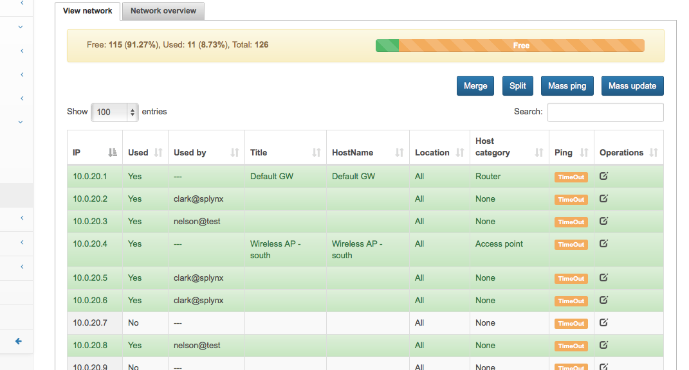
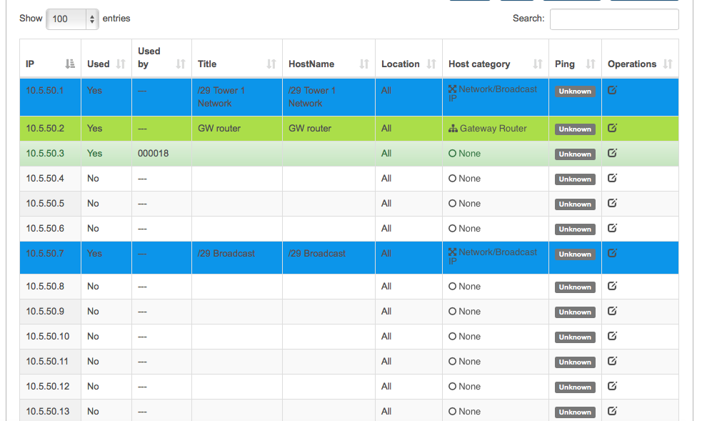

IP address management
==========

IP addresses are used in every corporate or ISP network. They‘re an essential component of the whole networking. There are several ways to manage IP address assignments. Many administrators even in large companies are still using Excel sheets due to a lack of smart IP address management tools. We recommend our engine for IP address management . This module is connected to the customer database in Splynx. When an IP address or subnet is assigned to a customer for his access, the IPs will be assigned in the IP address management tab as well. The main advantage of this is avoiding IP conflicts when several customers get the same IP or an IP with the wrong range. Also, you always have an overview of the current situation with subnets.

#### Steps how to configure IPAM in Splynx are shown below:

1. Create a root network and subnetworks.

  Create large root network and add subnetworks to it. The root network is marked with yellow color. For example, 172.16.0.0/9 is a root network and all /24 are end networks. From Root network is not possible to assign any IPs, it's used just as a parent for all real networks.

  IP addresses inside the selected subnetwork are shown in the table:

  

2. We can statically define what a certain IP address is used for. When you assign an IP address to customer, it’s locked in the IP address management tool, and if you try to assign an IP that has been already used, the system will prevent it

  

3. As an extra feature you can send a Mass ping to devices in the selected network, split the network into smaller subnets or merge the network into one large one. You can switch to a graphical map view with icons to get quick information. All red icons mean that the IP address is not responding on Mass ping.

  

There is also a way how to customize colors and types of devices, as well as add new types of equipment.

Screenshot shows an example of how to visualize small networks /29,/28 etc. in one common /24 network

