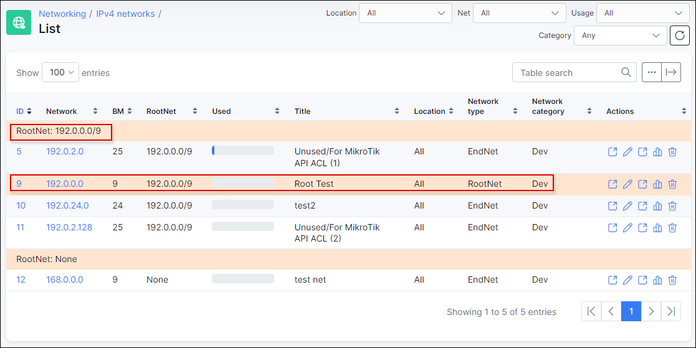
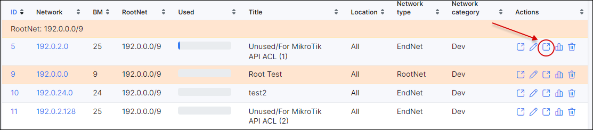
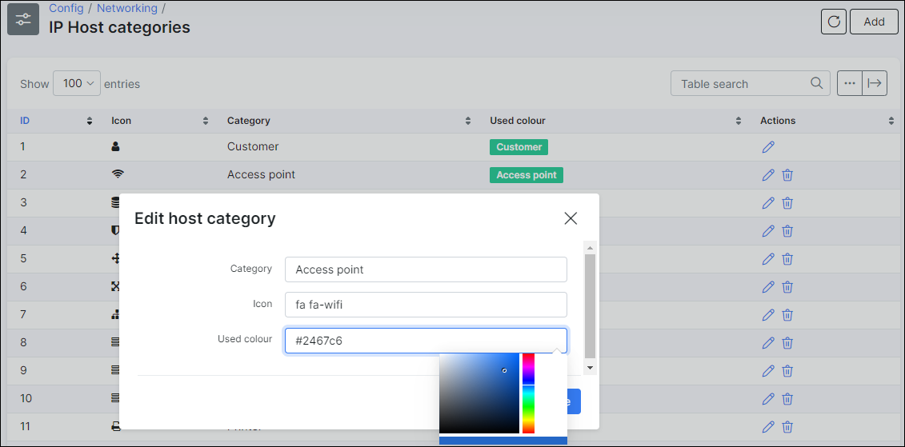
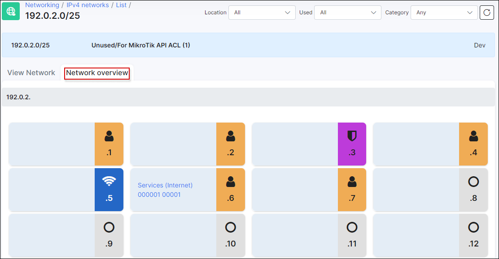

Ipv4 address management
====================

#### How to configure IPAM in Splynx:

1. Create a root network and subnetworks.

  Create a large root network and add subnetworks to it. The root network is marked with the color yellow. For example, 192.0.0.0/9 is a root network and there are its end networks. From the Root network, it is not possible to assign any IP's as it is used as a parent for all real networks.

  

  IP addresses within the selected subnetwork are displayed in a table:

  

  

2. We can statically define what a certain IP address is used for. When you assign an IP address to a customer, it is locked in the IP address management tool, and if you try to assign an IP that has already been used, the system will prevent this.

  

3. As an extra feature, you can send a Mass ping to devices in the selected network, split the network into smaller subnets or merge the network into one large one. You can switch to a graphical map view with icons to get quick access to information. Red icons mean that the IP address is not responding to the Mass ping.

  

*****************************************
There is also the ability to customize the colors and types of devices, as well as adding new types of equipment. For this, navigate to *Config → Networking → IP Host categories*:

Below is an example of how you can visualize a subnetwork:

You might also like the next video tutorial:

<iframe width="350" height="270" src="https://www.youtube.com/embed/z1XdFHUM3zA" title="YouTube video player" frameborder="0" allow="accelerometer; autoplay; clipboard-write; encrypted-media; gyroscope; picture-in-picture" allowfullscreen></iframe>
