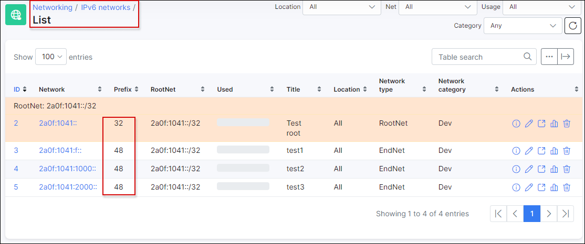
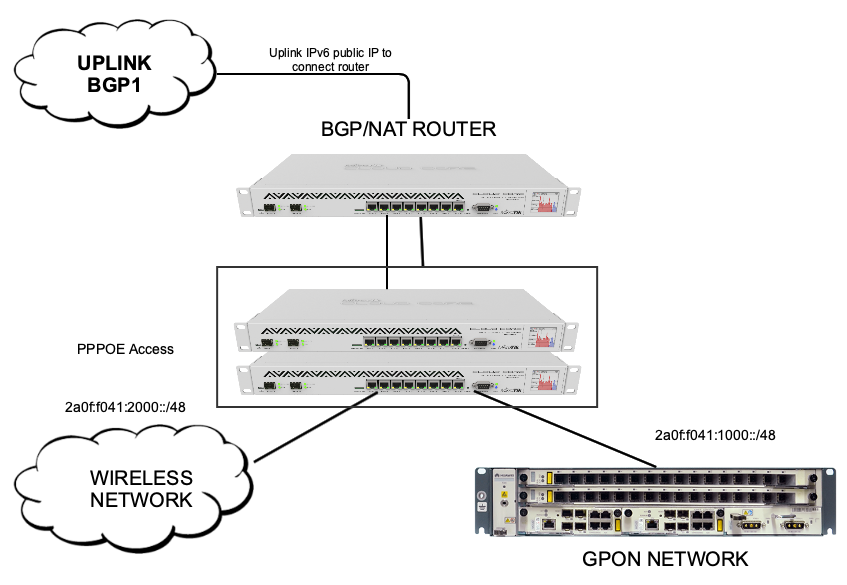
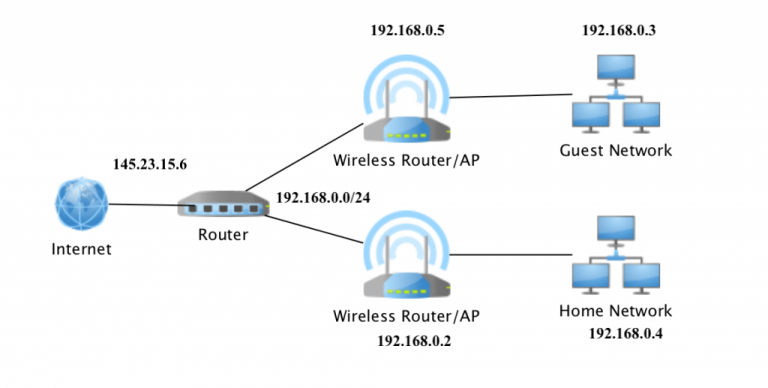

IPv6 address management
======================

In this section we will cover the 3 main sections of IPv6 deployment:

1. IPv6 address management in Splynx;
2. Activation of IPv6 in ISP infrastructure;
3. IPv6 assignments to end-users.

IPv6 address management

In Splynx, IPv6 management is similar to IPv4 network management. Under Networking there is an IPv6 networks sub-menu with the ability to add networks, show available networks and to display the details of usage for each network.

In the example, we have added a /32 IPv6 network. It is the network that is usually assigned to the ISP company by the local registry.

From the /32 network we can choose /48 networks to route them to a certain site or PPPoE server. In total, /32 networks consists of 65536 /48 networks. This means that we can have up to 65k different high-sites or PPPoE/DHCP NAS routers. Each NAS or PPPoE server or DHCP server (depends on your topology and authentication method), can connect up to 65k subscribers. /64 networks are always delegated to end user’s LAN networks or their CPE's. Within one /48 IPv6 network there are 65536 /64 networks.

We recommend to using this basic IPv6 topology design within small and medium size ISP networks. Of course, there are plenty of other IPv6 planning options that can be found on the Internet, but all these IP plans are quite complicated and just bring more complexity to IPv6 address deployment.

In our example, we have received a network 2a0f:f041::/32 from RIPE NCC.
We decided to dedicate one /48 network to the infrastructure needs – 2a0f:f041:f::/48
PPPoE servers will assign IP's within the range of : 2a0f:f041:1000::/48 and 2a0f:f041:2000::/48.
In a case where we have more PPPoE servers, we can use IP networks like 2a0f:f041:1100::/48 or 2a0f:f041:1011::/48 or 2a0f:f041:3050::/48. We actually  used 4-5 /48 IPv6 networks to cover all our NAS routers and infrastructure and there are still over 65k IPv6 /48 networks left.

As mentioned above, customers receive /64 prefixes. From these prefixes CPE's/home router devices creates a pool (similar to IP lan pools in IPv4 world) and IP's from this pool will be assigned to end devices.

Below is an example of how IPv6 appears in Splynx IPv6 networks when a CPE received a /64 prefix delegated:

## Activation of IPv6 in existing infrastructure

We have designed a simple IPv6 address plan, let’s recap what should be done during the first phase of IPv6 deployment :
1. BGP peering should be configured on IPv6 addresses
2. IPv6 network assigned to BGP and BGP filters should be configured
3. Internal connections between infrastructure routers should be established on subnetworks

2a0f:f041:f::/48. All traffic can actually be routed between routers using Link-local IPv6 addresses, but we have enabled IP's from the 2a0f:f041:f::/48 range on our routers to check IPv6 visibility to and from outside the network.
4. Static routes to 2a0f:f041:1000::/48 and 2a0f:f041:2000::/48 should be created from BGP infrastructure to PPPoE routers.

## IPv6 assignments to the end users

When all the above is configured and working, we can start with the most tricky part of IPv6 deployment – assignments of IPv6 to the end users.
Most commonly, end users have their own wireless routers that connects their devices to the Internet.
Below is the topology of a connection of an advanced home user, that has one router and two access-point bridges with many devices, such as PCs and phones.

As we can see in this topology, SOHO router has one public IPv4 address on it’s WAN interface and one IPv4 address from the LAN range 192.168.0.0/24 that is used as a default gateway for all devices at home. It’s obvious that the router acts as a NAT server in this scenario, where all customers from home are leaving the LAN network and connect to Internet from one public IP address and all traffic is sent back to the network via this one single public IP address.

The IPv6 world has no NAT abilities. This means that CPE's or SOHO/Home routers should route via a public IPv6 network instead of private range. How will a small home/office router know which IPv6 network it should use and route? This is the job of the ISP’s equipment, which is to instruct the CPE's/Home routers on which network is to be used/routed.

In general, ISP routers assigns a IPv6 address to WAN interface in the same way  it does with IPv4 addresses, but also it should assign a “LAN” network. This is called Delegated IPv6 networks and it’s the network of the /64 mask.
Below is an example of this theory/logic.

In our example, the Home router received a single IPv6 address 2a0f:f041:a:1::1 on the pppoe-client tunnel and additionally it got a prefix, that is automatically configured on the LAN interface 2a0f:f041:1000:1::/64. All IPv6 end devices will receive the IP address with ND (Neighbor discover) technology which is called or referred to as SLAAC. This is a technology of stateless automatic IPv6 address configuration for end users that should be used in local area networks.

In Splynx each customer has Internet service, under the settings of this services are options to assign IPv4 and IPv6 addresses.
The first option “IPv6 network” is for IPv6 assignment to the WAN interface and the second “Delegated IPv6 network” is for the network, that should be used by CPE's/Home routers within LAN network.

You might also like the next video tutorials:

<iframe width="350" height="270" src="https://www.youtube.com/embed/JGytvVHl780" title="YouTube video player" frameborder="0" allow="accelerometer; autoplay; clipboard-write; encrypted-media; gyroscope; picture-in-picture" allowfullscreen></iframe>

<iframe width="350" height="270" src="https://www.youtube.com/embed/jJejxvQvMDQ" title="YouTube video player" frameborder="0" allow="accelerometer; autoplay; clipboard-write; encrypted-media; gyroscope; picture-in-picture" allowfullscreen></iframe>
