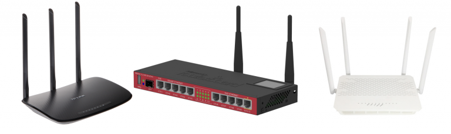
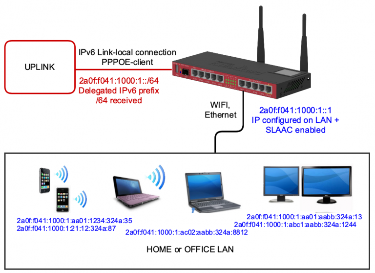
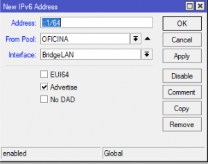
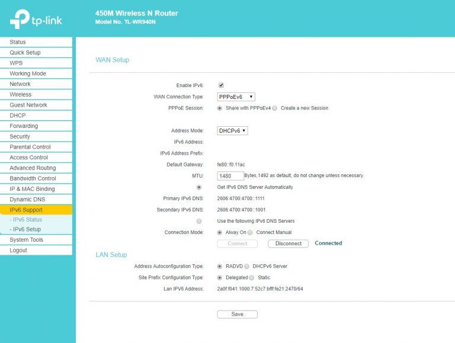
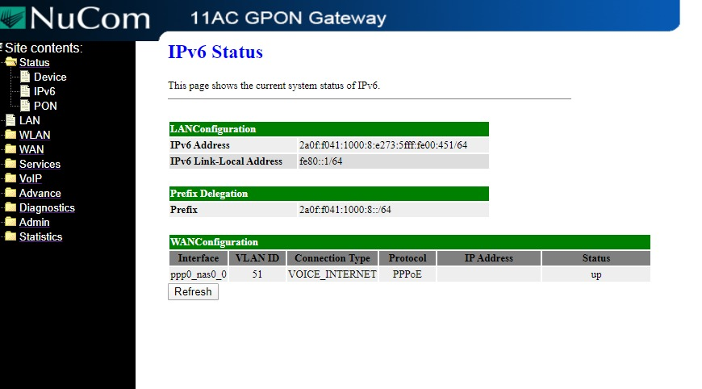
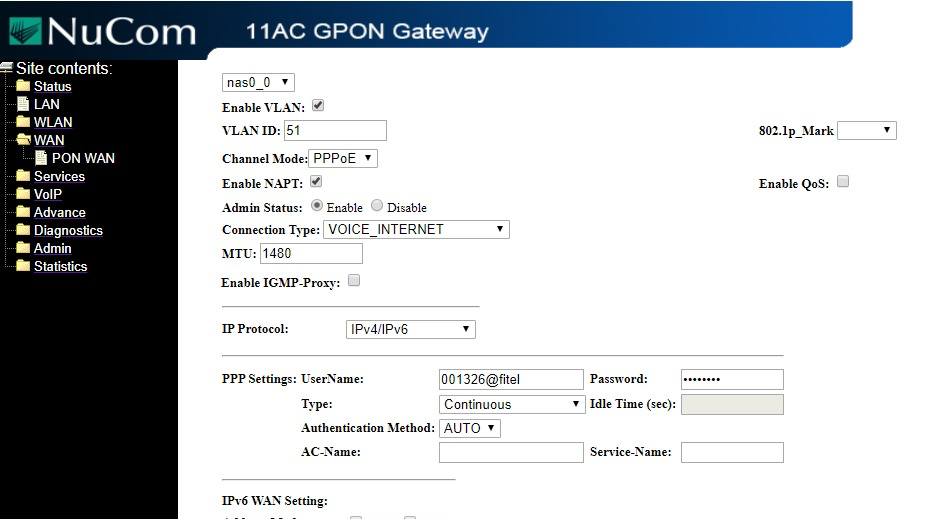

IPv6 CPE support
==============

Splynx supports IPv6 management for a range of CPE's and home routers.

This article depicts examples of the configuration of 3 different types of CPE's from 3 different vendors. We have selected IPv6 routers that are commonly used in the networks of Splynx customers. Models of the home routers support by Splynx for IPv6 are : TP Link 450, Nucom 8800AC and any Mikrotik RouterOS based router.

Below is a typical scheme of a CPE or Home router connection to tan ISP with PPPoE and IPv6 enabled

Let’s have a look at the setup:
There are two interfaces configured – one is a WAN interface, which connects to the uplink/ISP and the second is a LAN interface, that usually works as a bridge, that combines all physical LAN interfaces – Ethernet and WiFi whilst providing internet access.

1. WAN connection
The uplink interface is configured with a PPPoE client. The PPPoE client connects to the PPPoE server and communication between Home router and ISP router works on IPv6 Link Local addresses. It’s also possible to assign a public IPv6 address to Home router, however, we don’t use it in our configurations to avoid making it too complicated. Public IPv6 addresses on routers will be available on LAN interface and this IP can be used to access the router.

When the PPPoE Client connection is established, our home router receives an IPv6 LAN prefix, that is called a Delegated IPv6 prefix. The home router should be configured with IPv6 addressing on it’s LAN interface, as that will work as the default gateway for all our devices.
When IPv6 is configured on LAN, our router should start issuing IPv6 addresses to the LAN network (similar to what DHCP does in IPv4 networks). In the LAN environment,  IPv6 Stateless auto configuration is almost always used, that is called SLAAC and is based on IPv6 Neighbor Discovery protocol (ND).

In picture above, the router has established a pppoe connection and received a /64 IPv6 pool 2a0f:f041:1000:1::/64. This pool will be used for LAN devices and all devices will receive its own IPv6 addresses from that pool.

As you remember, while IPv4 is a 32 bit IP address, that is split into 4 octets, IPv6 address is 128 bits and is split into 8 parts, each contains 16 bits of information. 16 bit parts that contain only zeros can be merged with :: symbols. It means that the network, 2a0f:f041:1000:1::/64 that is allocated to router is equal to 2a0f:f041:1000:1:0:0:0:0:/64, but we cut the last 4 zero parts out and make the view of the IPv6 network shorter.

2. LAN connection.
In our example, the home router uses the first IP received from the /64 pool. This means that it automatically assigns the IP ::1 to it’s LAN interface. This setup is available on Mikrotik routers. Other routers will generate an IP automatically on their LAN interfaces. So, in a case of the Mikrotik receiving the IP 2a0f:f041:1000:1::1, it is used on the LAN interface and this IP will become the default gateway for all home devices.
Home devices with IPv6 support have SLAAC enable on their Internet interfaces, get the IPv6 ND information and create own IPv6 address. The following example shows configuration on Mikrotik RouterOS. Window on left side shows PPPoE client interface configuration – we say that it’s needed to get a prefix from PPPoE server. The received prefix is called LAN and is stored in IPv6 pools. Second window shows that IPv6 address is configured on LAN Interface from the prefix LAN, and EUI64 will be used to create IPv6 LAN address. Important is flag “Advertise”, that enables SLAAC and ND on interface, so end devices will be able to get IPv6.

If we want to use IP 2a0f:f041:1000:1::1 on LAN interface instead of a generated IP, then just disable EUI64, and setup IP as on example below:

Now the Mikrotik CPE/Home router is configured and devices will get access to IPv6 internet.

Let’s check configuration of TP Link. Configuration is much simpler, comparing to Mikrotik. We must be sure that Firmware supports Ipv6, many older TP link devices don’t have ability to work with IPv6. But the devices that support IPv6 are configured similar way as Mikrotik – enable IPv6 on PPPoE interface, and it will create IPv6 address on LAN with SLAAC enabled.

Nucom 8800AC Fiber ONT router has also similar one step configuration, PPPoE with IPv6 enabled and then IPv6 is configured on LAN and SLAAC enabled to connect end user devices.

The configuration for NUCOM is shown below:

