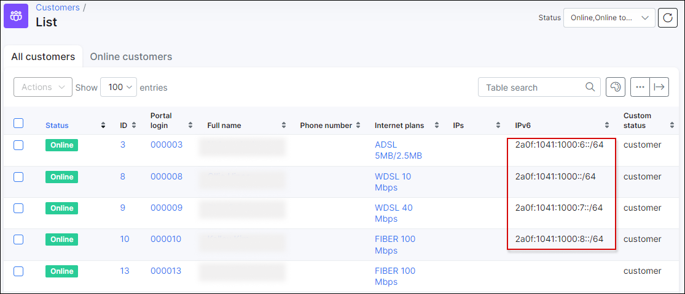
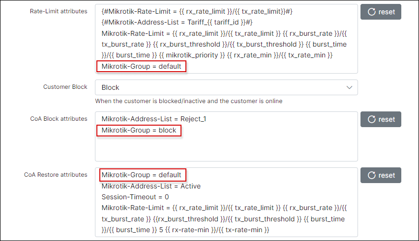

IPv6 Mikrotik Configuration
================

In this section, we describe how to configure Mikrotik routers to act as a PPPoE server with IPv6 enabled.

The first tests were trailed with the ROUTEROS Version 6.42.6, however, unfortunately, versions prior to 6.43 does not support Radius Delegated IPv6 attributes at all, in V6.43 it doesn’t support DHCPv6 accounting, so for the successful configuration of your IPv6 network, please upgrade your RouterOS to at least version 6.46.1 or a later RouterOS version.

When the router version has been upgraded, we can proceed with the PPPoE server configuration.

The first step is to create the Mikrotik PPPoE server with Radius authentication.

Below is an example of a PPPoE server configuration on RouterOS.

Please note, it is very important to select the IPv6 pool. It is the IPv6 network that will be used on the PPPoE server. Customers should receive IPv6 delegated prefixes from this pool. At the moment (version 6.46 of Mikrotik), the Radius server is not able to assign Delegated-IPv6 networks to the PPPoE customers.
That’s why it is necessary to define the pool in IPv6 pool, then when the customer is online, Splynx collects the used IPv6 network from the Radius accounting packets and stores the information in its own database.

Unfortunately, there is no way to assign public IPv6 addresses to WAN PPPoE interfaces of the customer via the Radius server. Lack of this feature is not that crucial, because PPPoE works well on local link addresses, but from our perspective, we feel that it should also be available on Mikrotik's Radius implementation.

Regarding the Splynx configuration – the Internet service of the customer should be configured leaving the IPv6 and Delegated IPv6 fields empty. The IPv6 appears in online session of the customers and is stored to the logs and statistics. Radius based simple queues are applied to the pppoe tunnel and there is no additional queue needed for IPv6 traffic.
Below depicts an example of such sessions

Another option to check IPv6 prefixes that were assigned to CPE devices is by checking the DHCPv6 server leases on the Mikrotik router.

Below is an example of DHCPv6 active leases

The next question is how to block IPv6 traffic? Usually, IPv4 traffic is blocked when customer’s IP address is put to a address list and traffic is redirected. The other option is to assign an IP address to the customer from a special pool for blocked subscribers.

However, this configuration cannot be achieved in IPv6 networks, because, currently, Radius cannot assign the special pool or manipulate the IPv6 address of the end user.

The only possible option is to have several Profiles configured within the Mikrotik PPPoE server. Profiles can be sent from Radius to the Mikrotik PPPoE router via the Mikrotik-Group attribute.

Here is a description of the attribute from the Mikrotik website :

*Mikrotik-Group – Router local user group name (defines in /user group) for local users; HotSpot default profile for HotSpot users; PPP default profile name for PPP users.*

In this case, we will define two profiles – default and block, with two different IPv6 pools.

The default profile is used for authenticated customers and the block profile will be assigned to blocked or non-authenticated customers.

These two profiles should be defined in the Splynx Radius blocking attributes as depicted in the image below:

The second option to block customers in IPv6 networks, is to use the Mikrotik-Delegated-IPv6-Pool attribute, instead of choosing and configuring the different profiles, it is possible to set the name of the Pool that should be used for blocked customers. For example, a customer that is active will get an IP from the “default” pool and if the customer is blocked – they will receive an IPv6 address from the “blocked” pool.

## Using Mikrotik as CPE's or home routers with IPv6

Mikrotik rpouters can act as a home router or CPE with IPv6 support enabled.

First of all, we need to enable the IPv6 package which is always disabled by default.

Let’s imagine that we have one WAN interface with the pppoe-client and a Bridge configured for LAN interfaces.

After the activation of the pppoe interface and setting the username/password on it, we should enable the DHCPv6 client on the pppoe-client interface. The DHCPv6 client should receive the delegated prefix from the PPPoE router (yes, it sounds weird, but there is a DHCP client running over the PPPOE client for IPv6, because natively there is no way to provide the home router a delegated prefix).

Please do not forget to configure the pool name and then create the IP address assignment with SLAAC on the LAN interface. We would recommend simply copying the configuration shown on the image below:

