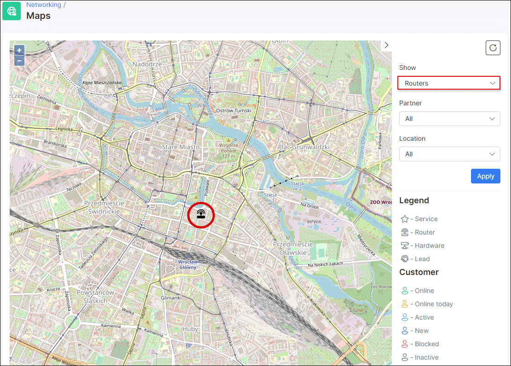

Maps
=============

This section of the networking module displays a physical location Map with all devices, services, customers, etc, configured on the system, which have physical locations/addresses configured for them.

On the right of the map, we've provided a convenient filter for you to display devices by a particular criteria. You can filter devices to display on the map by a variety of parameters/types:

You can filter the parameters/types you have specified in the *Show* field further, by a specify Partner and/or Location:

Once you've selected the devices you would like to see for a specific or all partners and locations, simply click on apply and you will see the results of the criteria on the map. You can then identify each of the devices/items on the map with the use of the the legend provided:

