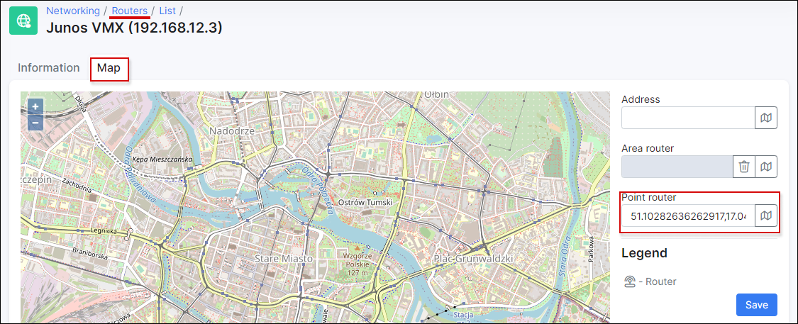

Maps
=============

This section of the networking module displays a physical location Map with all devices, services, customers, leads. All located objects need to have the configured GPS coordinates in Splynx.

**********************************************************************
<icon class="image-icon"></icon> **NOTE:**
If you need to add a router or a hardware, it is possible to do it in **Map** tab:

***********************************************************************
On the right sidebar of the map, is provided a convenient filter for you to display objects by a particular criteria. You can filter objects to be displayed on the map by a variety of parameters/types:

Once you've selected the objects you would like to see, click on `Apply` button and you will see the result of the criteria on the map.

Then you can identify each of the objects/items on the map with the provided legend:

