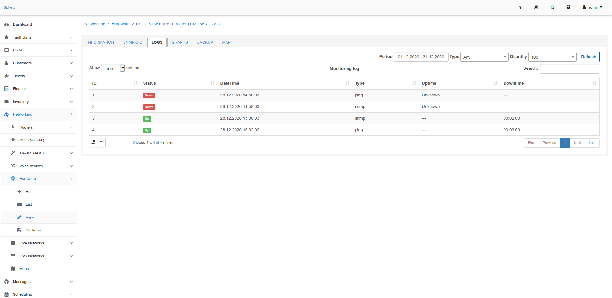
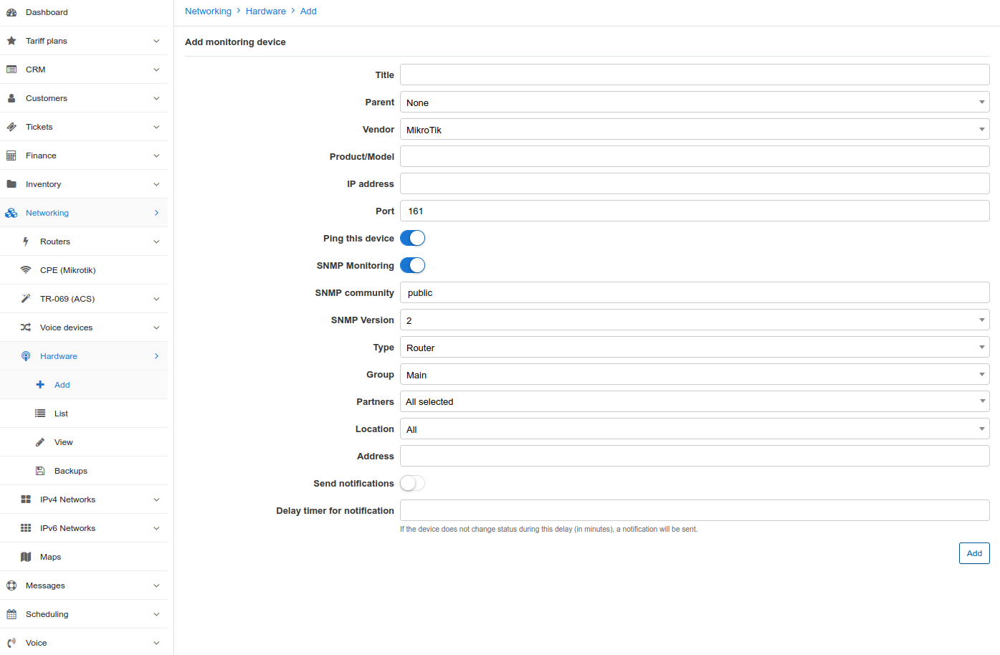

Hardware: SNMP Monitoring
==========

Splynx monitoring is based on SNMP and Ping tools.

The following images displays SNMP logs and RRD charts. We make use of RRD as a technology for data logging and generating charts.

#### How to add a device to monitoring:

## Information

Navigate to `Networking / Monitoring` and Add a new device. Please enter the IP address and SNMP community. You can also choose if you would like to receive notifications if the device is down.

* **Title** - name of the device
* **Parent** - you can build parent-child relations in Splynx monitoring
* **Vendor** - select the vendor of the device from the list provided
* **Product/Model** - specify the device model/product number
* **IP address** - IPv4 address of the device where SNMP and Ping tools will connect
* **Ping this device** - If enabled, Splynx will send ICMP echo pings to the device
* **Port** - specify the port number to communicate with the device via SNMP(default port: 161)
* **SNMP Monitoring** - If enabled, Splynx will connect to the device via SNMP and grab the available information
* **SNMP community** - define a custom community, using "public" is insecure
* **SNMP Version** - we recommend using version 2
* **Type** - router, switch or any other type that is possible to configure in settings
* **Group** - this is an important field as it defines under which group device the device is assigned to. This is used for notification purposes
* **Partners** - defines the partners will be able to see the device in Monitoring
* **Location** - used for searching and listing purposes
* **Address** - information about the address where the device is installed
* **Send notifications** - If enabled,  notifications will be sent according to Group settings
* **Delay timer for notification** - specify a time in minutes to send notifications if no change in the device status was detected

If the device is up and running we should see the information of the device as depicted in the image below:

That was the simple configuration to get the status of a device.

## SNMP OID

We can use SNMP OIDs to get the values and measure hardware components such as CPU performance, Memory usage, Voltage or speed on interfaces. To achieve this, navigate to the SNMP OID tab and use the SNMP Walk tool to get the interface list and all available OIDs.

SNMP Walk is a linux tool that Splynx uses to get the available SNMP OID values for configuration. Clicking the "+" button, will add the value for monitoring:

In the example, we have added ports of the LAN, WlAN and WAN usage as the values to be monitored.

## Graphs

Using values retrieved via SNMP, we can add charts to Splynx. By navigating to the Graph tab and clicking on the Add graph button:

You will be presented with the following window:

You can then give the graph a title, a title for the vertical values, specify the height of the graph, specify whether the graph is Public or not, then most importantly specify the data source and select the ports to add to the graph:

For the monitoring of speeds on interfaces, it is important to set the field "values in" to bps and set the "Factor" field to 8. This will create charts and use Bits per second. It is also possible choose which type of chart/graph you wish to create by specifying it in the "Draw" field (Line, Bold line (LINE2) or Area).

Below is an example of the result of a graph/chart:

## Backups

Devices added to the monitoring list can also be configured for backups. Simply configure the login details, port to communicate(SSH),the command, and specify the hours which you would like to run backups:

All devices that have been configured for backups will then save backups to the Backups section of Monitoring:

The system also displays a physical location of the device on a Map in the *Map* tab. The device will only be displayed if an address has been configured in the information of the device:

Charts and SNMP values from Monitoring can be used in the Splynx Weathermap tool as depicted on the example below:

To configure notifications for monitoring, please navigate to the `Config → Networking → Monitoring` section:

Scroll to the bottom of the page to the Groups section.

Each group has it's members and types of notifications - Email, to Admin portal or SMS.

For a deeper understanding of Splynx monitoring, please view the videos below:

<iframe frameborder=0 height=270 width=350 allowfullscreen src="https://www.youtube.com/embed/2XDbqc7b-cI?wmode=opaque">Video on youtube</iframe>

Ping tools :

<iframe frameborder=0 height=270 width=350 allowfullscreen src="https://www.youtube.com/embed/BebSml0tQ-U?wmode=opaque">Video on youtube</iframe>

CPU usage :

<iframe frameborder=0 height=270 width=350 allowfullscreen src="https://www.youtube.com/embed/jr_HKAT4qHA?wmode=opaque">Video on youtube</iframe>

Memory usage :
<iframe frameborder=0 height=270 width=350 allowfullscreen src="https://www.youtube.com/embed/yIlq_msIpmA?wmode=opaque">Video on youtube</iframe>
