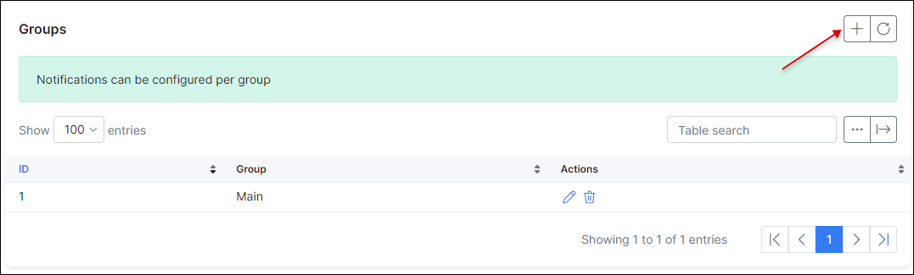

Monitoring
==========

Splynx monitoring is based on SNMP and Ping tools.

The following pictures show SNMP logs and RRD charts. We are using RRD as a technology for data logging and generating charts.

#### How to add a device to monitoring:

Open the monitoring Tab and Add a new device. Please enter the IP address and SNMP community. You can also define if you want to receive notifications if device is down.

* **Title** - name of the device
* **Parent** - you can build a parent-child relations in Splynx monitoring
* **Producer** - vendor name
* **Model** - information about the device model
* **IP address** - IPv4 of the device where SNMP and Ping tools will connect
* **Ping this device** - If enabled, Splynx will send ICMP echo pings to the device
* **SNMP Monitoring** - If enabled, Splynx will connect over SNMP to device and grab available information
* **SNMP community** - define community, using "public" is insecure
* **SNMP Version** - we recommend to choose version 2
* **Type** - router, switch or any other type that is possible to configure in settings
* **Group** - important fields, defines under which group device is device assigned. This is used for notification purpose
* **Partners** - defines the partner that can see device in Monitoring
* **Location** - used for searching and listing purpose
* **Address** - information about the address where device is installed
* **Send notifications** - If enabled, will send notification according to Group settings

When device is up and running we should see the message like on picture below:

That was the simple configuration to get status of the device. We can use SNMP OIDs to get the values and measure such thing as CPU performance, Memory usage, Voltage or speed on interfaces. Please, open the SNMP OID tab and use SNMP watch to get the interface list and all available OIDs.

SNMP Walk is a linux tool that Splynx uses to get available SNMP OID values for configuration. Clicking the + button you will add the value for measurement:

In the example we have added LAN, WAN and CPU usage.

Now using these values, we can add the charts to Splynx. Follow to Graph tab and click the button Add graph:

For measuring of speed on interfaces is important to set values bps and set Factor to 8. This will create charts and use Bits per second. Also is availabe to choose what type of chart will be drawn. Line, Bold line (LINE2) or Area.

Below you can see the result of charts:

Charts and SNMP values from Monitoring can be used in Splynx Weathermap tool as on example below:

To configure notification for monitoring, please open `Config → Networking → Monitoring` section:

Below all sections you can find Groups definition.

Each group has it's members and types of notification - Email, to Admin portal or SMS.

Please follow the video tutorials to get deeper understanding of Splynx monitoring:

<iframe frameborder=0 height=270 width=350 allowfullscreen src="https://www.youtube.com/embed/2XDbqc7b-cI?wmode=opaque">Video on youtube</iframe>

Ping tools :

<iframe frameborder=0 height=270 width=350 allowfullscreen src="https://www.youtube.com/embed/BebSml0tQ-U?wmode=opaque">Video on youtube</iframe>

CPU usage :

<iframe frameborder=0 height=270 width=350 allowfullscreen src="https://www.youtube.com/embed/jr_HKAT4qHA?wmode=opaque">Video on youtube</iframe>

Memory usage :
<iframe frameborder=0 height=270 width=350 allowfullscreen src="https://www.youtube.com/embed/yIlq_msIpmA?wmode=opaque">Video on youtube</iframe>
