Radius server customization
==========

In `Config → Networking → Radius` we will find a field available for setting additional attributes.

Some attributes are configured by default, such as Framed-IP, Framed-Route and Auth-Type.

## Variables
We can use a lot of variables from within Splynx


### Tariff

Most of these values can be changed at the Tariff plans menu in Splynx

[Internet plans description](configuring_tariff_plans/internet_plans/internet_plans.md)


Variable | Value | Comment |
-------- | ----- | ------- |
{{ rx_burst_rate }}	| rx_rate_limit * (100 + tariff.burst_limit) / 100	| FUP rule is applied (if it is active) |
{{ rx_burst_threshold }}	| rx_rate_limit * tariff.burst_threshold / 100	| FUP rule is applied (if it is active) |
{{ rx_rate_limit }}	| Download speed. In bit/s	| FUP rule is applied (if it is active) |
{{ rx_rate_min }}	| rx_rate_limit * tariff.speed_limit_at / 100	| FUP rule is applied (if it is active) |
{{ tariff.service_name }}	| Service name | |
{{ tariff.title }}	| Title | |
{{ tx_burst_rate }}	| tx_rate_limit * (100 + tariff.burst_limit) / 100	| FUP rule is applied (if it is active) |
{{ tx_burst_threshold }} | tx_rate_limit * tariff.burst_threshold / 100	| FUP rule is applied (if it is active) |
{{ tx_rate_limit }}	| Upload speed. In bit/s |	FUP rule is applied (if it is active) |
{{ tx_rate_min }}	| tx_rate_limit * tariff.speed_limit_at / 100	| FUP rule is applied (if it is active) |
{{ tariff.aggregation }}	| Aggregation | |
{{ tariff.burst_limit }}	| Burst limit. In % | |
{{ tariff.burst_threshold }}	| Burst threshold. In % | |
{{ tariff.burst_time }} {{ burst_time }}	| Burst time. In sec |	Two variables have the same value |
{{ tariff.id }} {{ tariff_id }}	| ID number of Tariff plan | Two variables have the same value |
{{ tariff.mikrotik_priority }} {{ mikrotik_priority }}	| 1 - if tariff.priority is 'high', 5 - if tariff.priority is 'normal', 8 - if tariff.priority is 'low'	| Two variables have the same value |
{{ tariff.price }} |	Tariff price | |
{{ tariff.priority }} {{ priority }}	| Priority. Can be 'low', 'normal' or 'high' | Two variables have the same value |
{{ tariff.speed_download }}	| Download speed. In kbit/s | <icon class="image-icon"></icon> FUP rules are not applied. Not recommended to use |
{{ tariff.speed_limit_at }}	| Guaranteed speed limit at. In %	| |
{{ tariff.speed_upload }}	| Upload speed. In kbit/s	| <icon class="image-icon"></icon> FUP rules are not applied. Not recommended to use |
{{ tariff.tariffs_for_change }}	| ID numbers of Tariff plans, to which you can change	| Comma separated |
{{ tariff.vat_percent }}	| VAT percent | |
{{ tariff.with_vat }}	| 0 - VAT is not included in the price,  1 - VAT is included in the price" | |


### Service

Most of these values can be changed at the `Customers/ List/customer/Services`

[Customer services description](customer_management/customer_services/customer_services.md)

Variable | Value | Comment |
-------- | ----- | ------- |
{{ service.id }} | ID number of service | |
{{ service.customer_id }}	| ID number of customer | |
{{ service.tariff_id }}	| ID number of Tariff plan |	The same value as tariff.id and tariff_id (See tariff section) |
{{ service.bundle_service_id }}	| ID number of Bundle service	| |
{{ service.description }}	| Description | |
{{ service.quantity }} | Quantity | |
{{ service.unit }} | Unit | |
{{ service.unit_price }} | Service price | <icon class="image-icon"></icon> It can differ from the tariff.price |
{{ service.start_date }} | Start date (yyyy-mm-dd) | |
{{ service.end_date }} |	End date (yyyy-mm-dd)	| |
{{ service.discount }} | 0 - Discount disabled, 1 - Discount enabled | |
{{ service.discount_percent }} | Discount percent | |
{{ service.discount_start_date }}	| Discount start date (yyyy-mm-dd)	| |
{{ service.discount_end_date }}	| Discount end date (yyyy-mm-dd) | |
{{ service.discount_text }} | Discount text | |
{{ service.login }}	| Login	| |
{{ service.password }} | Empty string |	<icon class="image-icon"></icon> Always is empty string for security reasons |
{{ service.mac }}	| MAC | |
{{ service.port_id }}	| Port ID | |
{{ service.router_id }}	| ID number or Router | |
{{ service.sector_id }}	| ID number of Router's sector | |
{{ service.taking_ipv4 }}	| 0 - if [Taking IPv4](customer_management/customer_services/customer_services.md) is 'None', 1 - if Taking IPv4 is 'Permanent IP', 2 - if Taking IPv4 is 'Dynamic IP' | |
{{ service.ipv4_pool_id }} | ID number of [IPv4 Network](https://splynx.com/wiki/?wikipage=Networking/IPv4_networks). Can be used when Taking IPv4 = 'Dynamic IP': 0 - if Taking IPv4 is 'None' or 'Permanent IP' | |
{{ service.ipv4 }} | IP address. Can be used when Taking IPv4 = 'Permanent IP'. Empty string - if Taking IPv4 is 'None' or 'Dynamic IP' | |
{{ service.ipv4_route }} | Additional network | |


### Customer
[Customer information description](customer_management/customer_information/customer_information.md)

Variable | Value | Comment |
-------- | ----- | ------- |
{{ customer.id }}	| ID number of customer | |
{{ customer.billing_type }}	| Billing type 'prepaid' or 'prepaid_monthly' or 'recurring'	| |
{{ customer.partner_id }}	| ID number of [Partner](administration/main/partners/partners.md) | |
{{ customer.location_id }} | ID number of [Location](administration/main/localtions/locations.md) | |
{{ customer.added_by }}	| Login of [Admin](administration/main/admins_and_permissions/admin_and_permissions.md) who added this customer | |
{{ customer.added_by_id }} | ID number of Admin who added this customer |
{{ customer.login }}	| Login to customers' portal |	<icon class="image-icon"></icon> This is not service.login |
{{ customer.password }}	| Password to customers' portal | <icon class="image-icon"></icon> This is not service.password |
{{ customer.category }}	| Category 'person' or 'company' |
{{ customer.name }}	| Full name |
{{ customer.phone }} | Phone number |
{{ customer.street_1 }}	| Street |
{{ customer.zip_code }}	| ZIP |
{{ customer.city }}	| City |
{{ customer.date_add }}	| Date added (yyyy-mm-dd) |


### FUP (Fair user policy)

Most of these values can be changed at the **Tariff plans** menu in Splynx

[FUP description](networking/bandwidth_management/fup/fup.md)

Variable | Value | Comment |
-------- | ----- | ------- |
{{ fup_compiled.service_id }}	| ID number of service	| The same value as service.id (See service section) |
{{ fup_compiled.traffic_accounting }}	| 0 - if traffic accounting disabled, 1 - if traffic accounting enabled |
{{ fup_compiled.time_accounting }}	| 0 - if time accounting disabled, 1 - if time accounting enabled |
{{ fup_compiled.is_hard }}	| 1 - if the amount of traffic used this month exceeds the Monthly limit, 0 - otherwise |


#### FUP rule
These values are empty if no FUP rule is applied

Variable | Value |
-------- | ----- |
{{ rule_name }}	| Name of FUP rule applied 'EMPTY' if CAP rule applied |
{{ rule.percent }} | Speed decrease percent |


### Additional attributes

There are also 4 arrays of additional fields:

1. **{{ customer_attributes }}** - additional attributes of the customer.
2. **{{ service_attributes }}** - additional attributes of the internet service.
3. **{{ tariff_attributes }}** - additional attributes of the internet plan.
4. **{{ card_attributes }}** - additional attributes of the prepaid voucher.

Can be used by typing {{ array_name.field_name }}

<icon class="image-icon"></icon> Additional field has its **name** and **title** in Splynx. We use **name** (not **title**)

For example, we can create additional field for customer, called 'my_field'. Then we can use its value by typing {{ customer_attributes.my_field }}


### Variables usage

We use [Twig engine](https://twig.symfony.com/doc/2.x/templates.html) in Splynx. So, you can use its capabilities.

* Basic mathematical operations (+ - * /)
Example: Mikrotik-Rate-Limit = {{ tx_rate_limit / 1000 }}
Result: Mikrotik-Rate-Limit = 10 (assume that tx_rate_limit=10000)

* Attributes combination
Example: Mikrotik-Rate-Limit = {{ rx_rate_limit }}/{{ tx_rate_limit }} {{ rx_burst_rate }}/{{ tx_burst_rate }} {{ rx_burst_threshold }}/{{ tx_burst_threshold }} {{ burst_time }}/{{ burst_time }} {{ mikrotik_priority }} {{ rx_rate_min }}/{{ tx_rate_min }}
Result: Mikrotik-Rate-Limit = 5000/90000 20000/360000 1400/25200 93/93 8 6350/114300

* Twig filters\*
Example: Mikrotik-Address-List = {{ tariff.title | upper }}
Result: Mikrotik-Address-List = TARIFF (assume that tariff.title = 'tariff')
\* in addition to [default Twig filters](https://twig.symfony.com/doc/2.x/filters/index.html) one more filter can be used - dec2hex (dec2hex(4))

* Conditions
Example:

Mikrotik-Address-List = {{ service_attributes.adrlist }}


  Result: Radius attribute **Mikrotik-Address-List** will be sent to router, only if internet service' additional attribute with name **adrlist** is not empty.

### Examples


#### Example 1

We can assign IPv6 prefix to PPP client using RADIUS attribute Framed-IPv6-Prefix:

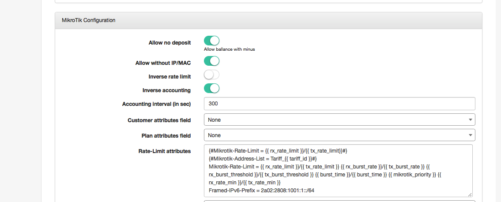

And the route is created for the IPv6 prefix to the client's CPE:

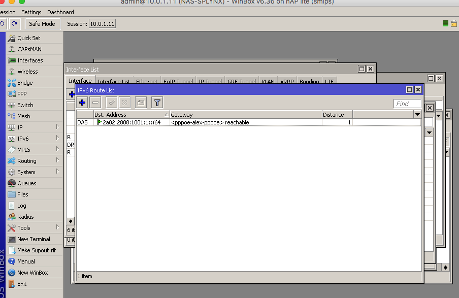


Of course, this example is very simple and useless, because then Splynx will setup the same IPv6 prefix to all clients.


#### Example 2

We can tune previuos example a bit and get IPv6 prefix from the additional field

First, we add the additional field to Splynx Internet services, called 'IPv6 prefix':


Then, define the IPv6 prefix in customer's services:

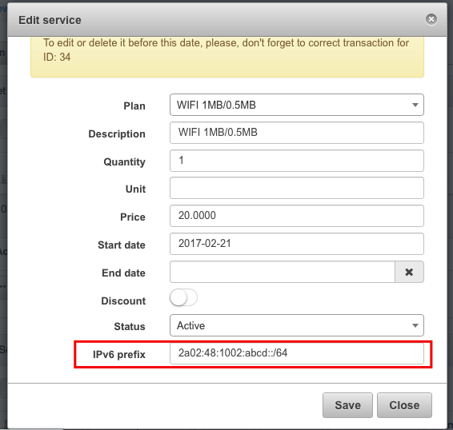

Then, we assign the value of additional field to RADIUS attribute:

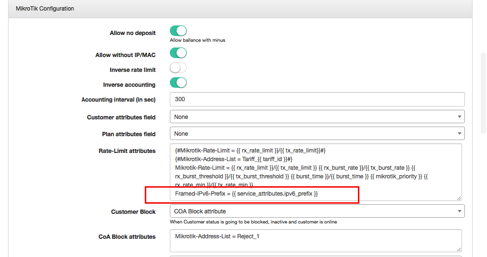


<icon class="image-icon"></icon> It's possible even to check if the parameter exists - send it in Radius reply. If field in Splynx is empty, don't send it in Radius reply:

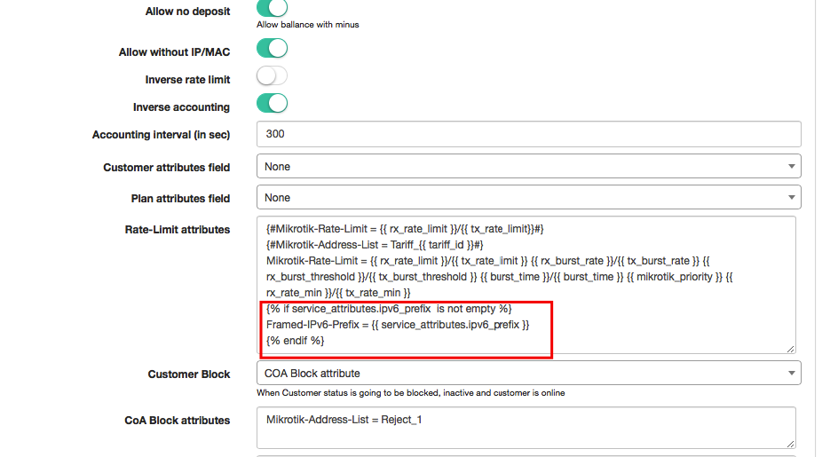


#### Example 3

Address-List depends on plan settings

Let's add additional field to internet plan, with name **wan**:

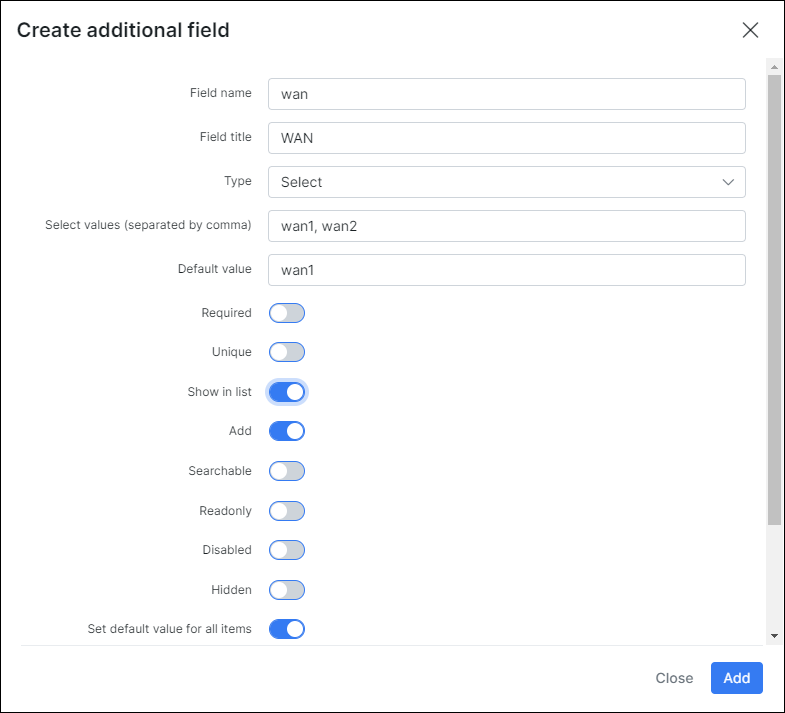

Follow to `Config/Networking/Radius`

Loading Nas Type: **Mikrotik**

Add **Rate-Limit attributes**:
```
Mikrotik-Address-List = {{ tariff_attributes.wan }}
```

Same value better to add to **FUP CoA Rate-Limit attributes, FUP CoA Restore attributes, CoA Restore attributes**


Result should be:

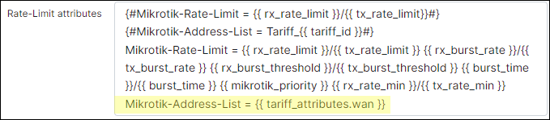

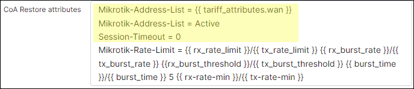

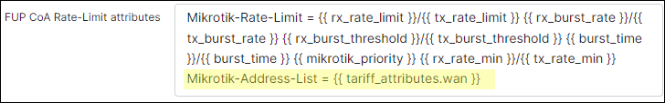

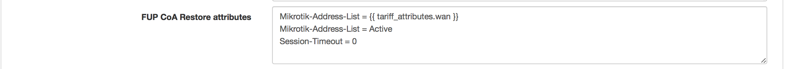

After reconnection customer should go to address-list wan1, or wan2 depends on plan settings.


#### Example 4

Custom IP address.

This example shows how to assign any IP address to customer's device. You do not have to add **IPv4 networks** to Splynx in this scenario.

1. Create the **additional field** for internet services. In this example its name is **ip**.

  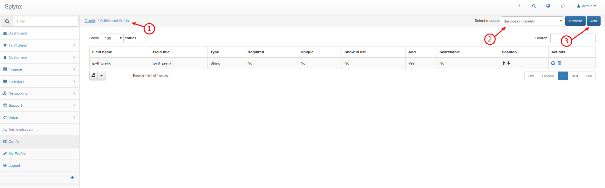
  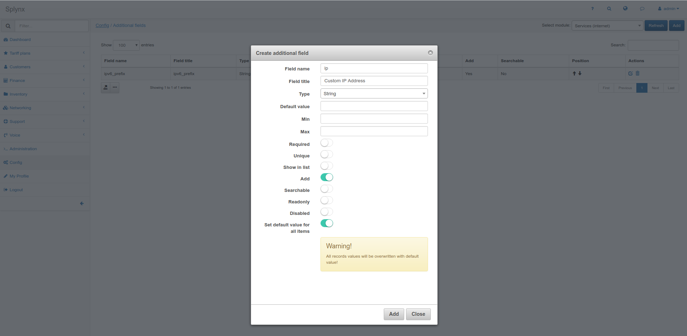

2. Open Radius configuration (`Config/Networking/Radius/Load`) and add this line to Rate-Limit attributes:
```
Framed-IP-Address = {{ service_attributes.ip }}
```
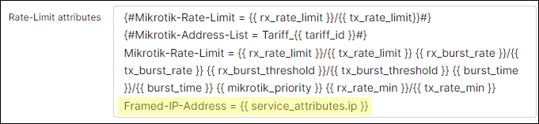
<icon class="image-icon"></icon> Where "**ip**" - is the name of additional field, that we have added on the first step.


3. Save changes and Restart Radius to apply changes.

  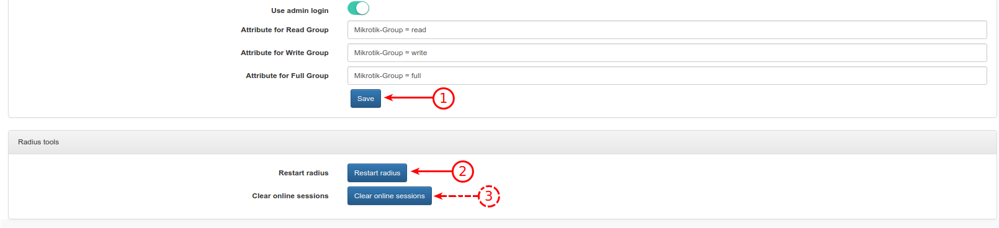


4. Set the IP address for the internet service.

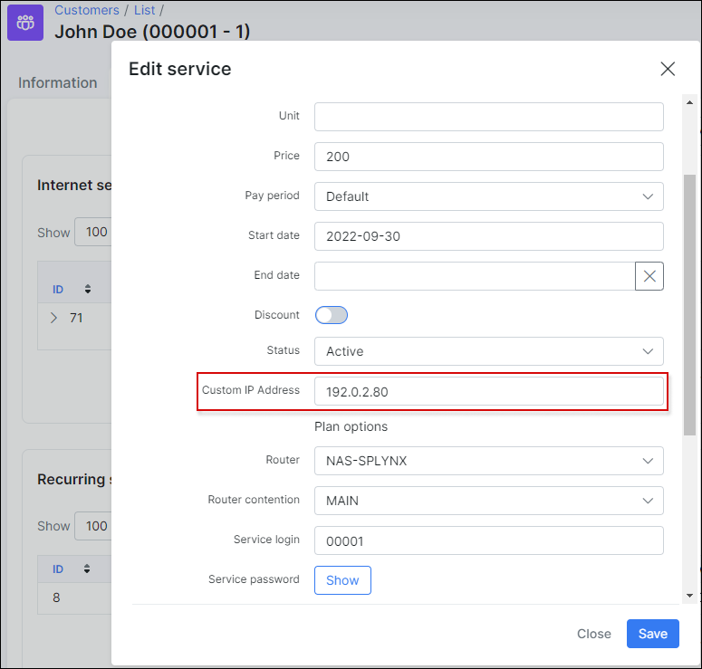


5. Connect a device.
Server:


Client:
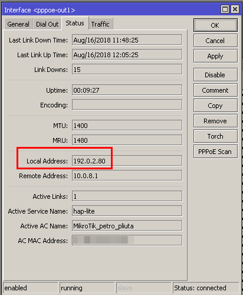


<icon class="image-icon"></icon> In this case, custom IP address overrides IP address that is chosen in Splynx.
If custom IP address is not entered, IP address will be 0.0.0.0 !
If you want to override IP address only if custom IP address is entered (is not empty), add this lines to **Rate-Limit attributes**:
```

Framed-IP-Address = {{ service_attributes.ip }}

```
