Radius server customization
==========

In *Config → Networking → Radius*, we will find a field available for setting additional attributes.

Some attributes are configured by default, such as Framed-IP, Framed-Route and Auth-Type.

## Variables
We can use a lot of variables from within Splynx


### Tariff

Most of these values can be changed on the configuration of Tariff plans within Splynx

[Internet plans description](configuring_tariff_plans/internet_plans/internet_plans.md)


Variable | Value | Comment |
-------- | ----- | ------- |
{{ rx_burst_rate }}	| rx_rate_limit * (100 + tariff.burst_limit) / 100	| FUP rule is applied (if it is active) |
{{ rx_burst_threshold }}	| rx_rate_limit * tariff.burst_threshold / 100	| FUP rule is applied (if it is active) |
{{ rx_rate_limit }}	| Download speed. In bit/s	| FUP rule is applied (if it is active) |
{{ rx_rate_min }}	| rx_rate_limit * tariff.speed_limit_at / 100	| FUP rule is applied (if it is active) |
{{ tariff.service_name }}	| Service name | |
{{ tariff.title }}	| Title | |
{{ tx_burst_rate }}	| tx_rate_limit * (100 + tariff.burst_limit) / 100	| FUP rule is applied (if it is active) |
{{ tx_burst_threshold }} | tx_rate_limit * tariff.burst_threshold / 100	| FUP rule is applied (if it is active) |
{{ tx_rate_limit }}	| Upload speed. In bit/s |	FUP rule is applied (if it is active) |
{{ tx_rate_min }}	| tx_rate_limit * tariff.speed_limit_at / 100	| FUP rule is applied (if it is active) |
{{ tariff.aggregation }}	| Aggregation | |
{{ tariff.burst_limit }}	| Burst limit. In % | |
{{ tariff.burst_threshold }}	| Burst threshold. In % | |
{{ tariff.burst_time }} {{ burst_time }}	| Burst time. In sec |	Two variables have the same value |
{{ tariff.id }} {{ tariff_id }}	| ID number of Tariff plan | Two variables have the same value |
{{ tariff.mikrotik_priority }} {{ mikrotik_priority }}	| 1 - if tariff.priority is 'high', 5 - if tariff.priority is 'normal', 8 - if tariff.priority is 'low'	| Two variables have the same value |
{{ tariff.price }} |	Tariff price | |
{{ tariff.priority }} {{ priority }}	| Priority. Can be 'low', 'normal' or 'high' | Two variables have the same value |
{{ tariff.speed_download }}	| Download speed. In kbit/s | <icon class="image-icon"></icon> FUP rules are not applied. Not recommended to use |
{{ tariff.speed_limit_at }}	| Guaranteed speed limit at. In %	| |
{{ tariff.speed_upload }}	| Upload speed. In kbit/s	| <icon class="image-icon"></icon> FUP rules are not applied. Not recommended to use |
{{ tariff.tariffs_for_change }}	| ID numbers of Tariff plans, to which you can change	| Comma separated |
{{ tariff.vat_percent }}	| VAT percent | |
{{ tariff.with_vat }}	| 0 - VAT is not included in the price,  1 - VAT is included in the price" | |


### Service

Most of these values can be changed in `Customers → List → Customer → Services`

[Customer services description](customer_management/customer_services/customer_services.md)

Variable | Value | Comment |
-------- | ----- | ------- |
{{ service.id }} | ID number of service | |
{{ service.customer_id }}	| ID number of customer | |
{{ service.tariff_id }}	| ID number of Tariff plan |	The same value as tariff.id and tariff_id (See tariff section) |
{{ service.bundle_service_id }}	| ID number of Bundle service	| |
{{ service.description }}	| Description | |
{{ service.quantity }} | Quantity | |
{{ service.unit }} | Unit | |
{{ service.unit_price }} | Service price | <icon class="image-icon"></icon> It can differ from the tariff.price |
{{ service.start_date }} | Start date (yyyy-mm-dd) | |
{{ service.end_date }} |	End date (yyyy-mm-dd)	| |
{{ service.discount }} | 0 - Discount disabled, 1 - Discount enabled | |
{{ service.discount_percent }} | Discount percent | |
{{ service.discount_start_date }}	| Discount start date (yyyy-mm-dd)	| |
{{ service.discount_end_date }}	| Discount end date (yyyy-mm-dd) | |
{{ service.discount_text }} | Discount text | |
{{ service.login }}	| Login	| |
{{ service.password }} | Empty string |	<icon class="image-icon"></icon> Always left empty for security reasons |
{{ service.mac }}	| MAC | |
{{ service.port_id }}	| Port ID | |
{{ service.router_id }}	| ID number or Router | |
{{ service.sector_id }}	| ID number of Router's sector | |
{{ service.taking_ipv4 }}	| 0 - if [Taking IPv4](customer_management/customer_services/customer_services.md) is 'None', 1 - if Taking IPv4 is 'Permanent IP', 2 - if Taking IPv4 is 'Dynamic IP' | |
{{ service.ipv4_pool_id }} | ID number of [IPv4 Network](https://splynx.com/wiki/?wikipage=Networking/IPv4_networks). Can be used when Taking IPv4 = 'Dynamic IP': 0 - if Taking IPv4 is 'None' or 'Permanent IP' | |
{{ service.ipv4 }} | IP address. Can be used when Taking IPv4 = 'Permanent IP'. Empty string - if Taking IPv4 is 'None' or 'Dynamic IP' | |
{{ service.ipv4_route }} | Additional network | |


### Customer
[Customer information description](customer_management/customer_information/customer_information.md)

Variable | Value | Comment |
-------- | ----- | ------- |
{{ customer.id }}	| ID number of customer | |
{{ customer.billing_type }}	| Billing type 'prepaid' or 'prepaid_monthly' or 'recurring'	| |
{{ customer.partner_id }}	| ID number of [Partner](administration/main/partners/partners.md) | |
{{ customer.location_id }} | ID number of [Location](administration/main/locations/locations.md) | |
{{ customer.added_by }}	| Login of [Admin](administration/main/admins_and_permissions/admin_and_permissions.md) who added this customer | |
{{ customer.added_by_id }} | ID number of Admin who added this customer |
{{ customer.login }}	| Login to customers' portal |	<icon class="image-icon"></icon> This is not service.login |
{{ customer.password }}	| Password to customers' portal | <icon class="image-icon"></icon> This is not service.password |
{{ customer.category }}	| Category 'person' or 'company' |
{{ customer.name }}	| Full name |
{{ customer.phone }} | Phone number |
{{ customer.street_1 }}	| Street |
{{ customer.zip_code }}	| ZIP |
{{ customer.city }}	| City |
{{ customer.date_add }}	| Date added (yyyy-mm-dd) |


### FUP (Fair usage policy)

Most of these values can be changed on the configuration of  **Tariff plans** within Splynx

[FUP description](networking/bandwidth_management/fup/fup.md)

Variable | Value | Comment |
-------- | ----- | ------- |
{{ fup_compiled.service_id }}	| ID number of service	| The same value as service.id (See service section) |
{{ fup_compiled.traffic_accounting }}	| 0 - if traffic accounting disabled, 1 - if traffic accounting enabled |
{{ fup_compiled.time_accounting }}	| 0 - if time accounting disabled, 1 - if time accounting enabled |
{{ fup_compiled.is_hard }}	| 1 - if the amount of traffic used this month exceeds the Monthly limit, 0 - otherwise |


#### FUP rule
These values are empty if no FUP rule is applied

Variable | Value |
-------- | ----- |
{{ rule_name }}	| Name of FUP rule applied 'EMPTY' if CAP rule applied |
{{ rule.percent }} | Speed decrease percent |


### Additional attributes

There are also 4 arrays of additional fields:

1. **{{ customer_attributes }}** - additional attributes of the customer.
2. **{{ service_attributes }}** - additional attributes of the internet service.
3. **{{ tariff_attributes }}** - additional attributes of the internet plan.
4. **{{ card_attributes }}** - additional attributes of the prepaid voucher.

These values can be utilized in the following format:

 {{ array_name.field_name }}

<icon class="image-icon"></icon> Additional fields have configuration fields available for the **name** and **title** of the additional within Splynx. We use the **name** field and not the **title** field.

For example, we can create an additional field for a customer called 'my_field'. The format of the values for doing this would be as follows:

 {{ customer_attributes.my_field }}


### Variables usage

We use [Twig engine](https://twig.symfony.com/doc/2.x/templates.html) within Splynx. Therefore, all it's capabilities are available for your use.

* Basic mathematical operations (+ - * /)
Example: Mikrotik-Rate-Limit = {{ tx_rate_limit / 1000 }}
Result: Mikrotik-Rate-Limit = 10 (assume that tx_rate_limit=10000)

* Attributes combination
Example: Mikrotik-Rate-Limit = {{ rx_rate_limit }}/{{ tx_rate_limit }} {{ rx_burst_rate }}/{{ tx_burst_rate }} {{ rx_burst_threshold }}/{{ tx_burst_threshold }} {{ burst_time }}/{{ burst_time }} {{ mikrotik_priority }} {{ rx_rate_min }}/{{ tx_rate_min }}
Result: Mikrotik-Rate-Limit = 5000/90000 20000/360000 1400/25200 93/93 8 6350/114300

* Twig filters\*
Example: Mikrotik-Address-List = {{ tariff.title | upper }}
Result: Mikrotik-Address-List = TARIFF (assume that tariff.title = 'tariff')
\* in addition to [default Twig filters](https://twig.symfony.com/doc/2.x/filters/index.html) one more filter can be used - dec2hex (dec2hex(4))

* Conditions
Example:

Mikrotik-Address-List = {{ service_attributes.adrlist }}


  Result: Radius attribute **Mikrotik-Address-List** will be sent to the router, only if the internet service's additional attribute with the name **adrlist** is not empty.

### Examples


#### Example 1

We can assign IP from a specific pool to DHCP customers using the RADIUS attribute Framed-Pool:

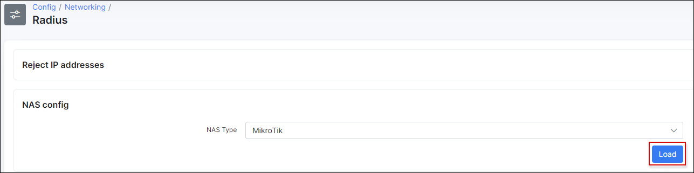

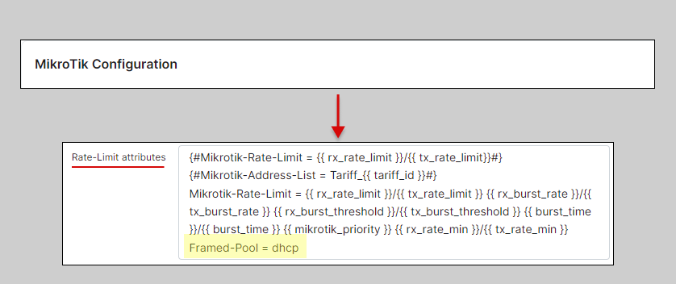

The route will assign IP from dhcp pool:

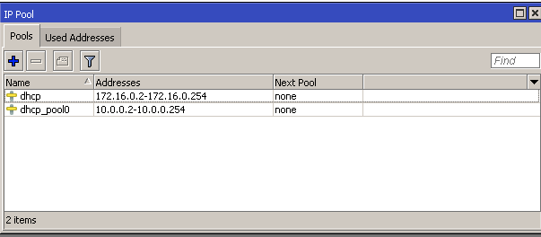

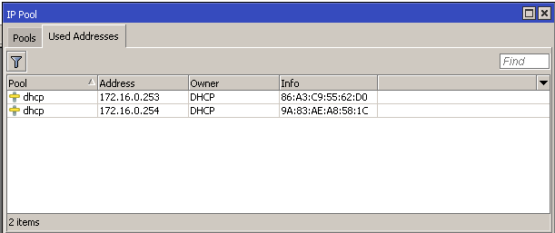

This example is quite simple because then Splynx will setup the same pool IPs to all customers.

#### Example 2

We can reconfigure the previous example a bit to get the IP pool name from the additional field.

Firstly, we need to add the additional field to the Internet services within Splynx, called 'Router address pool':

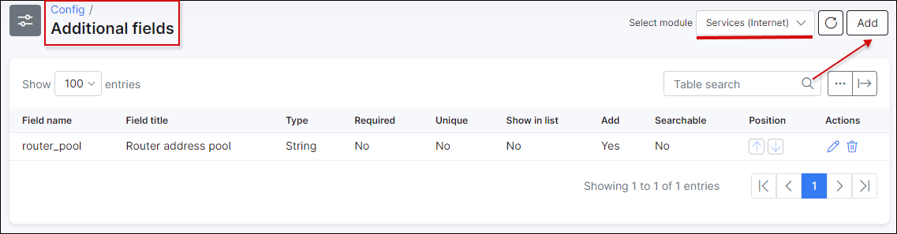

Then we can define the IP pool in the customer's services:

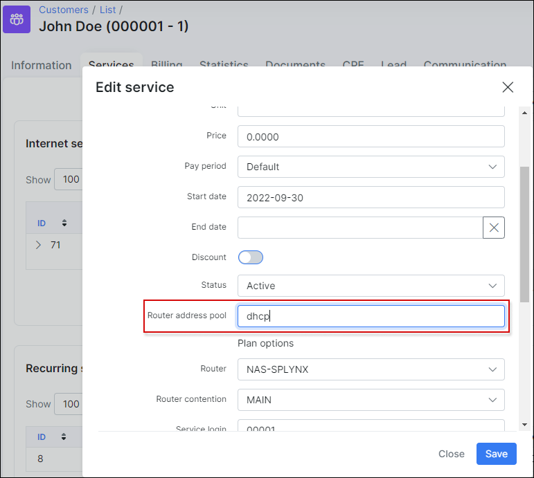

Thereafter, we can assign the value of the additional field to the RADIUS attributes:

```bash
Framed-Pool = {{ service_attributes.router_pool }}
```

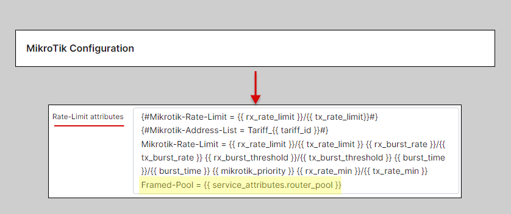


<icon class="image-icon"></icon> It is possible to check that the parameter exists by sending it in the radius reply. If the field is empty within Splynx, it will not be sent in the radius reply:

```bash

Framed-Pool = {{ service_attributes.router_pool }}

```
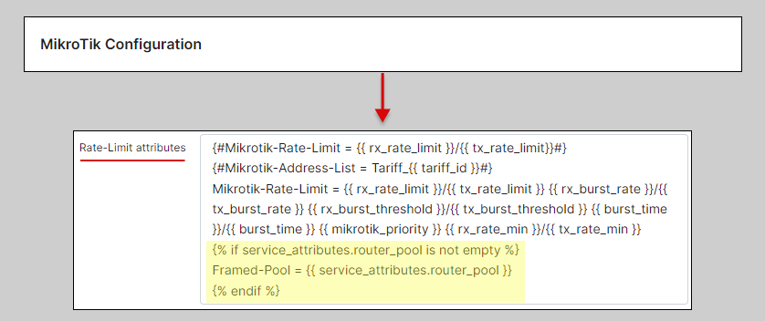

#### Example 3

**Address-List depending on Tariff plan settings**

Let's add an additional field to Internet plans named **"WAN"**:

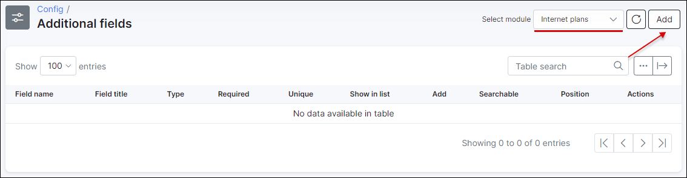


1. Navigate to *Config → Networking → Radius*.

2. Load the Nas Type: **Mikrotik**

3. Add the following in the text box for **Rate-Limit attributes**:
```
Mikrotik-Address-List = {{ tariff_attributes.wan }}
```

It is a good practice to add the same value to the **FUP CoA Rate-Limit attributes, FUP CoA Restore attributes, CoA Restore attributes** fields.


The result should be:


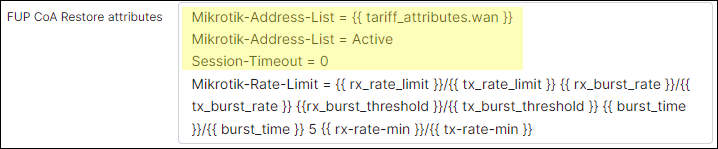

After reconnecting, the customer should be added to address-list wan1, or wan2 depending on the plan settings.


#### Example 4

**Custom IP address**

This example illustrates how to assign any IP address to a customer's device. You do not have to add **IPv4 networks** to Splynx in this scenario.

1. Create an **additional field** for internet services. In this example we've named it **"Custom IP Address"**.

  
  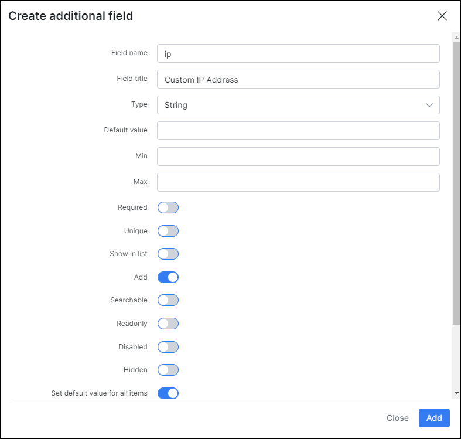

2.  1. Navigate to *Config → Networking → Radius*.

    2. Load the Nas Type: **Mikrotik**

    3. Add the following in the text box for **Rate-Limit attributes**:

```bash
Framed-IP-Address = {{ service_attributes.ip }}
```


<icon class="image-icon"></icon> Where "**ip**" is the name of the additional field that we have added in the first step.


3. Save the changes and Restart Radius to apply the changes.

  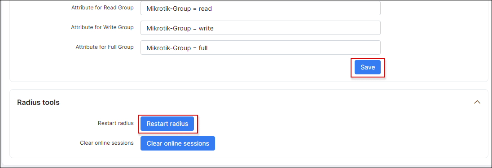


4. Set the IP address for the internet service of the customer.


5. Connect a device.

*Server*:


*Client*:


<icon class="image-icon"></icon> In this case, the custom IP address overrides the IP address that is chosen in Splynx.
If the custom IP address is not entered, the IP address will be set to 0.0.0.0 !
If you only  want to override IP addresses when a custom IP address is entered (is not empty), add the following lines to the **Rate-Limit attributes**:
```

Framed-IP-Address = {{ service_attributes.ip }}

```
