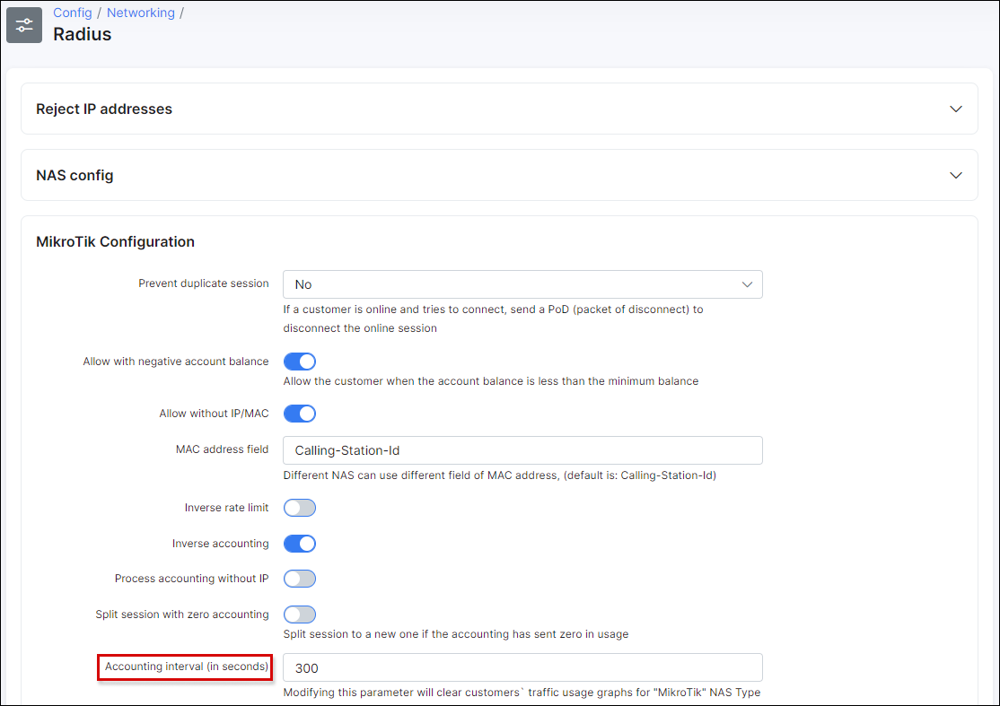
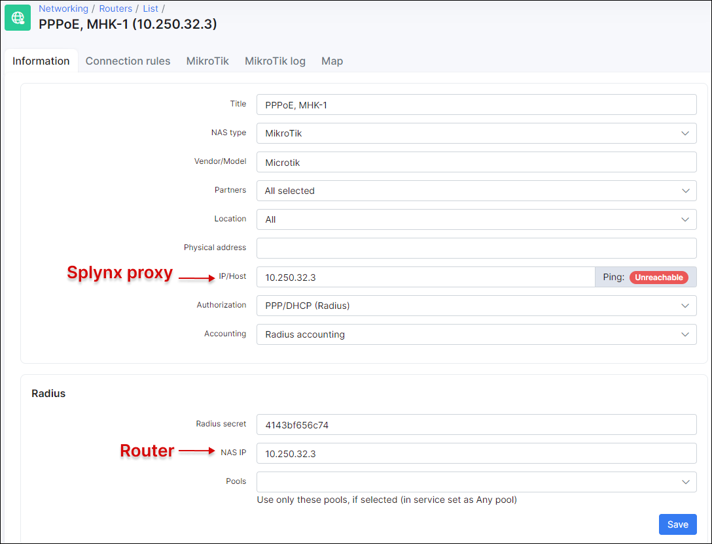

Radius Proxy Accounting
=======================

Splynx has the abillity to proxy[[1]](#one) RADIUS accounting packets to another RADIUS server. In this case, customers' traffic will be accounted on more than one RADIUS server.

## Radius Accounting process
During RADIUS authorization, if the customer is allowed to connect, the RADIUS server[[2]](#two) sends a **RADIUS-Accept** packet to the NAS[[3]](#three) with an **Acct-Interim-Interval** Attribute (among other attributes). This attribute contains the number of seconds, of how frequently the NAS should send traffic usage updates[[4]](#four) to the RADIUS server.
You can change this time in Splynx under *Config → Networking → Radius → (choose NAS type) → Load → Accounting interval (in sec)*.

## Radius Proxy Accounting

After a session starts, the NAS sends traffic statistics every **Accounting interval (in sec)** seconds, as  mentioned. If you enable **Proxy accounting** under *Config → Networking → Radius advanced*, Splynx will copy these RADIUS Accounting packets to the _IP:Port_ specified in the **Radius host** field.

## Splynx as Remote RADIUS Accounting server
To use Splynx as a Remote RADIUS Accounting server, create a Router under **Networking → Routers**.

**IP/Host** - IP address (hostname) of the Splynx proxy server.
**NAS IP** - IP address of the router (NAS)

***
[1] RADIUS Proxy Accounting behaviour in Splynx is a bit different from the descriptions in [RFC 2866](https://tools.ietf.org/html/rfc2866). Splynx RADIUS server answers to the NAS immediately and simply copies Accounting data to the other server. "Classic" RADIUS Proxy Accounting servers, first sends Accounting Request to the remote server and only answers to the NAS after the Accounting Accept is received from the remote server.
[2] Splynx server.
[3] Network Access Server, **Router** in Splynx terminology.
[4] Interim-Updates
