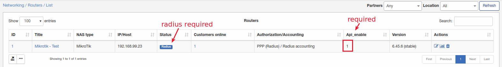
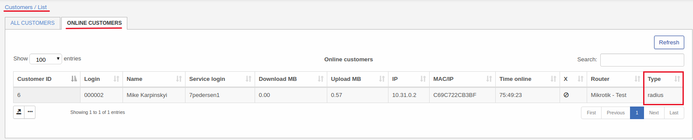

### Mikrotik Live bandwidth usage

Start from Splynx 3.0 version we have a new feature called "Live bandwidth usage" what is available only for Mikrotik devices for now.

Few things is required:
1. Radius authorization;
2. API configured and enabled for a router;
3. NAS Type - Mikrotik only;
4. ROS > than 6.43.

Navigate to "Edit" section of a router and select tab "Mikrotik"

Here API must be configured and enabled, API status must be "OK" and successfull test API connection.

Press on "Live Bandwidth usage" button to see router graph:

If graph is available on a router - customer who connected to this router will have this graph too under Statistic tab:

Navigate to a customer view and select "Statistics" tab:

In this case customer isn't using internet at the moment so graph is empty.

*NOTE! Sometimes graph on a router is available and for a customer it's not. You can try to fix it by connecting to your server via SSH and run next command:*

**sudo service splynx_node restart**

If after restart of this module graph for customer still not available - create a ticket with this issue.
