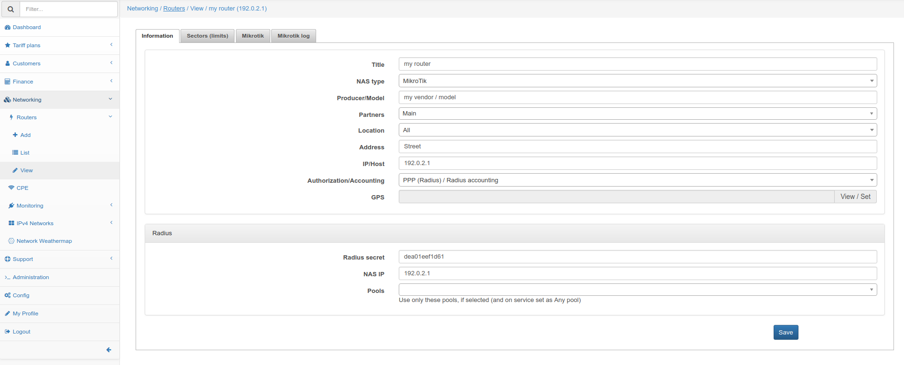
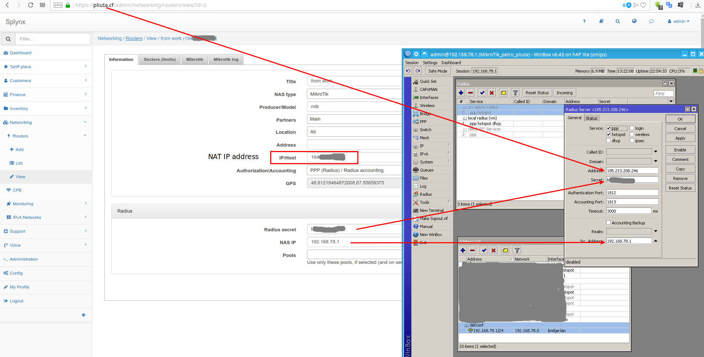

Routers settings
==========

`Networking / Routers` - is where you can add and configure routers to your network (Network Access Servers).

<icon class="image-icon"></icon> Please note, if a new router is added or configuration is changed - it may take up to 5 minutes to apply the new radius configurations.

**Title** - formal name. Just to distinguish between different routers. 
**NAS type** - Type of NAS (Network Access Server). You can configure NAS types under _Config / Networking / NAS types_. The main difference between different NAS types is to use Mikrotik API for this NAS type or not. Also, you can set different settings for different NAS types under _Config / Networking / Radius_.  
**Producer/Model** - Vendor and model of the device.  
**Partners** - Partners to grant access to the device.  
**Location** - Locations to grant access to the device.  
**Address** - Physical address where the device is installed.  
**IP/Host** - Router's IP address, this is the physical IP address from where packets are sent to the Radius server (to Splynx). **If the router is behind a NAT, this field should be populated with the public IP address of the NAT device.** This field can be set as a domain name or dynamic DNS entry.  
**Authorization/Accounting** - which type of Authorization/Accounting to use.

## Types of Authorization/Accounting:

*   **None / None** - used in unique scenarios.
*   **None / API accounting** - useful for unique scenarios. In addition, Mikrotik API accounting will be used.
*   **Firewall IP-MAC filter / API accounting** - Mikrotik API will be used to push firewall filter rules to the router. This is useful for Static IP addresses, when customers sets their IP addresses on the equipment manually.
*   **DHCP (Radius) / API accounting** - The DHCP server on the router will use Radius authorization. Accounting will be performed with Mikrotik API.
*   **DHCP (Leases) / API accounting** - Mikrotik API will be used to push DHCP leases to the router. <icon class="image-icon"></icon> Do not forget to set MAC addresses for internet services. Accounting will be performed with Mikrotik API.
*   **PPP (Radius) / Radius accounting** - PPPoE / PPTP / OpenVPN server will use Radius authorization. Radius accounting will be used.
*   **PPP (Secrets) / API accounting** - Mikrotik API will be used to push PPP secrets to the router. Accounting will be performed with Mikrotik API.
*   **Hotspot (Users) / API accounting** - Mikrotik API will be used to push Hotspot users to the router. Accounting will be performed with Mikrotik API.
*   **Hotspot (Radius) / Radius accounting** - Mikrotik Hotspot server will use Radius authorization. Radius accounting will be used.

<icon class="image-icon"></icon> Even if Authorization = None or API authorization is used - Radius authorization and Radius accounting will work.  
<icon class="image-icon"></icon> If API Authorization is used - do not forget to choose the specific router in internet service settings of the customer (if router = None, this will not work).  
<icon class="image-icon"></icon> If API Authorization is used - Mikrotik API should be enabled and configured on the _Mikrotik_ tab in Router settings.

**API ACCOUNTING** - The Splynx server will continuously (every 5 minutes) login to the Mikrotik device via Mikrotik API to gather statistics.
**RADIUS ACCOUNTING** - The router sends accounting statistic every **n** seconds to the Splynx server using RADIUS accounting packets. **n** is the configurable value, which can be configured per NAS type under *Config / Networking / Radius / NAS Type/ Load / Accounting interval (in sec)*.

**GPS** - you are able to pin-point the location of the devices on the map (where router is located). This field is only available when the Google Maps add-on is installed.  
**Radius secret** - Configure a Radius secret.  
**NAS IP** - the real IP source address, for radius packets. **It does not matter if the router is behind NAT or not.** It is recommended that in the Radius settings of the Mikrotik router, Src. address should be the NAS IP configured in Splynx.

**Pools** - if selected, only use selected pools for this router. If you want to use all available pools - do not select any.

* * *

Splynx supports different router models from different producers. Below are configuration tutorials for vendors that are most commonly used:

* [Cisco routers](networking/routers_settings/cisco/cisco.md)

* [Juniper routers](networking/routers_settings/juniper/juniper.md)

* [Mikrotik routers](networking/routers_settings/mikrotik/mikrotik.md)

* [Other](networking/routers_settings/other/other.md)

* [Ubiquiti Edge routers](networking/routers_settings/ubiquiti/ubiquiti.md)
