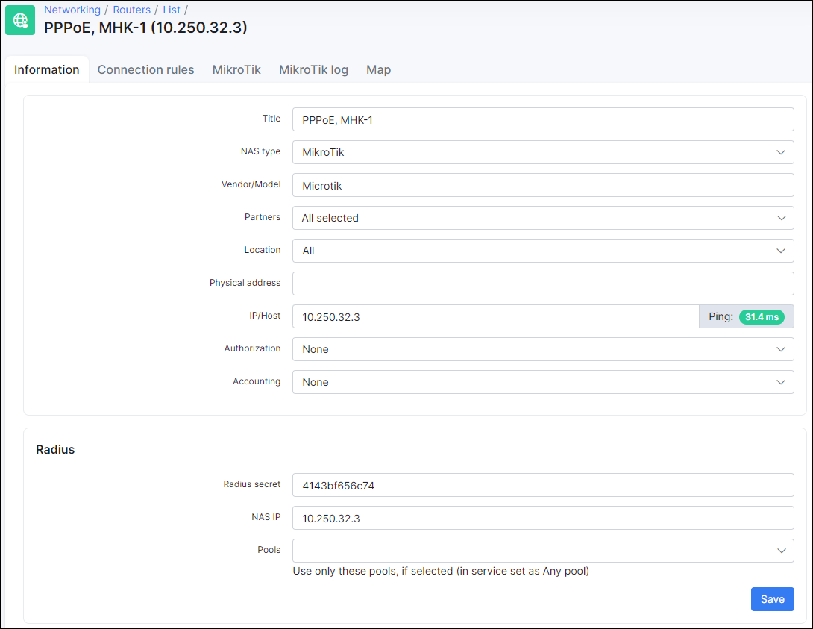
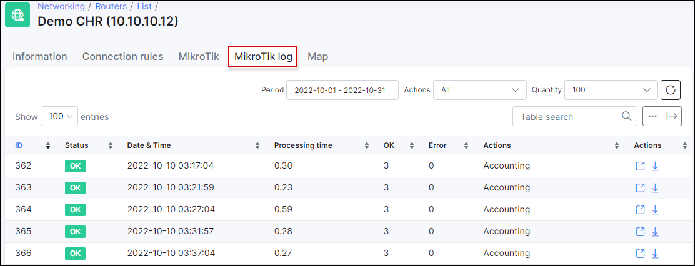

Routers settings
==========

`Networking / Routers` - In this section, you can add and configure your routers which will manage Authentication, Accounting and Bandwidth management (Network Access Servers).

To add a new router navigate to **Networking -> Routers -> Add**:

Here you need to specify:

* **Title** - name of the router;

* **NAS type** - select a NAS type for the new router. If you can't find the required NAS type here, it can be added under *Config -> Networking -> NAS types*;

* **Vendor/Model** - specify the vendor and model of the router;

* **Partners** - select the partners who can use this router;

* **Location** - select locations;

* **Physical address** - specify the physical address of the router;

* **IP/Host** - Router's IP address, this is the physical IP address from where packets are sent to Radius server (to Splynx). **In the case where a router is behind NAT, this is the public IP address of NAT device.** Can also be set as a domain name or dynamic DNS entry;

* **NAS IP** - RADIUS server attribute **NAS-IP-Address** (RADIUS server "Src. address" field on a Mikrotik router). If field "Src. Address" is specified on a Mikrotik RADIUS server - NAS IP (in Splynx) should be the same;

* **Authorization/Accounting** - select the type of Authorization/Accounting:

  *  **None / None** - useful for non-standard scenarios;
  *   **None / API accounting** - No authentication will be applied from Splynx but Mikrotik API accounting will be used;
  *   **Firewall IP-MAC filter / API accounting** - Mikrotik API will be used to push firewall filter rules into the router. This is useful for Static IP address assignment - when a customer sets the IP address on the equipment manually;
  *   **DHCP (Radius) / API accounting** - DHCP server on the router will use Radius authorization. Accounting will be done via Mikrotik API;
  *   **DHCP (Leases) / API accounting** - Mikrotik API will be used to push DHCP leases to the router. **Do not forget to set the MAC addresses in the customer's internet service**. Accounting will be processed via Mikrotik API;
  *   **PPP (Radius) / Radius accounting** - PPPoE/PPTP/OpenVPN server will use Radius authorization. Radius accounting will be used;
  *   **PPP (Secrets) / API accounting** - Mikrotik API will push PPP secrets to the router. Accounting will be processed via Mikrotik API;
  *   **Hotspot (Users) / API accounting** - Mikrotik API will push Hotspot users to the router. Accounting will be processed via Mikrotik API;
  *   **Hotspot (Radius) / Radius accounting** - Mikrotik Hotspot server will use Radius authorization. Radius accounting will be used.

 **NOTE!**
 *Even if Authorization = None or API authorization is used - Radius will respond to authorization and accounting requests.*

*If API Authorization is used - do not forget to specify the correct router in the customer's internet service settings (if router is set to None this will not work).*

*If API Authorization is used - Mikrotik API should be enabled and configured on the _Mikrotik_ tab and in Router settings.*

**API ACCOUNTING** - Splynx will login every 5 minutes (can't be changed) and gathers statistics from the Mikrotik router using Mikrotik API;

**RADIUS ACCOUNTING** - Router sends accounting statistics every **n** seconds to the Radius (Splynx) server using RADIUS accounting packets. **n** is a configurable value. It can be configured per NAS type under *Config / Networking / Radius / NAS Type / Load / Accounting interval (in sec)*.

* * *
Once the router is added, you can change the following parameters:

#### RADIUS

* **Radius secret** - Radius secret (field "Secret" under RADIUS server on a Mikrotik);

* **NAS IP** - RADIUS server attribute **NAS-IP-Address** (RADIUS server "Src. address" field on a Mikrotik router). If field "Src. Address" is specified on the Mikrotik RADIUS server - NAS IP(in Splynx) should be the same;

* **Pools** - if selected, only use the selected pools for this router. If you want to use all available pools - do not select any. Pools have to be created under *Networking / IPv4 Networks*.

**IP/HOST** Next to this field you'll see a ping tool which indicates whether a router is pingable or not.

* * *
### ROUTER CONTENTION
Here you can add/edit router contention:

### Mikrotik

In this section the API connection between the Mikrotik router and Splynx is managed. To use this function we have to create a new user within the Mikrotik under (System - Users) as seen below:

We'll use *splynx_user* to link the router with Splynx:

We configured all parameters in step 1(in the screenshot), saved the configuration in step 2 and test the connection in step 3 where we got the result.

Additional parameters to configure:

* **Enable shaper** - enable/disable Mikrotik API shaping (Radius rate limiting should be disabled (commands should be negated "#" - when enabling this);

* **Shaper** - select where the API bandwidth rules should be applied;

* **Shaping type** - select queue structure type. More info about shaping can be found [here](networking/bandwidth_management/bandwidth_management.md).

* **Wireless access list** - if enabled, and the service of a customer has a MAC address specified, the MAC address of the service will be added under *Wireless - Access list* on the Mikrotik;

* **Disabled customers to Address-List** - used for API authorization. This option changes the blocking behavior. If disabled - credentials of blocked customers will not be added to the router(hotspot users, PPP secrets firewall rules and DHCP leases), if enabled - blocked customers IP addresses will be placed in the respective address list;

* **Blocking rules** - enable/disable blocking rules. If enabled - Splynx will push a series of firewall filter rules to the router to enforce the suspension of blocked customers' services.

In the **Mikrotik status** window you can see the latest status of the API connection, router model, ROS version, CPU usage, status of IPv6 and date & time of the last received status.

There are 3 more buttons:

* **Delete all rules from router** - by click on this button all API rules will be removed from a router. If you need to use this, click on it and immediately disable "Enable API";

* **Backups** - by clicking on this button you will see available backups of the router;

* **Check status now** - forces Splynx to check the status.

### Mikrotik log

Here you can find Mikrotik logs:

Files can be viewed of downloaded.

### MAP

Under this tab you can configure the geolocation of a router on the map by specifying the geo data for the router.

Splynx supports different router models from different producers. Below are configuration tutorials for vendors that are used most often and supported by us:

* [Mikrotik routers](networking/routers_settings/mikrotik/mikrotik.md)
  * [MikroTik Live bandwidth](networking/routers_settings/mikrotik_live_bandwidth/mikrotik_live_bandwidth.md)

* [Cisco routers](networking/routers_settings/cisco/cisco.md)

* [Juniper routers](networking/routers_settings/juniper/juniper.md)

* [Ubiquiti Edge routers](networking/routers_settings/ubiquiti/ubiquiti.md)
