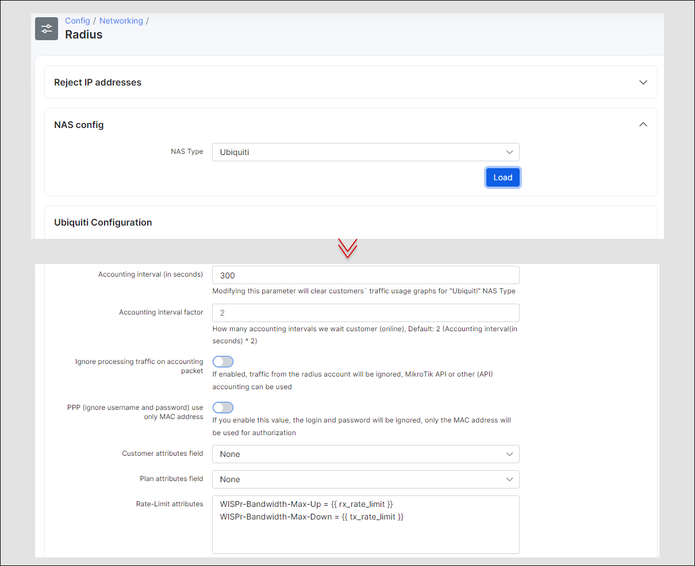

Ubiquiti Edge routers
==========

UBNT EdgeRouters can act as PPPoE servers with authentication of CPEs, providing statistics, blocking end users, setting up speed limits and applying FUP rules.

The configuration can be divided into the following steps:

1. Configure the EdgeRouter's PPPoE server with Radius
2. Configure the EdgeRouter's PPPoE server for incoming radius packets
3. Add the EdgeRouter to Splynx
4. Connect PPPoE customers and check that everything works fine
5. Install other usefull tools to your Edgerouter

### 1. Configure EdgeRouter PPPoE Server with Radius support

The first step is to upgrade the system to at least version 1.5 or higher, because the support of Radius attributes was only added to EdgeOS starting from this version. The version we will be operating here is EdgeOS v1.8.5.
The upgrade can be performed in CLI with the following commands:
```
add system image http://dl.ubnt.com/...
add system image new-version-1085.tar
```

The second step is to define the IP address for communication between the Radius server and the EdgeRouter.
In this case the ip address is: 10.0.1.166, configure it as the main IP of the EdgeRouter with the following command (in configure mode):

```
set system ip override-hostname-ip 10.0.1.166
```

Then we will setup the PPPoE server with following mandatory settings:

```
edit service pppoe-server
set authentication mode radius
set authentication radius-server 10.10.10.65 key 12345
set client-ip-pool start 10.5.50.2
set client-ip-pool stop 10.5.50.200
set interface eth2
```

The Radius configuration can also be done in a web browser:


Encryption on Edge Router tunnels are disabled by default. To enable it, login to the EdgeRouter via SSH and run the following command:

```
sudo su -
vi /opt/vyatta/share/perl5/Vyatta/PPPoEServerConfig.pm
```
press "/" on your keyboard and type: refuse-chap
and then press 'i' on your keyboard and change "refuse-chap" to "require-chap".
Thereafter, press Escape button on your keyboard and type :wq
PAP and MSCCHAP can be enabled in the same way.


### 2. Configure EdgeRouter PPPoE incoming packets

This is an important part when we need to change plans, disconnect customers or apply FUP rules. In all these cases, the Splynx Radius server sends packets to the Edge Router.
The default port of UBNT is 3779. To enable incoming packet processing, run the following command on the Edge router:
```
sudo cp /opt/vyatta/etc/pppoe-server/start-pppoe-radius-disconnect /config/scripts/post-config.d/
```
Reboot the router to apply changes.

To run a debug, to check whether packets are received or not, use the pppoe-radius-disconnect.log file:
```
tail /var/log/pppoe-radius-disconnect.log
```
Below is an example of the output when a disconnect packet was received by EdgeOS:


### 3. Add EdgeRouter to Splynx and set up settings in Splynx

Simply add a router to Splynx in `Networking → Routers → Add` and choose the NAS Type as Ubiquiti:


You can apply additional attributes to the configuration of the NAS Type under *Config → Networking → Radius*.
By default, we support radius-rate-limit attributes to setup speeds of PPPoE tunnels.



### 4. Connect PPPoE customer and check that everything is working fine

Now we can connect the PPPoE customer to the EdgeRouter and check that everything works as expected.
With the `show pppoe-server` command we can see how many users are connected to the PPPoE server:


In Splynx, we can see if the customer is online and get their statistics:


When we click on the disconnect button, the customer should be removed from the online list and reconnect with a new session, which means that the EdgeRouter accepted the incoming packet from the Splynx Radius server.


### 5. Install other useful tools to EdgeRouter

PPPoE client tunnels are dynamically created and are not shown in the web dashboard. We want to get statistics of the customer's throughput, and a simple way to do this is to install the bwm-ng software. It is located in the Debian repository, which means we need to add new repositories first and then install bwm-ng.
Adding new repositories:
```
configure
set system package repository wheezy components 'main contrib non-free'
set system package repository wheezy distribution wheezy
set system package repository wheezy url http://http.us.debian.org/debian
set system package repository wheezy-security components main
set system package repository wheezy-security distribution wheezy/updates
set system package repository wheezy-security url http://security.debian.org
commit
save
exit
```

Install the tool:
```
apt-get install bwm-ng
```

Then you can run bwm-ng -u bits to get the actual Kbps throughput of pppoe customers.
An example of the output of bwm-ng is depicted in the image below:


Now you can configure the Splynx Radius server with the UBNT EdgeRouter, benefiting from a fast router that delivers 1 million packets per second routing performance in a compact and affordable unit!


If you do face any difficulties, please refer to our forum – https://forum.splynx.com/ or submit a ticket to us for assistance – https://splynx.com/my-tickets/


Below is a video tutorial of the configuration steps of Edge Routers:

<iframe frameborder=0 height=270 width=350 allowfullscreen src="https://www.youtube.com/embed/p7gD5wYjco0?wmode=opaque">Video on youtube</iframe>
