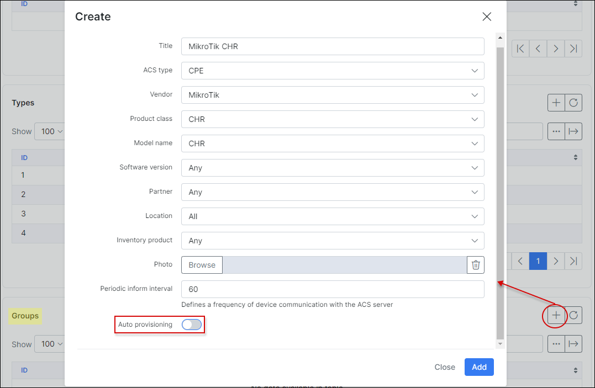
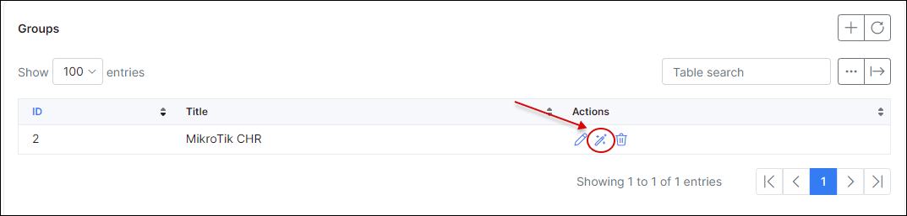
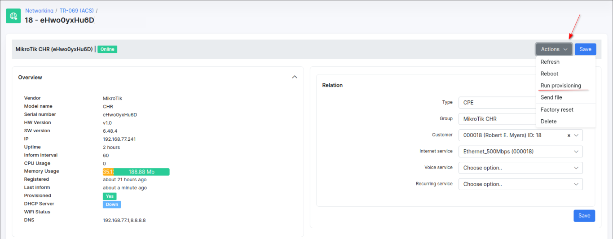

Device connection, types, groups and auto-provision flow
==========

## Connect your Mikrotik device

We will use a Mikrotik device with TR-069 client as an example.

First of all, **TR-069 package** should be installed on Mikrotik. If this package is not installed, use the next steps to install it:

1. Open [Winbox](https://mt.lv/winbox64) and connect to the router (use [Wine](https://wiki.winehq.org/Ubuntu) to run Winbox on Ubuntu);

2. Update router to latest stable version `System → Packages → Check for updates` and update if required;

3. Navigate to Mikrotik [download page](https://mikrotik.com/download) and download the package for your device;

4. Extract the downloaded archive and find `tr069-client-X.XX.npk`;

5. Upload `tr069-client-X.XX.npk` file into your device and reboot Mikrotik (`System → Reboot`);

6. After reboot you should see a **TR-069** option in menu:


Click on **TR069** item and configure **connection to the ACS server**:

1. Put the check-mark to **Enable** client;

2. Put your **ACS URL** - it's a *URL* from menu on [step 3](networking/tr069_acs/services_server_config/services_server_config.md) for a *CWMP*;


In our example, we are using the *domain name* instead of IP address.

3. Specify username and password with values from **global** parameters ([step 1](networking/tr069_acs/services_server_config/services_server_config.md));

4. Enable **Periodic inform interval (seconds)** option.

After these steps you should have the next result:


The credentials in **Connection Request Username** and **Connection Request Password** fields should appear automatically. **Do not change these credentials unless absolutely necessary** (e.g. when you need to reconnect your device with an ACS server, these values can be removed and re-enable client - with new connection you will see a new credentials).

<icon class="image-icon"></icon> **IMPORTANT (for Mikrotik devices only)**: if you are using **HTTPS/SSL** on your Splynx server you can get **an error about SSL, asking for the local certificate**. In this case you need to run 2 commands in Mikrotik terminal:

```
/tool fetch https://letsencrypt.org/certs/isrgrootx1.pem
```
```
/certificate import file-name=isrgrootx1.pem passphrase="
```

<details style="font-size: 15px; margin-bottom: 5px;">
<summary><b>To remove the expired certificate use the next command</b></summary>
<div markdown="1">

Example:

```
/certificate remove trustid-x3-root.pem.txt_0

```


</div>
</details>

and **do not change any other config in TR-069 client** (`Client certificate` **option must be `none`**), just **re-enable TR-069 client**.

After that, the device will be registered under GenieACS:


as well as under Splynx:


Devices can be in the following statuses: `Online`, `Online today`, `Offline`.

Main parameters for ACS are configured and device is connected so you can manage the device remotely now. Also we have a few more options to configure: **Attributes**, **Types** and **Groups** in *Config → Networking → TR-069 (ACS)*.


## Types:

Simply add different types of devices:


## Groups:

<icon class="image-icon"></icon> **NOTE**: Before configuring ACS groups you need to connect some device to ACS server (navigate to `Networking → Routers → Add` and follow the steps of wizard, TR-069 should be configured on the router).

Under **Groups** you can create new entries to group devices. Press `Add` button and in a new window select the required parameters, the inventory [product](inventory/products/products.md) name (if existed), selected photo of the device etc.

<icon class="image-icon"></icon> **IMPORTANT**: It is recommended that you leave the option **Auto provisioning** `disabled` **to prevent an automatic upload of an incomplete configuration to your device.
Otherwise, the current device configuration can be erased and it can be unavailable remotely**.



## Provisioning flow

**Groups** are used for **auto-provision** devices and load device's parameters and properties with the correct TR069 attributes.

Once some device is added you can create a group base on that device, grab the configuration parameters from that device, edit such parameters and save (in this case, use `I have one device and ready to play with manual insert of parameters` provision configuration flow).

**IMPORTANT**

When the correct configuration is grabbed from the device, **it's recommended to remove unnecessary attributes and leave only those attributes that you plan add/update etc. on other devices**.

After that these attributes can be used for configuration of other devices based on this group, using previously exported parameters.

Click on <icon class="image-icon"></icon> (Provision flow) icon and choose the necessary option



We have a few options here:


|   |   |
| ------------ | ------------ |
| **I have one fully configured device (and ready to reset configuration, (I have backup of full config)**  | this option can be used when you have configured one device (Device 1) of this type and you need to configure another clear device (Device 2) with existed parameters. Splynx will grab parameters from Device 1, check what parameters can be used for Device 2 configuration and pull these changes. Or you have a backup what can be used for configuration  |
| **I have one non configured device and ready to configure this device (or I have backup of config and ready to apply it on next steps)**  |  vice versa to a previous method  |
| **I have two similar devices (One is fully configured, and one is not configured)**  | need 2 devices, one is fully configured and another one is not-configured. The configuration from both routers will be downloaded, only after that this config can be updated  |
| **I have one device and ready to play with manual insert of parameters**  | download configuration from a device and edit this config manually  |
| **I have a configuration file for import and want to import this file**  | in this step you need to import a .csv file with a configuration what can be imported  |
| **I want to insert config manually**  | manual way to configure a device |

If you choose **I want to insert config manually** step, the configuration for the device can be created from scratch in Splynx. You will see a window with the editor of device objects with its attributes. In this configuration menu you can **create** new object and attribute related to the object, **update**, **delete**


or apply the **mass actions** (*enable*, *disable*, *delete*) the existing object and its attribute (-s).


We can apply **4 actions to the object**:


- **create** - create an object with the attributes specified in the configuration, but if we already have an object with these attributes, a new object will not be created;
- **update** - update the object's attribute value (-s);
- **delete** - remove all objects according to the path, **for example** object `Device.Firewall.X_MIKROTIK_Filter.Chain.3.Rule` will remove all firewall rules from output chain on Mikrotik;


- **delete with equal condition** - remove the object if the attribute's `value` was specified in the configuration, **for example** remove all the disabled rules in firewall output chain.


------------

**Attribute options:**

- **Ignore statement** as an attribute option allows to use `---ignore---` value in the field to skip sending the attribute to the device.


**Example:**

```
value---ignore---
```

- **Template** as an attribute option helps to **use twig** to create provision template with conditional values.


**Examples:**

```
{{ customer.login }}.spl.rv.ua
```

```
---ignore---{{ customer.login }}.spl.loc
```

```
{{ device.device_id[:5] }}
```

```
{{ customer.custom.wifi_ssid }}--ignore---
```

Click on drop down menu to find out the correct variable of the value you need, e.g. **customer** (`{{ device.customer_id }}`), **model name** (`{{ device.model_name }}`), **IPv4 address** (`{{ internet_service.ipv4 }}`).

Click **Save** button to save the changes in current configuration.

By clicking on drop down arrow button near **Save**


you can **preview**, **export settings to .csv file** (exported config file can be used for configuration of other devices)


**import settings from .csv file** (**Important:** If the `Auto provisioning` option is enabled and you import configuration from .csv file, the existing settings on the device will be erased)


or **clean up** the existing/loaded device config.

When configuration is ready to upload to the device, navigate to `Config → Networking → TR-069 (ACS)`, find your device related group and in its **Edit** menu enable `Auto provisioning` option.

Then, open `Networking → TR-069 (ACS) → Devices`, click on its serial number or **View** icon and at the top-right corner of the new page click on drop-down **Actions** menu and choose `Run provisioning` action to perform it for your device.



After that, check if the settings on the device have changed.
