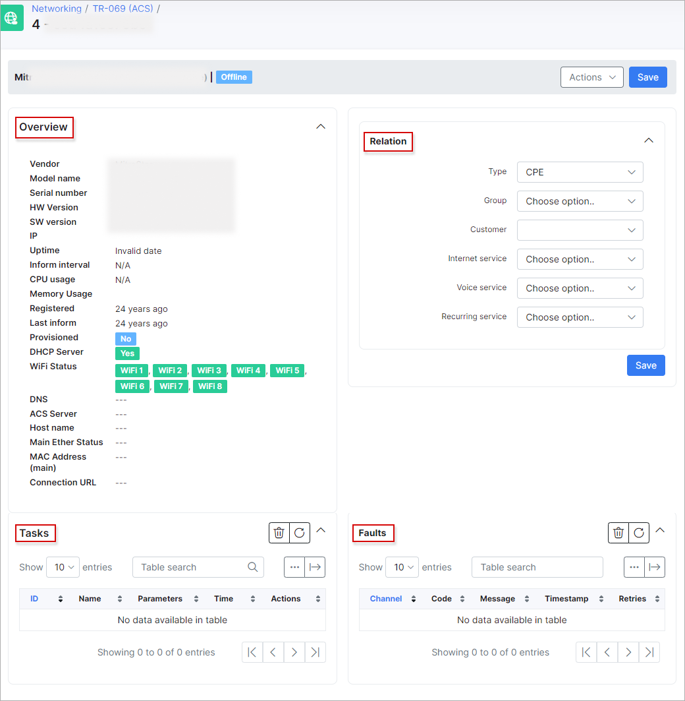
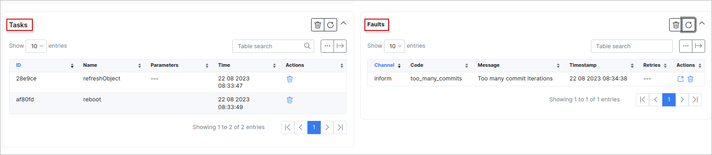
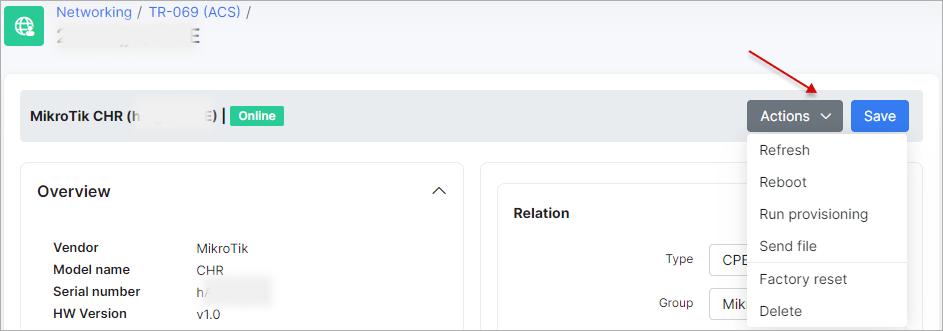
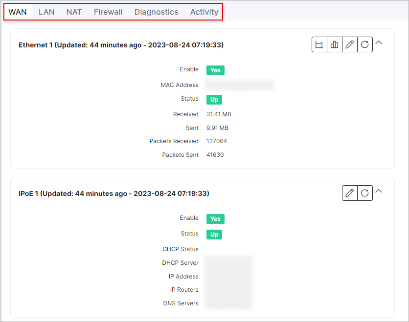
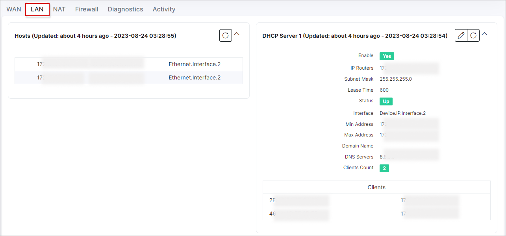
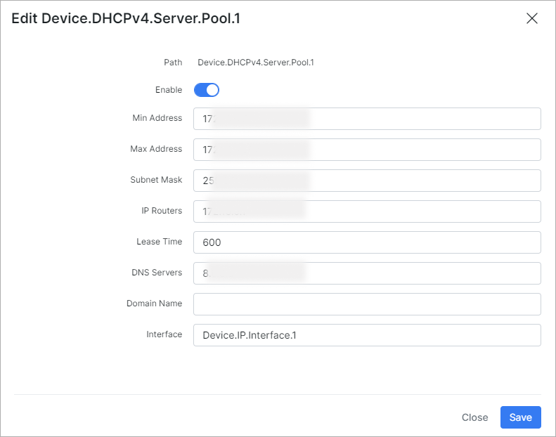
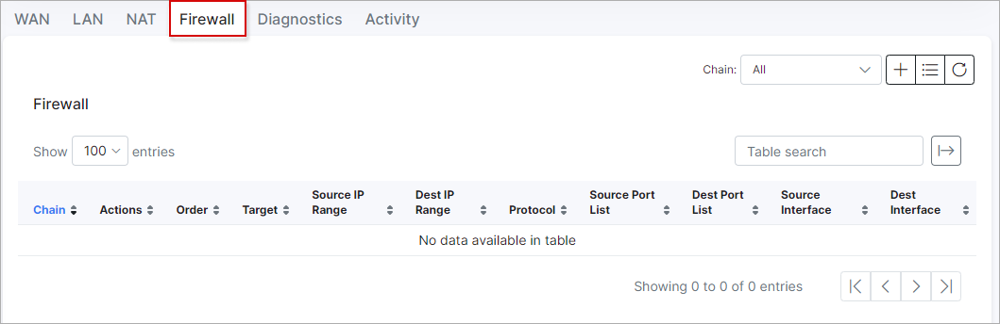
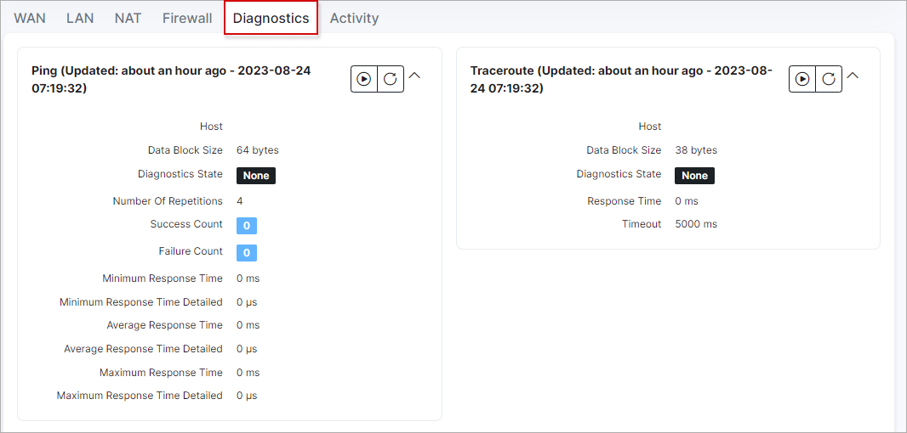
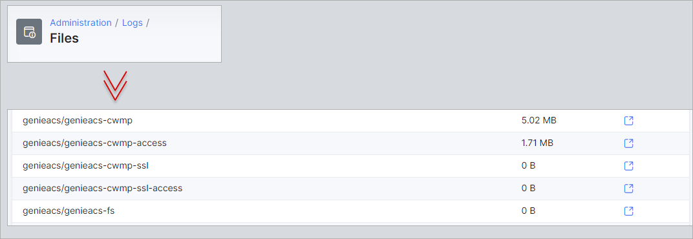

Device view
======================

In the device control menu, we can find the following sections:

On the **Overview** tab you can see basic parameters like *uptime*, *IP*, *CPU usage* etc.

On the **Relation** tab you can set type of device (**type** should be created under `Config → Networking → TR-069 → Types`), **group** (should be created under `Config → Networking → TR-069 → Groups` as well) also the customer and their services can be linked to this device.

On **Tasks** tab you will see the pending tasks (like you run a wi-fi password change and task will be created).

On **Faults** tab you will see tasks what were executed with an errors.

After clicking the `Actions` button, you can find the following options:

- **Refresh** - you can use it to refresh device connection between ACS and Splynx;
- **Reboot** - remotely reboot a device;
- **Run provisioning** - run provisioning for a device;
- **Send file** - send some file to a device;
- **Factory reset** - reset device to its factory settings;
- **Delete** - delete this device from the ACS (if the device is connected to the network it will appear in the list again. First, disable the TR-069 client on the device if you do not want this device to appear on the ACS again).

At the bottom of the page there are additional tabs related to the router: **WAN**, **LAN**, **NAT**, **FIREWALL**, **DIAGNOSES**, **ACTIVITY**:

Switch between available tabs to configure the necessary parameters. As an example we can **change a DHCP server parameters**:

or **add some firewall rules** right here:

On the **Diagnostic** tab you can find such diagnostic tools as:  **ping**, **traceroute**, **upload/download statistic** and **wifi-analyzer**:

To run some diagnostic tool click on **Run** button near each tool.

<icon class="image-icon"></icon> This menu can differ depending on a device, e.g. Mikrotik router can be without а Wi-Fi module.

**Wi-fi analyzer** shows all the **available wi-fi networks** and its **signal strength**.

Debug logs can be found under `Administration → Logs → Files (administration/logs/files/files.md)` and find files by word `genie`:

