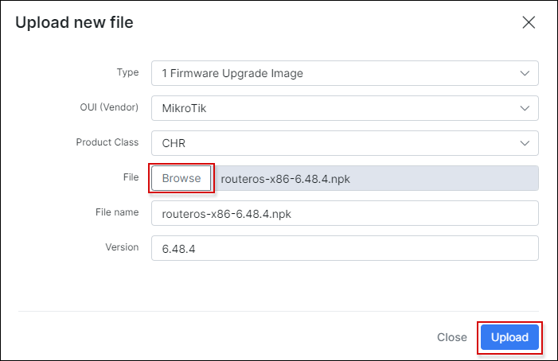
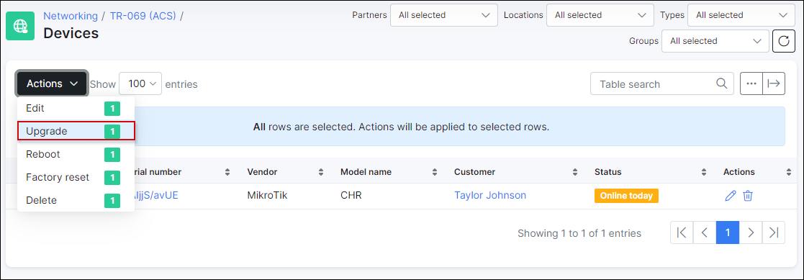

Files and upgrades
==========

**TR-069** is also used to manage the CPE’s firmware, allowing service providers to remotely upgrade their devices without the involvement of customer or extra engineer.
The *Download RPC* mechanism to directly upload files is shown below.

**NOTE:** `GenieACS` is required to be installed. The router should be configured and connected to Splynx. More information how to do this you can find in the next tutorials:
- [ACS services and server configuration](networking/tr069_acs/services_server_config/services_server_config.md)
- [Device connection, types, groups and auto-provision flow](networking/tr069_acs/dev_connection_types_groups_provision/dev_connection_types_groups_provision.md)

Let's consider the step-by-step instruction how to update *RouterOS* and *tr069-client* package on the Mikrotik device.

| Warning:  |
| ------------ |
| **Before performing the update/upgrade in production, it's strongly recommended to try to update/upgrade your locally tested device and make sure that CWMP communication is resumed with a new version and required ROS functionality works. Then, repeat steps by updating groups of CPEs incrementally. Do not update all remote devices at once**|

**STEP 1**

Under **Files** you can upload some update files or configuration files for a devices.


To add a new file, click on **Upload** button:



The next fields are presented here:

* **Type** - `FileType` values of *Remote procedure calls* which are defined by *CPE WAN Management Protocol (CWMP)* standard and indicate the purpose of the file download;

   - **1 Firmware Upgrade Image** - used to update of firmware. MikroTik's update is package based, that's why it is required to use *XML* file to describe firmware upgrade/downgrade files. Such *XML* file supports providing multiple URLs of files, which will be downloaded and applied. CPE will download XML, parse/validate its contents, download files from provided URLs and try to upgrade;

   - **2 Web Content** - is intended to be used for downloading files that contain only web content for a CPE’s web-based user interface;

   - **3 Vendor Configuration File** - used to perform complete configuration overwrite (as intended by standard) or configuration alteration (when URL's filename extension is ".alter");

   - **4 Tone File** - the tone data object used to voice service function of a CPE specified in *TR-104*. It defines the contents of the tones and announcements generated locally by the VoIP device;

   - **5 Ringer File** - the ringer data object used to voice service function of a CPE specified in *TR-104*. It defines the ring sequences generated by the VoIP device;

   - **X Mikrotik Factory Configuration File** - used to change of the RouterOS default configuration script that is executed when `/system reset-configuration` command is executed (or the other means when router configuration is being reset);


* **OUI (Vendor)** - an organizationally unique identifier of the device manufacturer;

* **Product Class** - identifier of the class of product for which the serial number applies. That is, for a given manufacturer, this parameter is used to identify the product or class of product over which the *SerialNumber* parameter is unique;

* **File** - used to choose the file, e.g. `routeros-x86-6.48.4.npk` to upload;

* **File name** - name of the file as it is written to the CPE’s memory, it will be extracted from the downloaded file itself;

* **Version** - used to indicate the version of the uploaded file.

We are going to update Mikrotik CHR *RouterOS* and *tr069-client* package from `v6.48` to `v6.48.4`, so the files `routeros-x86-6.48.4.npk` and `tr069-client-6.48.4.npk` were downloaded from https://mikrotik.com/download site on our local computer.

**STEP 2**

| NOTE:  |
| ------------ |
| **It is recommended to use **HTTPS** in production for firmware management.** HTTP should only be used when testing initial setup in the secured/private network because Man-in-the-middle attacker could read/change configuration parameters.|

It's required to create *XML* file with this content:

```
<upgrade version="1" type="links">
   <config/>
   <links>
       <link>
          <url>https://splynx_domain:7567/routeros-x86-6.48.4.npk</url>
       </link>
       <link>
          <url>https://splynx_domain:7567/tr069-client-6.48.4.npk</url>
       </link>
   </links>
</upgrade>

```

After that upload 3 files using `Upload` button in `Networking → TR-069 (ACS) → Files` menu of Splynx.


**STEP 3**

Once files have been uploaded, you can use them to update/upgrade a device in `Networking → TR-069 (ACS) → Upgrades` menu. The next step is to add `ACS upgrade batch` item.


The next fields are available here:

* **Group** - the ACS group created in `Config → Networking → TR-069 (ACS) → Groups (section)`;

* **Original version** - the current version of package (-s) on the device (-s);

* **File** - the file that will be uploaded to the device. The files are filtered by the selected `group`. The option `Upload new` helps to upload new file to `Networking → TR-069 (ACS) → Files` in case it wasn't done on the previous step;

* **New version** - the version to which device will be updated/upgraded;

* **Days** - the days where update/upgrade will be performed;

* **Hours** - the hours where update/upgrade will be performed;

* **Event** - on which event (`Boot` or `Inform`) the update/upgrade has to be triggered;

* **Max number of attempts** - number of attempts to update the device;

* **Max devices per day** - defines how many devices can be updated on the same day. By default: `0` value = unlimited.

Select previously uploaded `upgrade_6.48.4.xml` file in the **File** field and other parameters as shown on the screenshot above. Double check the `Devices for upgrade` list.

After `ACS upgrade batch` is added, we can view its info, edit the parameters or remove it. Below we can see devices which are due to be updated/upgraded or have already been updated/upgraded. The devices are detected by selected group and version.


The other options available here:

* **Find new devices** - helps to find new devices which are not listed but match the current batch parameters and add such devices to the update/upgrade queue;

* **Force upgrade (now)** - the forced run of update/upgrade on specific device;

* **Discard upgrade** - to remove device from update/upgrade queue.

Moreover, you can use `Upgrade` action from mass `Actions` drop-down list in `Networking → TR-069 (ACS) → Devices` to upload selected files on particular devices.



**STEP 4**

Finally, reboot the necessary device using [Winbox](https://mt.lv/winbox64) or directly via **GenieACS** interface. After that, wait 1 minute and reconnect to device, double check its *RouterOS*/package version.

The device status can be monitored in `Networking → TR-069 (ACS) → Upgrade → View ACS upgrade batch` as well. After 30 minutes Splynx checks if the version on the device is up to date and only then the status will be changed to *Ready* or to *Error* in case the version has not been changed.


If something doesn't work, you can try to find the solution in [Troubleshooting](networking/tr069_acs/troubleshooting/troubleshooting.md) section or contact our support team via ticket.
