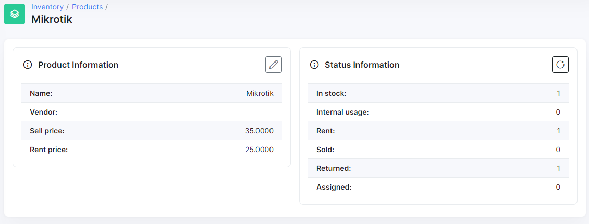
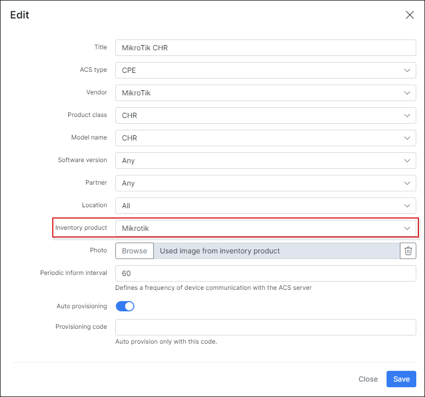
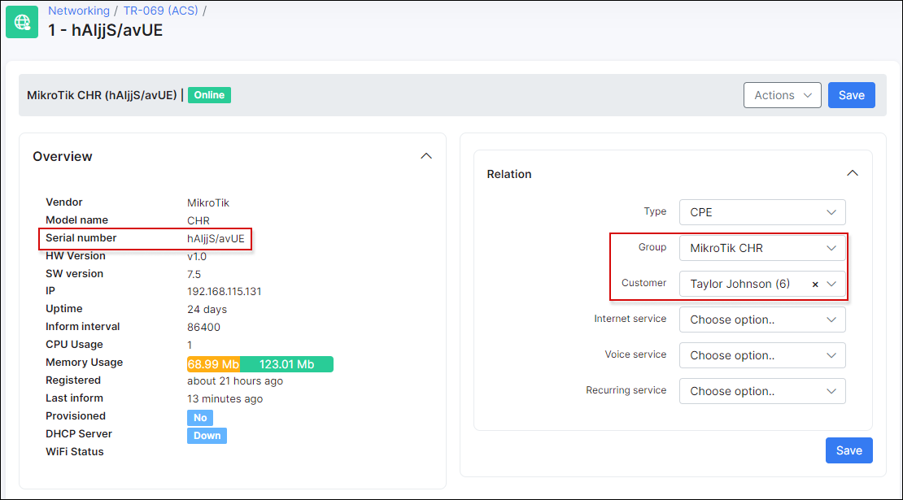
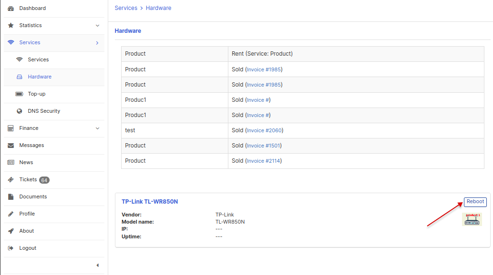

Key features
==========

<b>Relation with inventory</b>

It is possible  to **assign device by ACS identifier (Barcode or Serial number) to customer** before device establishes first connection to ACS. Splynx checks for some value in a field `Barcode` of inventory item, if `Barcode`, on the first connection, matches with `Serial number` device field - customer will be linked automatically. If field `Barcode` is empty or does not match `Serial number` of a device - in this case field `Serial number` will be used from inventory item. In this way you can add an inventory item with a barcode or serial number specified and assign it to a customer:

After this you can setup some group and auto provisioning, for example to push PPPoE login & password, WI_FI SSID & password on first connect. During the first connection a TR-069 device will be automatically assigned to a customer and an initial configuration will be pushed:

and after first connect:

------------

<b>Device management by customer from Portal page</b>

The customer can **reboot the router and change SSID and Wi-Fi password for assigned devices** directly from portal page on menu `Service → Hardware`:

------------
