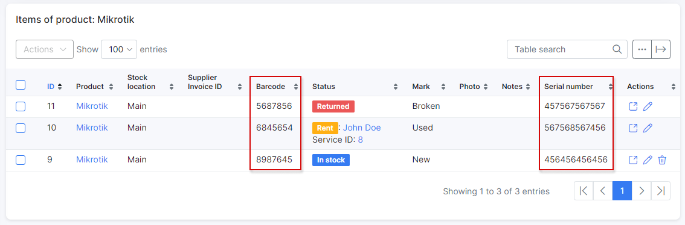

Key features
==========

<b>Relation with inventory</b>

It is possible  to **assign device by ACS identifier (Barcode or Serial number) to customer** before device establishes first connection to ACS. Splynx checks for some value in a field `Barcode` of inventory item. If `Barcode`, on the first connection, matches with `Serial number` device field, customer will be linked automatically. If field `Barcode` is empty or does not match `Serial number` of a device, in this case, field `Serial number` will be used from inventory item. This way you can add an inventory item with a barcode or serial number specified and assign it to a customer:

After this, you can setup some group and auto provisioning. For example to push PPPoE login & password, WI_FI SSID & password on first connect. During the first connection, a TR-069 device will be automatically assigned to a customer and an initial configuration will be pushed (*Config → Networking → TR-069 (ACS)* `Groups → Edit group`):

And after the first connect:

------------

<b>Device management by customer from Portal page</b>

The customer can **reboot the router and change SSID and Wi-Fi password for assigned devices** directly from portal page on menu `Services → Hardware`:

------------
