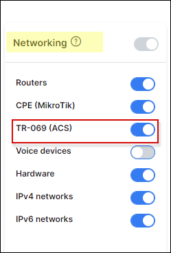
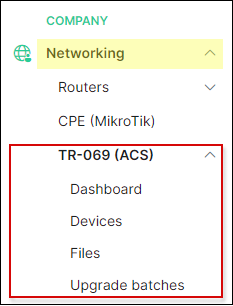
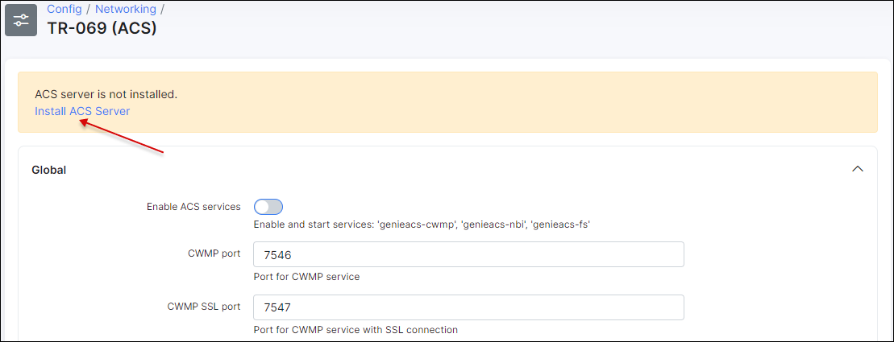
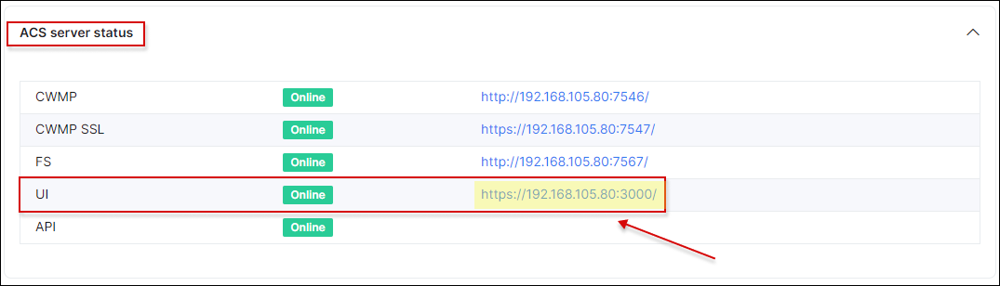

ACS services and server configuration
==========

## Enable ACS services

To enable ACS in Splynx, navigate to `Config → Integrations` and find **Main modules** button:

and enable a toggle for **TR-069 (ACS)**:

Once **TR-069 (ACS)** is enabled you will see a new sector under left side menu under `Networking`section:

## ACS server configuration

Let's start configuring the ACS server:

### Step 1

Navigate to `Config → Networking → TR-069 (ACS)` and click on install the ACS server:

Once it was installed specify its **global** parameters:

Here we have the next options:

* **Enable ACS services** - enable/disable ACS servicesn such as *genieacs-cwmp*, *genieacs-nbi*, *genieacs-fs*. Can be used to reboot the ACS server;

* **SSL enabled by default** - enable/disable using of domain name except of IP for access. Can be enabled only if *HTTPS/SSL* is configured under `Config → Main → HTTPS/SSL`;

* **Allowed networks** - list of allowed networks for connecting to cwmp service. To allow all host use `all` value;

* **Username** - using for authorization to connect to cwmp service. ATTENTION!: authorization is possible only if username and password fields are not empty;

* **Password** - using for authorization to connect to cwmp service. ATTENTION!: authorization is possible only if username and password fields are not empty;

* **Hostname** - hostname without protocol and port (*192.168.105.80* or *mysplynx.com* depending on your configuration);

* **Periodic inform inverval (seconds)** - interval on how often Splynx will sync with an ACS.

Don't forget to click on **Save** button when configuration is completed.

### Step 2

On the same menu `Config → Networking → TR-069 (ACS)` let's configure ACS User Interface parameters:

* **Enable ACS UI** - enable/disable an access via web interface;

* **Allowed networks** - specify allowed networks from which you can access to the ACS UI. To allow all hosts, please add the `all` value;

* **UI username** - username for UI access. ATTENTION!: authorization is possible only if username and password fields are not empty;

* **UI password** - password for UI access. ATTENTION!: authorization is possible only if username and password fields are not empty.

Don't forget to click on **Save** button when configuration is completed.

### Step 3

Click on a link for **UI** here:

And you should be redirected to the *Genie ACS page*, if you prompted for login/password use the credentials from a **step 2**.

After successful login you will see a window as in the screenshot below, you should click on "ABRACADABRA" button.

**IMPORTANT:** **All check-boxes should be selected except _Presets and Provisions_**.

**The default username and password for GenieACS are**: `admin` / `admin`

Once this done, you will see **GenieACS dashboard**:

