TR-069 (ACS - Auto configuration server)
==========

Starting from Splynx 3.1 version we have in-built ACS server based on [GenieACS](https://genieacs.com/) - open source TR-069 remote management solution with advanced device provisioning capabilities. GenieACS can work with any device that supports the TR-069 protocol. It auto-discovers the device’s parameter tree (including vendor-specific parameters) making no assumptions about the device’s data model.

Using Splynx you can configure devices directly from Splynx web page.

To enable ACS in Splynx, navigate to **Config/Integrations** and find **Main modules** button:


and enable a toggle for **TR-069(ACS)**:

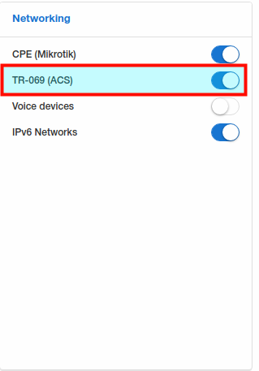

Once *TR-069 (ACS)* is enabled you will see a new sector under left side menu under topic *Networking*:

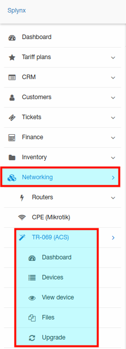


Let's start configuring the ACS server:

##### Step 1

Navigate to **Config/Networking/TR-069(ACS)** and install the ACS server:

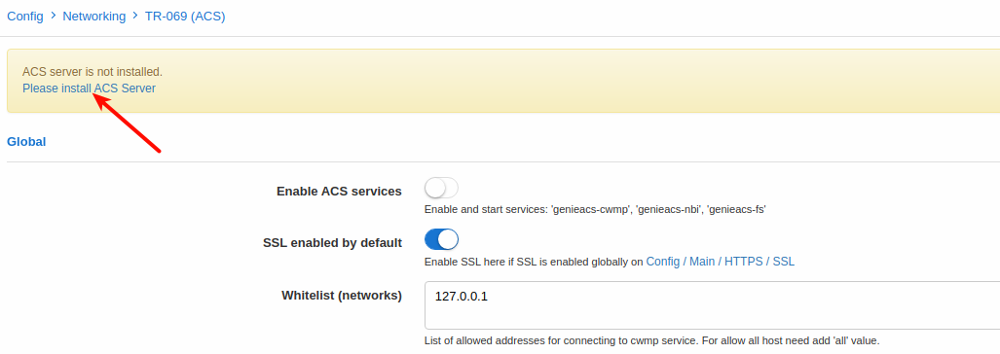

Once installed specify global parameters:

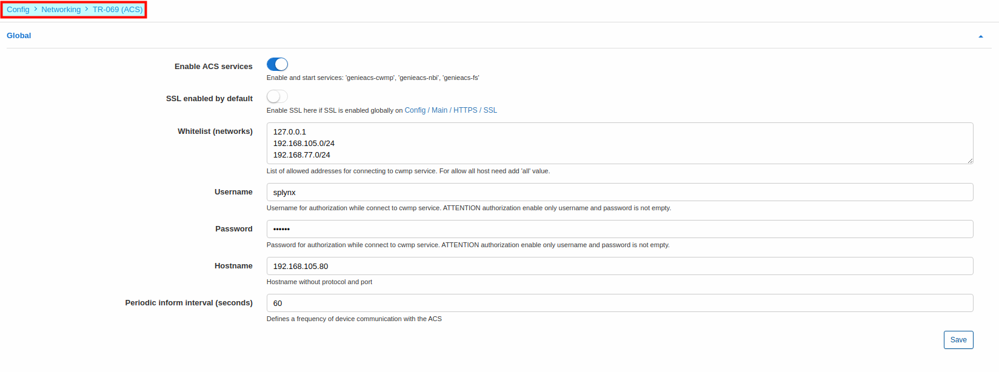

Here we have next options:

* **Enable ACS services** - enable/disable ACS services. Can be used to reboot of ACS server;

* **SSL enabled by default** - enable/disable using of domain name except of IP for access. Enable only if HTTPS/SSL enabled under *Config / Main / HTTPS/SSL*;

* **Allowed networks** - list of allowed networks for connecting to cwmp service. To allow all host use 'all' value;

* **Username** - using for authorization to connect to cwmp service. ATTENTION - authorization enabled only if username and password is not empty;

* **Password** - using for authorization to connect to cwmp service. ATTENTION - authorization enabled only if username and password is not empty;

* **Hostname** - hostname without protocol and port(*192.168.105.80* or *mysplynx.com* depending on your configuration);

* **Periodic inform inverval(seconds)** - interval on how often Splynx will sync with an ACS.

Don't forget to click on "Save" button when configuration is completed.

##### Step 2

On the same menu **Config/Networking/TR-069(ACS)** let's configure ACS User Interface parameters:

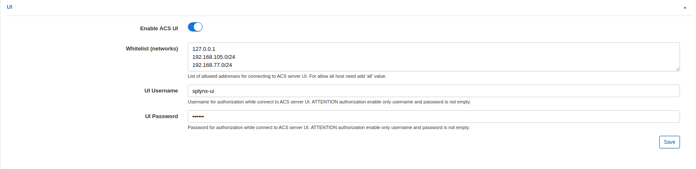

* **Enable ACS UI** - enable/disable an access via web interface;

* **Allowed networks** - specify allowed networks from which you can access to the ACS UI;

* **UI username** - username for UI access;

* **UI password** - password for UI access.

Don't forget to click on "Save" button when configuration is completed.

##### Step 3

Click on a link for UI here:

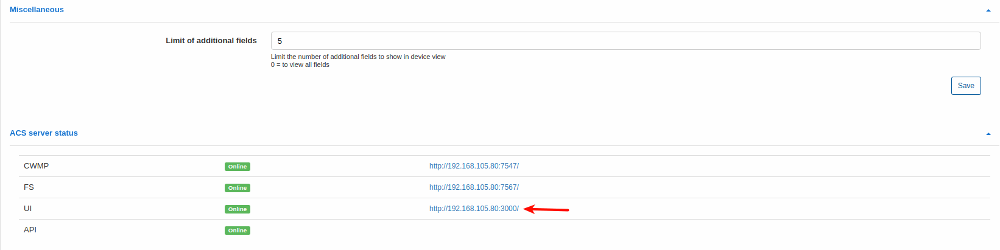

And you should be redirected to the Genie ACS page, if you prompted for login/password use a login/password from a previous step.

After successful login you will see this window where you should click on "ABRACADABRA" button.

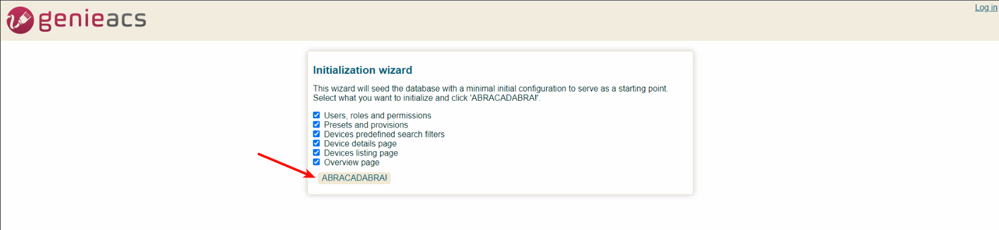

The default username and password for GenieACS: admin/admin

Once this done, you will see GenieACS dashboard:

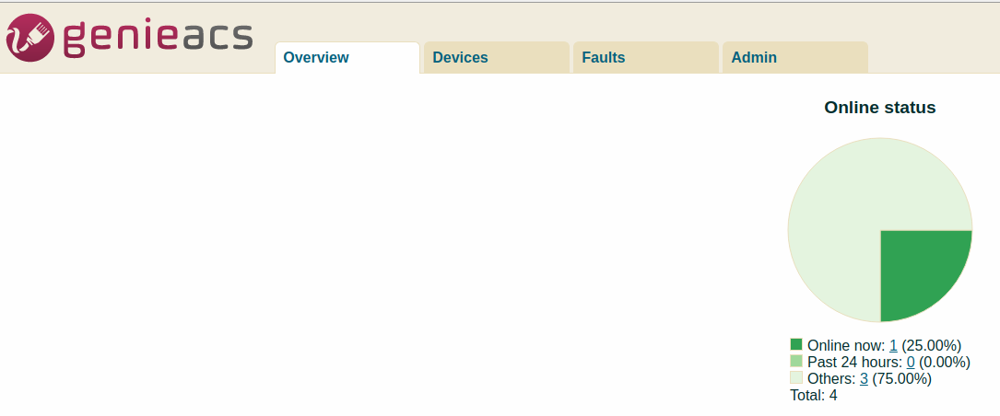

Main parameters for ACS are configured, you can use this feature now. Also we have a few more options to configure: Attributes, Types and Groups.

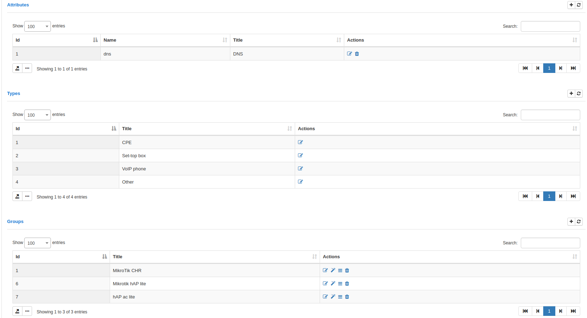

##### Types:

Simply add different types of devices:

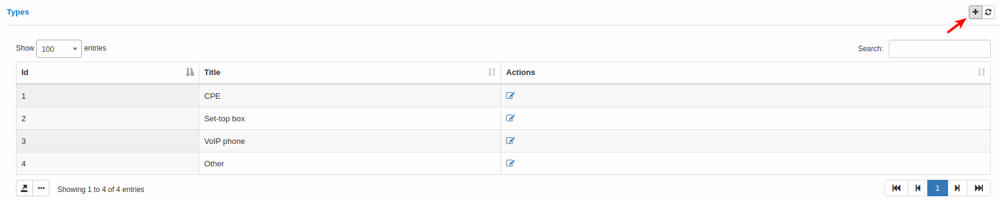

**NOTE!** Before starting to configure the *Groups*, [add the router](networking/routers_settings/routers_settings.md) to *Networking* section.

##### Groups:

Under groups you can create new entries to group devices.

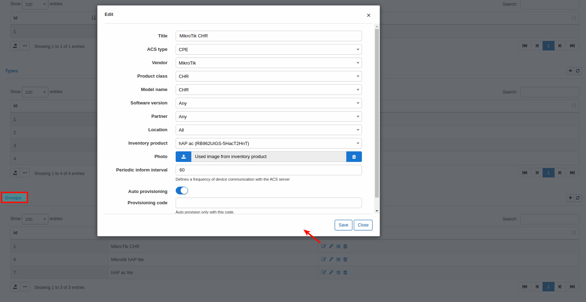

Here can be selected the next parameters and the inventory product code (if existed), selected photo of device etc. You can use next tool to grab some parameters from a device:

Groups are using for auto-provision devices and load device's parameters and properties from correct TR069 attributes.

Once some device is added you can create a group base on that device, provision configuration parameters from this device, edit them and save. After that these parameters can be used for configuration of other devices from this group using the existed parameters.

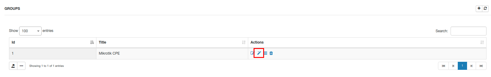

We have a few options here:

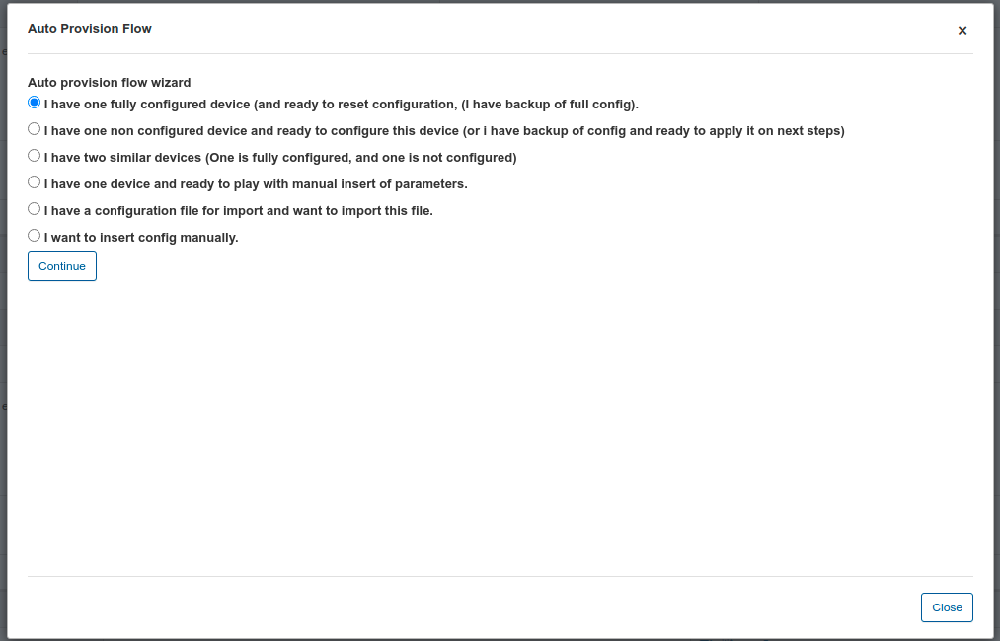

- **I have one fully configured device (and ready to reset configuration, (I have backup of full config)** - this option can be used when you have configured one device (Device 1) of this type and you need to configure another clear device (Device 2) with existed parameters. Splynx will grab parameters from Device 1, check what parameters can be used for Device 2 configuration and pull these changes. Or you have a backup what can be used for configuration;

- **I have one non configured device and ready to configure this device (or I have backup of config and ready to apply it on next steps)** - vice versa to a previous method;

- **I have two similar devices (One is fully configured, and one is not configured)** - need 2 devices, one is fully configured and another one is not-configured. The configuration from both routers will be downloaded, only after that this config can be updated;

- **I have one device and ready to play with manual insert of parameters** - download configuration from a device and edit this config manually;

- **I have a configuration file for import and want to import this file** - in this step you need to import a .csv file with a configuration what can be imported;

- **I want to insert config manually** - manual way to configure a device;

After this step you will see a window with available attributes:

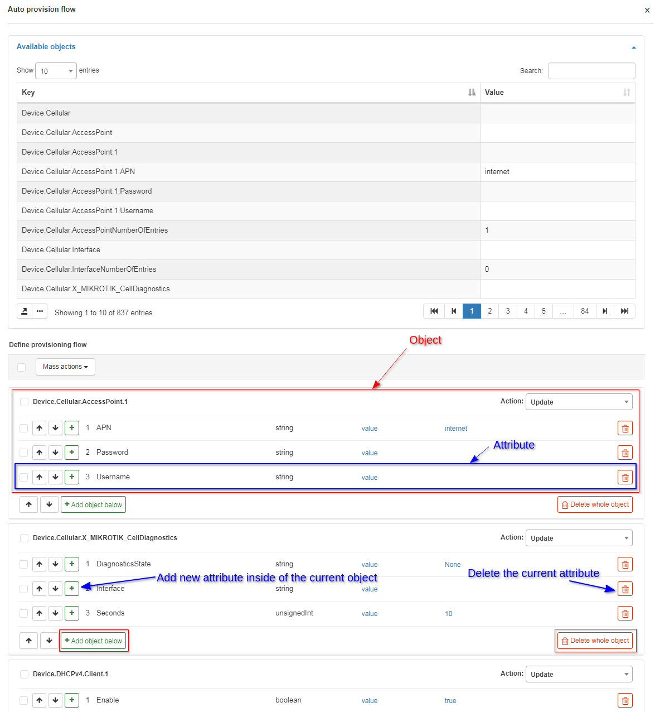

You can add new items or edit existing. In the specific field you can select one attribute and choose a lot of other options.

If you select *template* option you can use twig to create field value.

By click on additional button near "Save" button you can preview, export settings into a .csv format (for future, use it for configuration of other devices) or import an existing .csv file with settings.

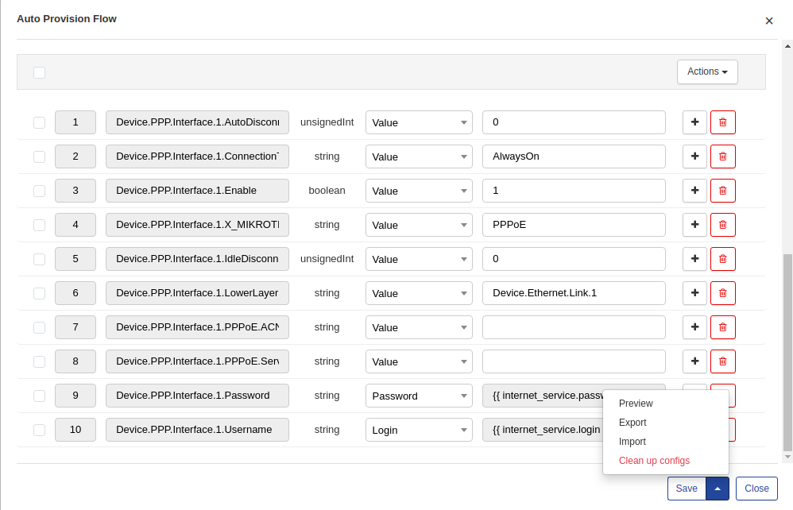


Also you can view custom attributes here:

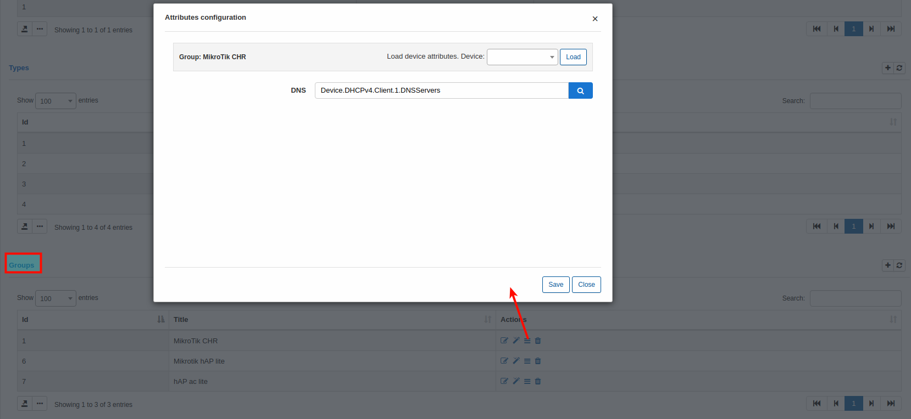

##### Attributes:

Here can be added some custom attributes to be displayed under ACS devices in Splynx. For example, we need to display a DNS attribute on the main info of device:

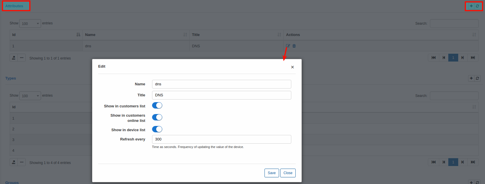

Once the attribute is added, you need to connect some devices to proceed with its configuration.

You will be able to display all these attributes:

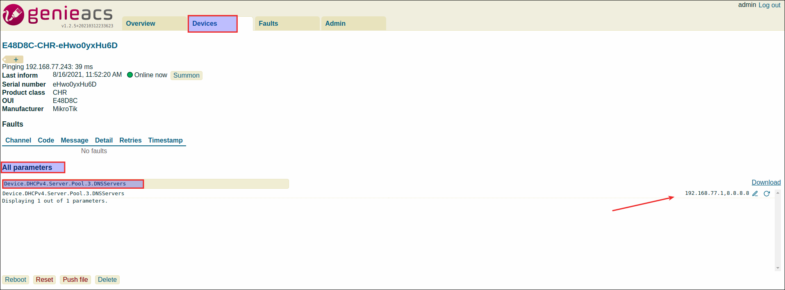

Once some devices are added and you have groups available, click on "Attributes config" near some group:

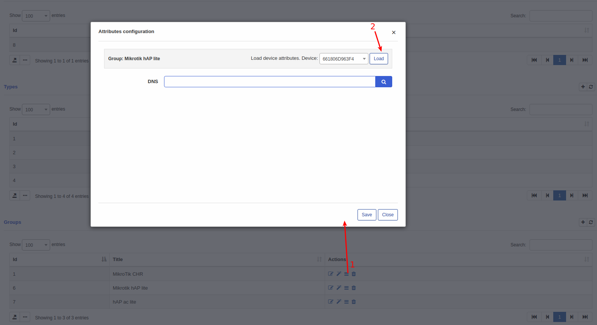

Select a device and click on "Load" button to load attributes. In this guide a Mikrotik device is used as an example. After the load, the attributes are ready to use:

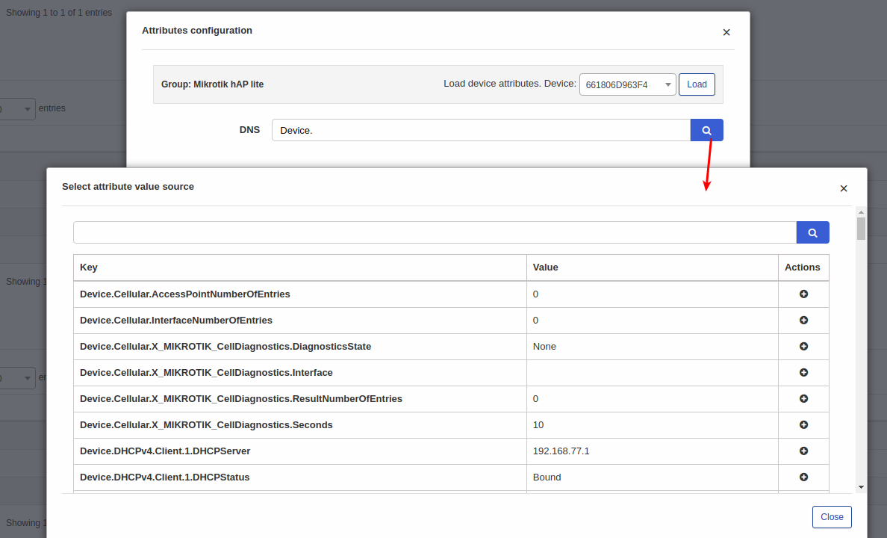

and after its configuration you'll see the attribute values on the device overview.

### Connect the device

Let's add some TR-069 client. We will use a Mikrotik device as an example. First of all, TR-069 package should be installed on Mikrotik. If this package is not installed, use the next steps to install it:

1. Open Winbox and connect to the router;

2. Update router to latest stable version *System > Packages > Check for updates* and update if required;

3. Navigate to Mikrotik Downloads and download the package for your device;

4. Extract the downloaded archive and find tr069-client-X.XX.npk;

5. Upload tr069-client-X.XX.npk into your device and reboot Mikrotik (System > Reboot);

6. After reboot you should see a TR-069 option in menu:

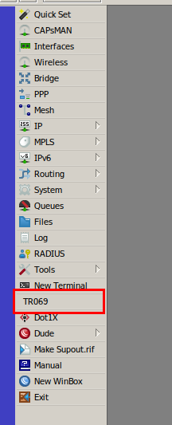

Click on TR069 item and configure connection to the ACS:

1. Enable client;

2. ACS URL is a URL from menu on step 3 for a CWMP (ends with port 7547);

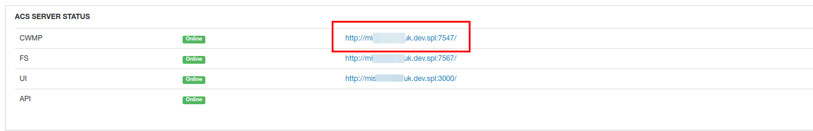

If you noticed we are using here another URL - it's because we changed a hostname from IP 192.168.105.80 to a domain name.

3. Specify username and password with values from global parameters (Step 1);

4. Enable "Periodic Inform Enabled".

That's all. After that you should see next:

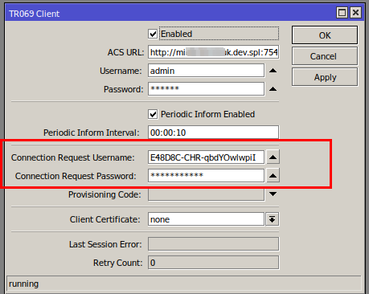

Should appear "Connection Request Username" and "Connection Request Password" - do not change these parameters (only when you need to reconnect this device with an ACS, these values can be removed and re-enable client - with new connection you will see a new values).

**Important note for Mikrotik devices**: if you are using HTTPS/SSL on your Splynx server you can get an error about SSL, asking for the local certificate. In this case you need to run 2 commands in Mikrotik terminal:

```
/tool fetch https://letsencrypt.org/certs/trustid-x3-root.pem.txt
/certificate import file-name=trustid-x3-root.pem.txt passphrase=""
```
and do not change any other config in TR-069 client ("Client certificate" option must be "none"), just re-enable TR-069 client.

After that device will be registered under GenieACS:

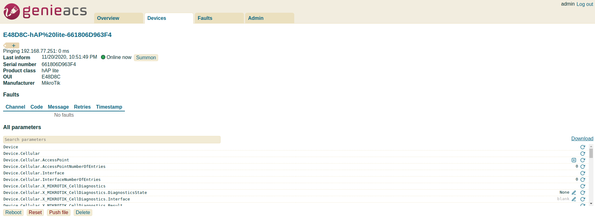

as well under Splynx:

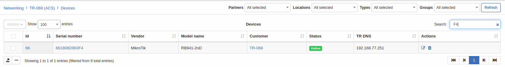

Devices can be in statuses: Online, Online today, Offline.

Let's see on device control menu:
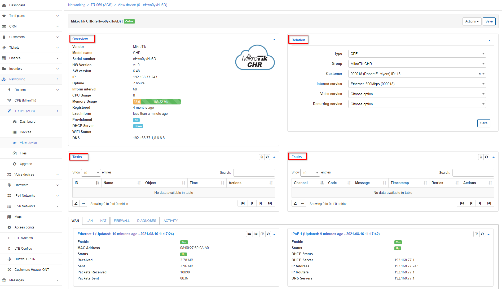

On the **Overview** tab you can see basic parameters like uptime, IP. CPU usage etc.

On the **Relation** tab you can set type of device (type should be created under Config/Networking/TR-069/Types), group (should be created as well) also the customer and their services can be linked to this device.

On **Tasks** tab you will see the pending tasks (like you run a wi-fi password change and task will be created).

On **Faults** tab you will see the tasks what were executed with the errors.

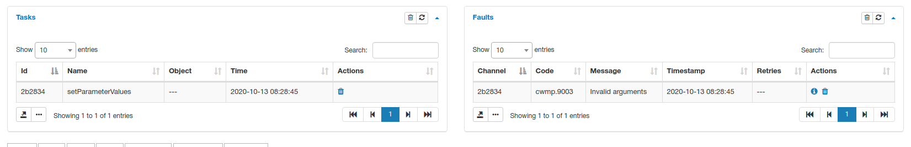

When click on **Actions** button you can find next options:

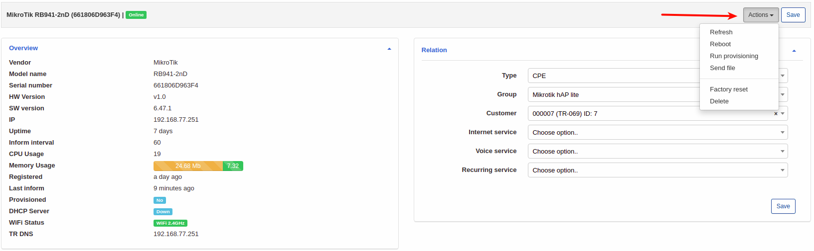

- *Refresh* - you can use it to refresh device connection between ACS and Splynx;
- *Reboot* - remotely reboot a device;
- *Run provisioning* - run provisioning for a device;
- *Send file* - send some file to a device;
- *Factory reset* - reset to factory settings;
- *Delete* - delete this device from the ACS (if the device connected to the network it will return to the list. TR-069 client need to be disabled on a device in case you don't want this device to appear on the ACS again).

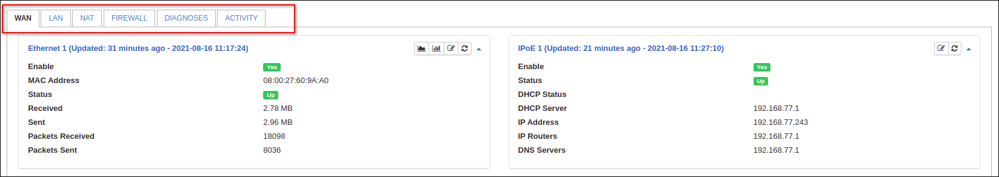

This view can change depends on device what you are using. This screenshot was made from a Mikrotik device. Switch between available tabs to configure needed parameters.

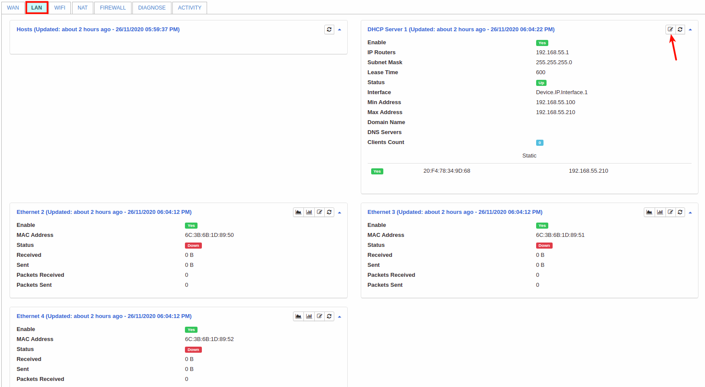

As an example we can change a DHCP server parameters:

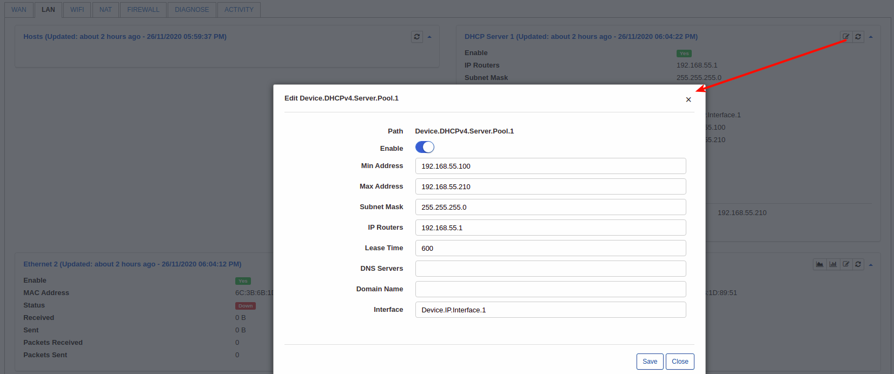

or add some firewall rules right here:

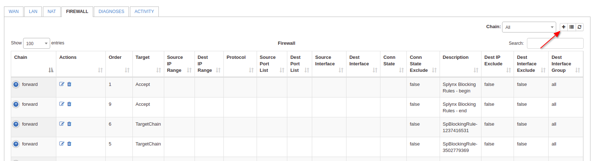

On *Diagnostic* tab you can find diagnostic tools like ping, traceroute, upload/download statistic and wifi-analyzer:

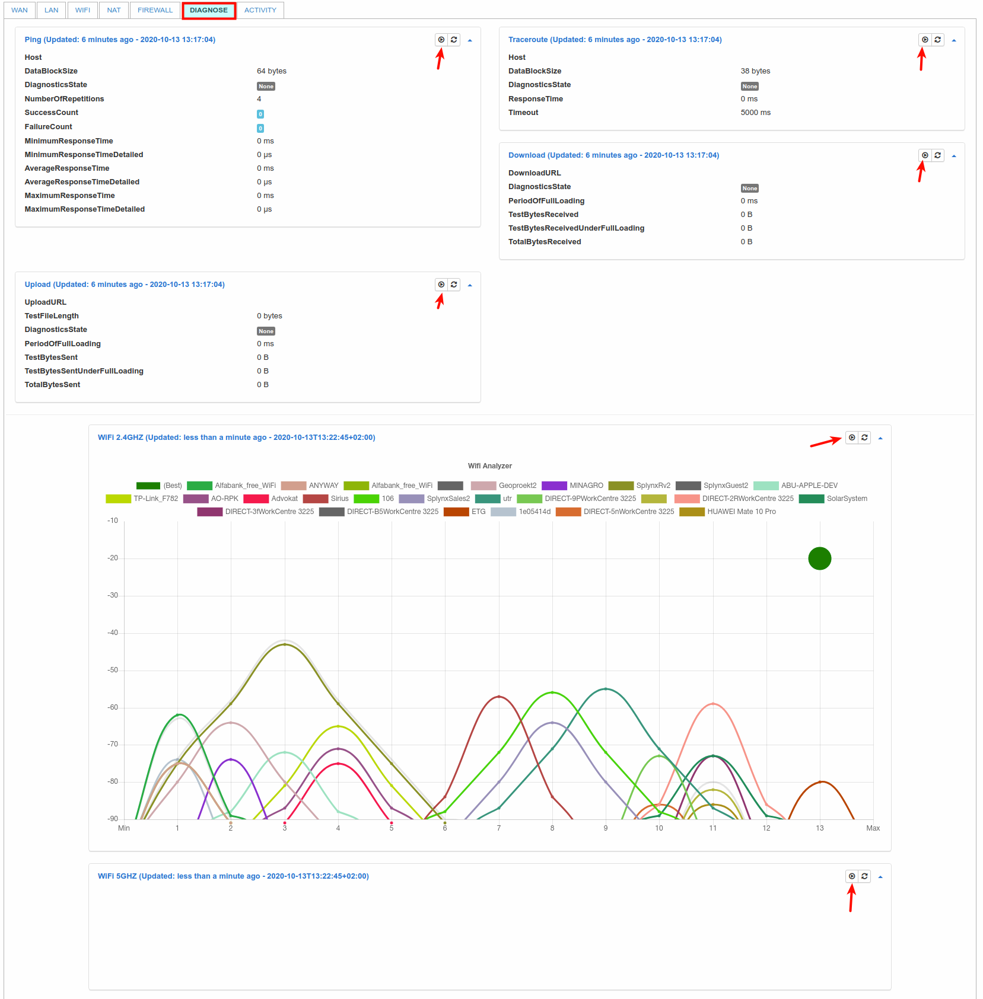

To run some diagnostic tool click on "Run" button near each tool.

**NOTE! This menu can differ depending on a device. These screenshots were made on a Mikrotik device.**

Wi-fi analyzer shows all the available wi-fi networks and signal strength near a device.

Debug logs can be found under **Administration / Logs / Files** and find files by word "genie":

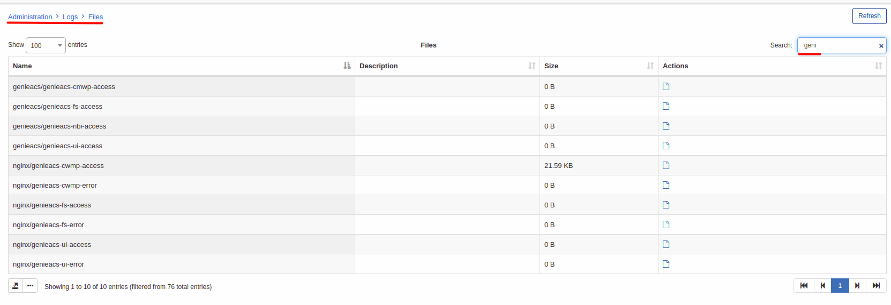


# Files and upgrades

Under **Files** you can upload some update files, or configuration files for a devices.

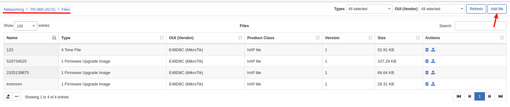

To upload a new file click on "Add file":

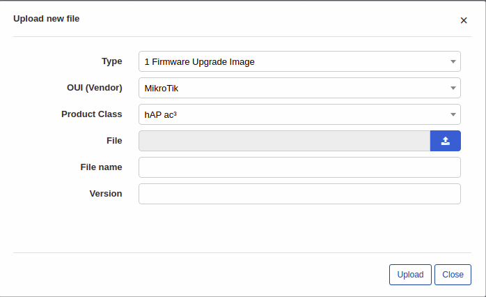

Once files uploaded, you can use them to upgrade a devices under **Upgrades** menu:

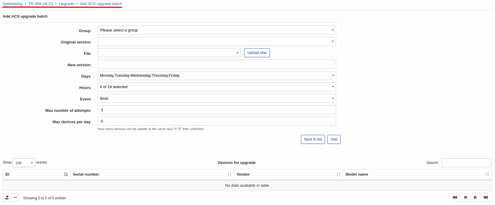

Now we can see devices for the upgrade (from this group) and some parameters for an update can be specified.

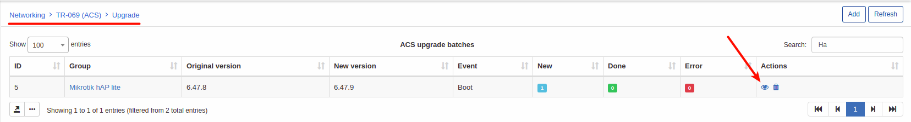

Click on this button to update a device.

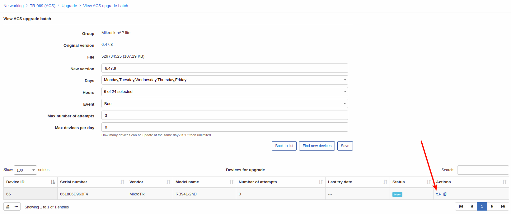
