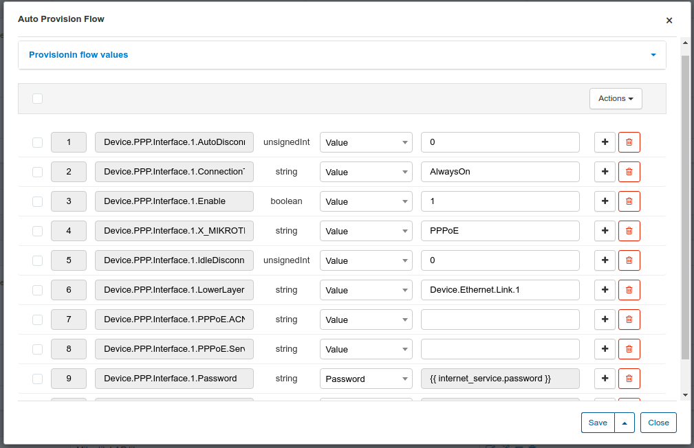
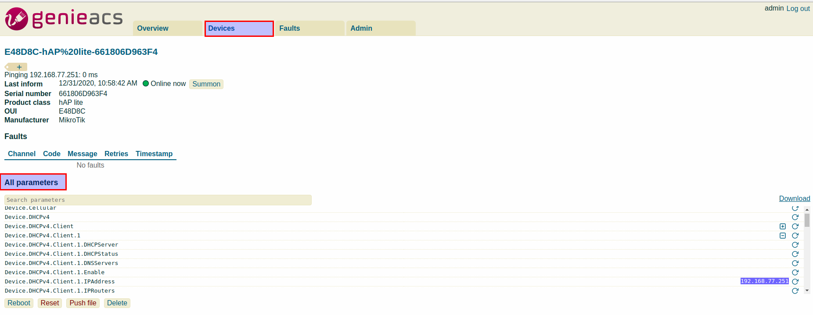
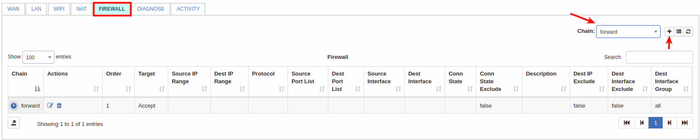

TR-069 (ACS - Auto configuration server)
==========

Starting from Splynx v3.1 we have in-built ACS server based on [GenieACS](https://genieacs.com/) - open source TR-069 remote management solution with advanced device provisioning capabilities. GenieACS can work with any device that supports the TR-069 protocol. It auto-discovers the device’s parameter tree (including vendor-specific parameters) making no assumptions about the device’s data model.

You can configure devices directly from Splynx web page.

## Enable ACS services

To enable ACS in Splynx, navigate to `Config → Integrations` and find **Main modules** button:


and enable a toggle for **TR-069 (ACS)**:


Once **TR-069 (ACS)** is enabled you will see a new sector under left side menu under `Networking`section:


## ACS server configuration

Let's start configuring the ACS server:

### Step 1

Navigate to `Config → Networking → TR-069 (ACS)` and click on install the ACS server:


Once it was installed specify its **global** parameters:


Here we have the next options:

* **Enable ACS services** - enable/disable ACS servicesn such as *genieacs-cwmp*, *genieacs-nbi*, *genieacs-fs*. Can be used to reboot the ACS server;

* **SSL enabled by default** - enable/disable using of domain name except of IP for access. Can be enabled only if *HTTPS/SSL* is configured under `Config → Main → HTTPS/SSL`;

* **Allowed networks** - list of allowed networks for connecting to cwmp service. To allow all host use `all` value;

* **Username** - using for authorization to connect to cwmp service. ATTENTION!: authorization is possible only if username and password fields are not empty;

* **Password** - using for authorization to connect to cwmp service. ATTENTION!: authorization is possible only if username and password fields are not empty;

* **Hostname** - hostname without protocol and port (*192.168.105.80* or *mysplynx.com* depending on your configuration);

* **Periodic inform inverval (seconds)** - interval on how often Splynx will sync with an ACS.

Don't forget to click on **Save** button when configuration is completed.

### Step 2

On the same menu `Config → Networking → TR-069 (ACS)` let's configure ACS User Interface parameters:


* **Enable ACS UI** - enable/disable an access via web interface;

* **Allowed networks** - specify allowed networks from which you can access to the ACS UI. To allow all hosts, please add the `all` value;

* **UI username** - username for UI access. ATTENTION!: authorization is possible only if username and password fields are not empty;

* **UI password** - password for UI access. ATTENTION!: authorization is possible only if username and password fields are not empty.

Don't forget to click on **Save** button when configuration is completed.

### Step 3

Click on a link for **UI** here:


And you should be redirected to the *Genie ACS page*, if you prompted for login/password use the credentials from a **step 2**.

After successful login you will see a window as in the screenshot below, you should click on "ABRACADABRA" button.


**The default username and password for GenieACS are**: `admin` / `admin`

Once this done, you will see **GenieACS dashboard**:


## Connect your Mikrotik device

We will use a Mikrotik device with TR-069 client as an example.

First of all, **TR-069 package** should be installed on Mikrotik. If this package is not installed, use the next steps to install it:

1. Open [Winbox](https://mt.lv/winbox64) and connect to the router (use [Wine](https://wiki.winehq.org/Ubuntu) to run Winbox on Ubuntu);

2. Update router to latest stable version `System → Packages → Check for updates` and update if required;

3. Navigate to Mikrotik [download page](https://mikrotik.com/download) and download the package for your device;

4. Extract the downloaded archive and find `tr069-client-X.XX.npk`;

5. Upload `tr069-client-X.XX.npk` file into your device and reboot Mikrotik (`System → Reboot`);

6. After reboot you should see a **TR-069** option in menu:


Click on **TR069** item and configure **connection to the ACS server**:

1. Put the check-mark to **Enable** client;

2. Put your **ACS URL** - it's a *URL* from menu on **step 3** for a *CWMP* (ends with port `:7547/`);


In our example, we are using the *domain name* instead of IP address - *192.168.105.80*.

3. Specify username and password with values from **global** parameters (**step 1**);

4. Enable **Periodic Inform Enabled** option.

After these steps you should have the next result:


The values in **Connection Request Username** and **Connection Request Password** fields should appear automatically. **Do not change these values unless absolutely necessary** (e.g. when you need to reconnect your device with an ACS server, these values can be removed and re-enable client - with new connection you will see a new values)..

**IMPORTANT (for Mikrotik devices only)**: if you are using **HTTPS/SSL** on your Splynx server you can get **an error about SSL, asking for the local certificate**. In this case you need to run 2 commands in Mikrotik terminal:

```
/tool fetch https://letsencrypt.org/certs/trustid-x3-root.pem.txt
```
```
/certificate import file-name=trustid-x3-root.pem.txt passphrase=""
```
and **do not change any other config in TR-069 client** (**Client certificate** option must be "none"), just **re-enable TR-069 client**.

After that device will be registered under GenieACS:


as well as under Splynx:


Devices can be in the following statuses: `Online`, `Online today`, `Offline`.

Main parameters for ACS are configured and device is connected so you can manage the device remotely now. Also we have a few more options to configure: **Attributes**, **Types** and **Groups**.


## Types:

Simply add different types of devices:


## Groups:

**NOTE!** Before configuring ACS groups you need to connect some device to ACS server.

Under groups you can create new entries to group devices.


Here can be selected the next parameters and the inventory [product](inventory/products/products.md) name (if existed), selected photo of device etc. You can use auto-provision feature to grab some parameters from a device.

Groups is used for **auto-provision** devices and load device's parameters and properties from the correct TR069 attributes.

Once some device is added you can create a group base on that device, provision the configuration parameters from that device, edit such parameters and save. After that these parameters can be used for configuration of other devices based on this group, using previously exported parameters.


We have a few options here:


|   |   |
| ------------ | ------------ |
| **I have one fully configured device (and ready to reset configuration, (I have backup of full config)**  | this option can be used when you have configured one device (Device 1) of this type and you need to configure another clear device (Device 2) with existed parameters. Splynx will grab parameters from Device 1, check what parameters can be used for Device 2 configuration and pull these changes. Or you have a backup what can be used for configuration  |
| **I have one non configured device and ready to configure this device (or I have backup of config and ready to apply it on next steps)**  |  vice versa to a previous method  |
| **I have two similar devices (One is fully configured, and one is not configured)**  | need 2 devices, one is fully configured and another one is not-configured. The configuration from both routers will be downloaded, only after that this config can be updated  |
| **I have one device and ready to play with manual insert of parameters**  | download configuration from a device and edit this config manually  |
| **I have a configuration file for import and want to import this file**  | in this step you need to import a .csv file with a configuration what can be imported  |
| **I want to insert config manually**  | manual way to configure a device |

If to choose **I want to insert config manually** step, you will see a window with the editor of device objects with its attributes. In this configuration menu you can **create** new object and attribute related to the object, **update**, **delete** or apply the **mass actions** (*enable*, *disable*, *delete*) the existing object and its attribute (-s).




We can apply **4 actions to the object**:


- **create** - create an object with the attributes specified in the configuration, but if we already have an object with these attributes, a new object will not be created;
- **update** - update the object's attribute value (-s);
- **delete** - remove all objects according to the path, e.g. object `Device.Firewall.X_MIKROTIK_Filter.Chain.3.Rule` will remove all firewall rules from output chain on Mikrotik;


- **delete with equal condition** - remove the object if the attribute's `value` was specified in the configuration, e.g. remove all the disabled rules in firewall output chain.


If you select **template** as attribute option you can **use twig** to create field value.


Also, by click on additional button near **Save** button


you can **preview**,  **export settings into a .csv format** (for future, use it for configuration of other devices)


**import an existing .csv file** with device settings (**NOTE!:** If there are already some settings on the device, they will be deleted during import)


or **clean up** the existing device config.


## Attributes:

Here we can add the custom attributes to be displayed under ACS devices in Splynx. For example, we need to display a DNS attribute on the main info of device:


Once the attribute is added, you need to connect some devices to proceed with its configuration.

You will be able to display all these attributes:



Once some devices are added and you have groups available, click on **Attributes config** near some group:


Select a device and click on **Load** button to load attributes. After the load, the attributes are ready to use:


and after its configuration you'll see the attribute values on the device overview or in customers list:


Additionally, in device control menu we can find the following sections:


On the **Overview** tab you can see basic parameters like *uptime*, *IP*, *CPU usage* etc.

On the **Relation** tab you can set type of device (**type** should be created under `Config → Networking → TR-069 → Types`), **group** (should be created under `Config → Networking → TR-069 → Groups` as well) also the customer and their services can be linked to this device.

On **Tasks** tab you will see the pending tasks (like you run a wi-fi password change and task will be created).

On **Faults** tab you will see tasks what were executed with an errors.


When click on **Actions** button you can find next options:


- **Refresh** - you can use it to refresh device connection between ACS and Splynx;
- **Reboot** - remotely reboot a device;
- **Run provisioning** - run provisioning for a device;
- **Send file** - send some file to a device;
- **Factory reset** - reset device to its factory settings;
- **Delete** - delete this device from the ACS (if the device is connected to the network it will appear in the list again. First, disable the TR-069 client on the device if you do not want this device to appear on the ACS again).

At the bottom of the page there are additional tabs related to the router: **WAN**, **LAN**, **NAT**, **FIREWALL**, **DIAGNOSES**, **ACTIVITY**:


Switch between available tabs to configure needed parameters. As an example we can **change a DHCP server parameters**:


or **add some firewall rules** right here:



On **Diagnostic** tab you can find such diagnostic tools as:  **ping**, **traceroute**, **upload/download statistic** and **wifi-analyzer**:


To run some diagnostic tool click on **Run** button near each tool.

**NOTE!:** This menu can differ depending on a device, e.g. Mikrotik router can be without а Wi-Fi module.

**Wi-fi analyzer** shows all the **available wi-fi networks** and its **signal strength**.

Debug logs can be found under `Administration → Logs → Files` and find files by word `genie`:


## Files and upgrades

Under **Files** you can upload some update files, or configuration files for a devices.


To upload a new file click on **Add file**:


Once files uploaded, you can use them to upgrade a devices under **Upgrades** menu:


Now we can see devices for the upgrade (from this group) and some parameters for an update can be specified.


Click on this button to update a device.


## Some features description

<details>
<summary><b>Relation with inventory</b></summary>
<p markdown="1">
It is possible  to **assign device by ACS identifier (Barcode or Serial number) to customer** before device establishes first connection to ACS. Splynx checks for some value in a field `Barcode` of inventory item, if `Barcode`, on the first connection, matches with `Serial number` device field - customer will be linked automatically. If field `Barcode` is empty or does not match `Serial number` of a device - in this case field `Serial number` will be used from inventory item. In this way you can add an inventory item with a barcode or serial number specified and assign it to a customer:


After this you can setup some group and auto provisioning, for example to push PPPoE login & password, WI_FI SSID & password on first connect. During the first connection a TR-069 device will be automatically assigned to a customer and an initial configuration will be pushed:


and after first connect:


</p>
</details>

------------

<details>
<summary><b>Device management by customer from portal page</b></summary>
<p markdown="1">
The customer can **reboot the router and change SSID and Wi-Fi password for assigned devices** directly from portal page on menu `Service → Hardware`:


</p>
</details>

------------

### Troubleshooting

Follow these instructions to troubleshoot problems with TR-069 (ACS):

<details>
<summary><b>Can't connect device to ACS</b></summary>
<p markdown="1">

  0. Make sure that device is accessible from Splynx server. Use tools like *ping* or *traceroute* to doublecheck;

  1. Pay attention to the IP restrictions. The requests can be sent only from IPs/networks allowed in this list:

  

  2. Make sure that `CWMP URL`, `username` and `password` that were configured under TR-069 client on a device are correct and ports `7547`, `7567` are opened;

  3. Try to disable firewall on a device to ensure that it's not a firewall issue;

  4. In case of using `HTTPS` - try to disable option `SSL enabled by default`, and use `CWMP URL` like http://splynxserver.com:7547/ instead of **https** at the beginning.

  5. Restart **GenieACS services** using this command - `sudo service genieacs* restart`

</p>
</details>

------------

<details>
<summary><b>Device is registered in Splynx but no communication established</b></summary>
<p markdown="1">
  0. Make sure that device is accessible from Splynx server. Use tools like *ping* or *traceroute* to doublecheck;

  1. Pay attention to the IP restrictions. The requests can be sent only from IPs/networks allowed in this list:

  

  2. Refresh device using this option and wait for the result:

  

  3. Pay attention to sections **Tasks** and **Faults**. Try to remove all tasks and all faults using remove button:

  

  4. Disable **TR-069 client** on a device, remove device from Splynx and enable **TR-069 client** to re-add device in Splynx.
</p>
</details>

------------
