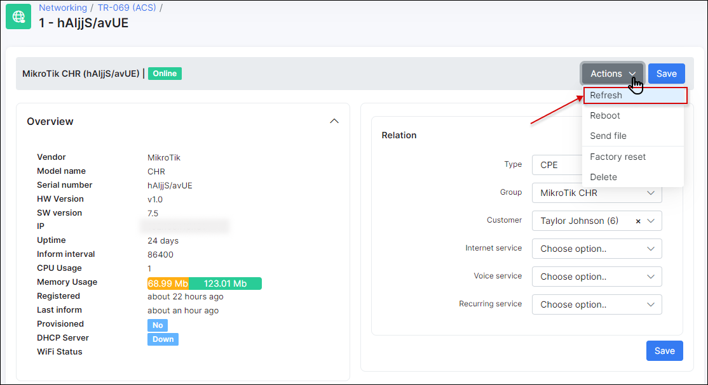
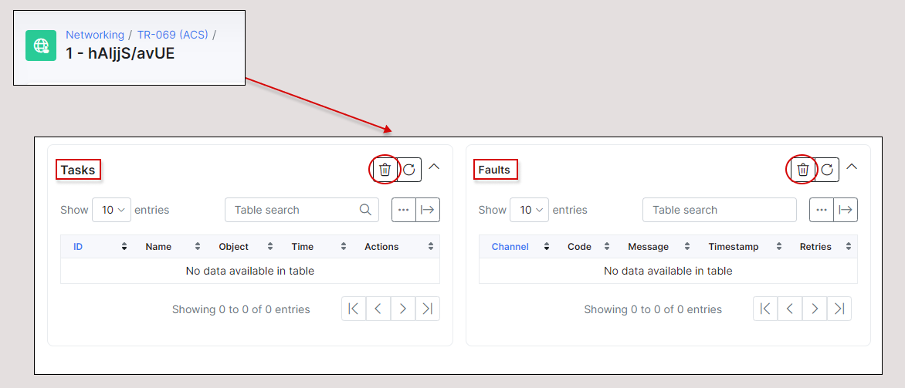

Troubleshooting
==========

Follow these instructions to troubleshoot problems with **TR-069 (ACS)**:

<details style="font-size: 15px; margin-bottom: 5px;">
<summary><b>Can't connect device to ACS</b></summary>
<div markdown="1">

  0. Make sure that device is accessible from Splynx server. Use tools like *ping* or *traceroute* to doublecheck;

  1. Pay attention to the IP restrictions. The requests can be sent only from IPs/networks allowed in this list:

  

  2. Make sure that `CWMP URL`, `username` and `password` that were configured under TR-069 client on a device are correct and ports `7547`, `7567` are opened;

  3. Try to disable firewall on a device to ensure that it's not a firewall issue;

  4. In case of using `HTTPS` - try to disable option `SSL enabled by default`, and use `CWMP URL` like http://splynxserver.com:7547/ instead of **https** at the beginning.

  5. Restart **GenieACS services** using this command - `sudo service genieacs* restart`

</div>
</details>

------------

<details style="font-size: 15px; margin-bottom: 5px;">
<summary><b>Device is registered in Splynx but no connection established</b></summary>
<div markdown="1">

  0. Make sure that device is accessible from Splynx server. Use tools like *ping* or *traceroute* to doublecheck;

  1. Pay attention to the IP restrictions. The requests can be sent only from IPs/networks allowed in this list:

  

  2. Refresh device using this option and wait for the result:

  

  3. Pay attention to sections **Tasks** and **Faults**. Try to remove all tasks and all faults using remove button:

  

  4. Disable **TR-069 client** on a device, remove device from Splynx and enable **TR-069 client** to re-add device in Splynx.

</div>
</details>

------------

<details style="font-size: 15px; margin-bottom: 5px;">
<summary><b>Debug GenieACS services</b></summary>
<div markdown="1">

To enable logs:

```
sudo nano /var/www/splynx/system/genieacs/genieacs.env
```

And insert these lines below of the existed ones:

```
GENIEACS_CWMP_LOG_FILE=/var/www/splynx/logs/genieacs/cwmp.log
GENIEACS_FS_LOG_FILE=/var/www/splynx/logs/genieacs/fs.log
GENIEACS_UI_LOG_FILE/var/www/splynx/logs/genieacs/ui.log
GENIEACS_DEBUG_FILE=/var/www/splynx/logs/genieacs/genieacs-debug.yaml
GENIEACS_DEBUG=true
```

And restart ACS services:

```
php /var/www/splynx/system/script/dev acs-restart
```

The logs can be found in:

```
/var/www/splynx/logs/genieacs

/var/www/splynx/logs/nginx
```

</div>
</details>

------------

<details style="font-size: 15px; margin-bottom: 5px;">
<summary><b>To reduce the timeout of device status after update/upgrade</b></summary>
<div markdown="1">

Splynx uses the default timeout 30m to check if the version on the device is up to date after the update/upgrade process has been performed. .

To reduce this time out, open your `splynx` database in [Adminer](configuration/tools/adminer/adminer.md), find the table `acs_upgrade_records`, press **edit** on your device record and in the `last_try_datetime` field change the **time** value back to one hour.
For example: the current value is - `2021-09-03 15:50:24`, it should be changed to `2021-09-03 14:50:24`


Then press **Save** button. And run the following command in Terminal:

```
php system/script/cron five-minutely
```

Double check the device status in `Networking → TR-069 (ACS) → Upgrade → View ACS upgrade batch`, the table **Devices for upgrade**.


</div>
</details>

------------

<details style="font-size: 15px; margin-bottom: 5px;">
<summary><b>Install GenieACS manually</b></summary>
<div markdown="1">

**NOTE:** Make sure you’re using Node.js v12 or higher on your server:

```
node --version
```

To install **Node.js v12** use the following commands in Terminal:

```
sudo apt update && sudo apt -y upgrade
sudo apt -y install curl dirmngr apt-transport-https lsb-release ca-certificates
curl -sL https://deb.nodesource.com/setup_12.x | sudo -E bash -
sudo apt -y install nodejs
```

To install **GenieACS** use the next commands:

```
sudo su
curl -s https://splynx.com/splynx.gpg.key | apt-key add -
echo 'deb https://deb.splynx.com/ splynx splynx3_1' > /etc/apt/sources.list.d/splynx_3_1.list
apt update
apt install splynx-genieacs

```

```
cd /var/www/splynx/system/nodejs/
npm i
```

If the error occurs, it's required to install `mongodb-server` manually and try to install `splynx-genieacs` again.


After that, add these lines to `/etc/sudoers.d/splynx` file (after *OpenVPN tools* block)

```
sudo nano /etc/sudoers.d/splynx
```

```
# Splynx ACS tools
splynx ALL=(ALL)     NOPASSWD: SETENV: /var/www/splynx/system/script/tools acs *
```

and save changes.

Restart services:

```
sudo service splynx_transport restart && sudo service splynx_node restart
```


</div>
</details>

------------

<details style="font-size: 15px; margin-bottom: 5px;">
<summary><b>GenieACS password reset</b></summary>
<div markdown="1">

If the password for an admin account has been changed and you cannot recall it, you can add a new user account to the GenieACS server to be able to log in.

Just follow with this step-by-step instructions:

1. To log in to MongoDB, please run the next command on your server CLI:

```
mongo
```

2. To connect to the ACS users database, run the following:

```
use genieacs
```

3. To check all rows in users tables, use the next command:

```
db.users.find()
```

4. To add a new user account to database, please copy and run:

```

db.users.insert({ "_id" : "new", "roles" : "admin", "password" : "86aebaa124d7ad917ac9bb8d8aedada1a065c045b02a99c873fe2028c6814421002b2c759d47f4501acc3759746bdca77693de63f4579351394f3ca892b6b7c41ee14894a57f30208946a09382504f6397be43724a5233cd666026e1a3a2f0736f3aceb2b2b9728e52aa6b5d9e636a025ea55bcd092bcc32194c94f799fa4ad9", "salt" : "45280c26e6a8fbabefa35d6fbee9da0c37189193aff2ea1d9d0bcb341244d2c8ccccbeef595fcb0a8f49e9c0030bd3fb834876a66f750ba68a3befc6922c9b11" })

```
Then, type ```exit``` to log out of the database:


A new user account will be added on the GenieACS server:


5. Navigate to `Config → Networking → TR-069 (ACS)` and click on the link next to the **UI** section - ```https://splynx_url:3000/```. Use the credentials from the **UI** section to connect to ACS server:


<details style="font-size: 15px; margin-bottom: 5px;">
<summary><b>If you forget your UI Password, click here</b></summary>
<div markdown="1">

If you forget your **UI Password**, use the [Adminer](configuration/tools/adminer/adminer.md) tool to check the `ui_password` value in `splynx` database.

Also, you can just type a new **UI Password** on `Config → Networking → TR-069 (ACS)` page.


</div>
</details>

<br>


6. Use your new credentials to log in to GenieACS server:

- **username:** `new`
- **password:** `admin`


On the GenieACS page, navigate to **Users** section to change the password for your current user:


</div>
</details>

------------
