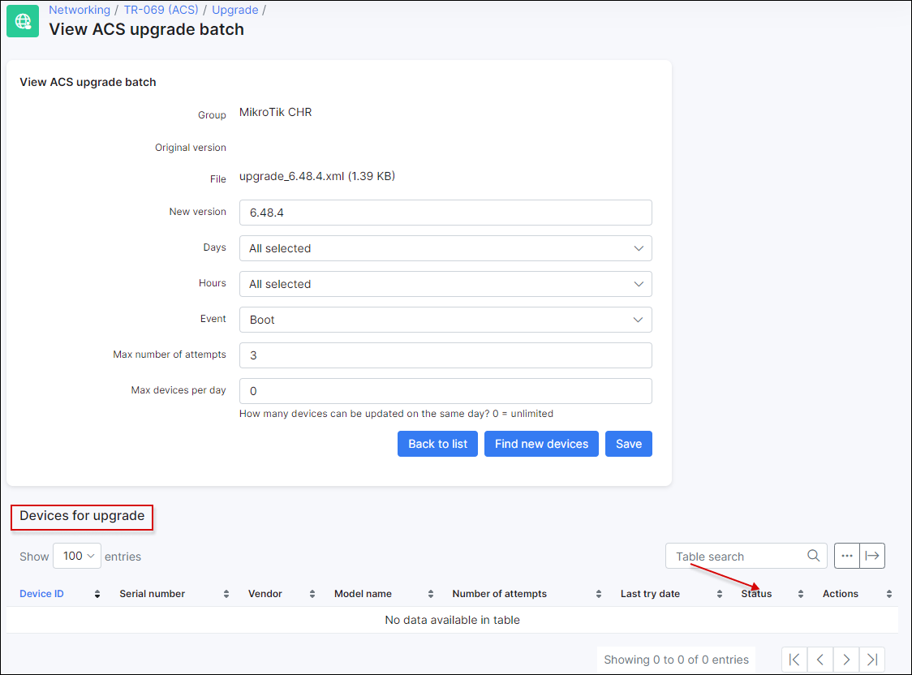

Troubleshooting
==========

Follow these instructions to troubleshoot problems with **TR-069 (ACS)**:

<details>
<summary><b>Can't connect device to ACS</b></summary>
<p markdown="1">

  0. Make sure that device is accessible from Splynx server. Use tools like *ping* or *traceroute* to doublecheck;

  1. Pay attention to the IP restrictions. The requests can be sent only from IPs/networks allowed in this list:

  

  2. Make sure that `CWMP URL`, `username` and `password` that were configured under TR-069 client on a device are correct and ports `7547`, `7567` are opened;

  3. Try to disable firewall on a device to ensure that it's not a firewall issue;

  4. In case of using `HTTPS` - try to disable option `SSL enabled by default`, and use `CWMP URL` like http://splynxserver.com:7547/ instead of **https** at the beginning.

  5. Restart **GenieACS services** using this command - `sudo service genieacs* restart`

</p>
</details>

------------

<details>
<summary><b>Device is registered in Splynx but no connection established</b></summary>
<p markdown="1">
  0. Make sure that device is accessible from Splynx server. Use tools like *ping* or *traceroute* to doublecheck;

  1. Pay attention to the IP restrictions. The requests can be sent only from IPs/networks allowed in this list:

  

  2. Refresh device using this option and wait for the result:

  

  3. Pay attention to sections **Tasks** and **Faults**. Try to remove all tasks and all faults using remove button:

  

  4. Disable **TR-069 client** on a device, remove device from Splynx and enable **TR-069 client** to re-add device in Splynx.
</p>
</details>

------------

<details>
<summary><b>Debug GenieACS services</b></summary>
<p markdown="1">

To enable logs:

```
sudo nano /var/www/splynx/system/genieacs/genieacs.env
```

And insert these lines below of the existed ones:

```
GENIEACS_CWMP_LOG_FILE=/var/www/splynx/logs/genieacs/cwmp.log
GENIEACS_FS_LOG_FILE=/var/www/splynx/logs/genieacs/fs.log
GENIEACS_UI_LOG_FILE/var/www/splynx/logs/genieacs/ui.log
GENIEACS_DEBUG_FILE=/var/www/splynx/logs/genieacs/genieacs-debug.yaml
GENIEACS_DEBUG=true
```

And restart ACS services:

```
php /var/www/splynx/system/script/dev acs-restart
```

The logs can be found in:

```
/var/www/splynx/logs/genieacs

/var/www/splynx/logs/nginx
```

</p>
</details>

------------

<details>
<summary><b>To reduce the timeout of device status after update/upgrade</b></summary>
<p markdown="1">

Splynx uses the default timeout 30m to check if the version on the device is up to date after the update/upgrade process has been performed. .

To reduce this time out, open your `splynx` database in [Adminer](configuration/tools/adminer/adminer.md), find the table `acs_upgrade_records`, press **edit** on your device record and in the `last_try_datetime` field change the **time** value back to one hour.
For example: the current value is - `2021-09-03 15:50:24`, it should be changed to `2021-09-03 14:50:24`


Then press **Save** button. And run the following command in Terminal:

```
php system/script/cron five-minutely
```

Double check the device status in `Networking → TR-069 (ACS) → Upgrade → View ACS upgrade batch`, the table **Devices for upgrade**.



</p>
</details>

------------

<details>
<summary><b>Install GenieACS manually</b></summary>
<p markdown="1">

**NOTE:** Make sure you’re using Node.js v12 or higher on your server:

```
node --version
```

To install **Node.js v12** use the following commands in Terminal:

```
sudo apt update && sudo apt -y upgrade
sudo apt -y install curl dirmngr apt-transport-https lsb-release ca-certificates
curl -sL https://deb.nodesource.com/setup_12.x | sudo -E bash -
sudo apt -y install nodejs
```

To install **GenieACS** use the next commands:

```
sudo su
curl -s https://splynx.com/splynx.gpg.key | apt-key add -
echo 'deb https://deb.splynx.com/ splynx splynx3_1' > /etc/apt/sources.list.d/splynx_3_1.list
apt update
apt install splynx-genieacs

```

```
cd /var/www/splynx/system/nodejs/
npm i
```

If the error occurs, it's required to install `mongodb-server` manually and try to install `splynx-genieacs` again.


After that, add these lines to `/etc/sudoers.d/splynx` file (after *OpenVPN tools* block)

```
sudo nano /etc/sudoers.d/splynx
```

```
# Splynx ACS tools
splynx ALL=(ALL)     NOPASSWD: SETENV: /var/www/splynx/system/script/tools acs *
```

and save changes.

Restart services:

```
sudo service splynx_transport restart && sudo service splynx_node restart
```


</p>
</details>

------------
