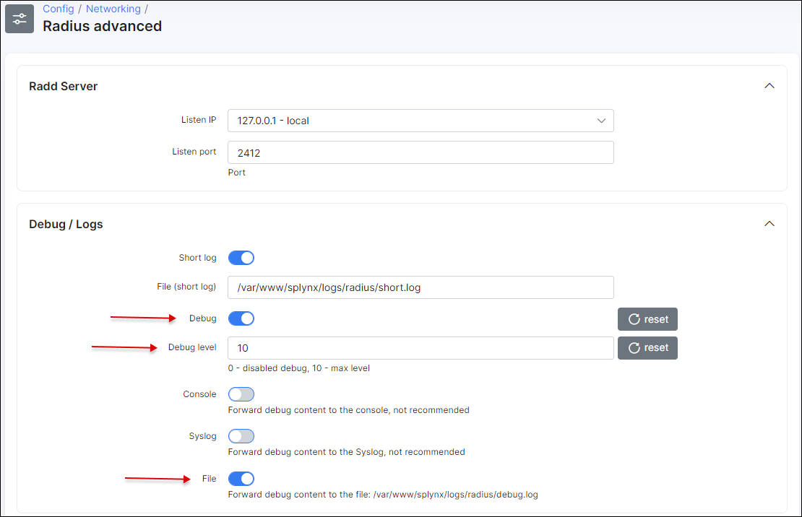

Troubleshooting Radius server
==========

This is a guide illustrating how to troubleshoot communication between your router (Mikrotik example) and the Radius server (Splynx).

Video tutorials for Radius configuration can be found on the page below:
  https://splynx.com/384/ispframework-and-radius-mikrotik-example/.

### Step 0
First of all make sure that the router is accessible from Splynx server and vice versa the router can "see" Splynx. In Splynx it is possible to check a ping status from Splynx to the router:


This troubleshooting step is only suitable when the "ping" is not restricted on a router and on a server (ICMP echo responses not blocked on the firewall).

Also read these manuals and compare the settings to ensure that setup is correct:

* in case of using PPPOE with Radius read this - [PPPoE with RADIUS](../authentication_of_customers/mikrotik_pppoe_radius/mikrotik_pppoe_radius.md)

* in case of using DHCP with RADIUS (IPoE) read this - [DHCP with RADIUS](../authentication_of_customers/mikrotik_dhcp_radius/mikrotik_dhcp_radius.md)

### Step 1

Compare RADIUS parameters on a router information tab in Splynx and on a Mikrotik router under `RADIUS` menu:


Field `Secret` on Mikrotik must be the same as field `Radius secret` on a router in Splynx.

Field `Address` on Mikrotik must be filled with Splynx IP.

Field `Src.Address` on Mikrotik must be filled with the router IP or can be 0.0.0.0.

Field `NAS IP` on a router in Splynx is a real IP source address for RADIUS packets. It is recommended that in the Radius settings of the Mikrotik router `Src. address` = `NAS IP` in Splynx.

Also make sure that you don't have multiply RADIUS servers configured with same service:


You can have multiply RADIUS servers but each server must be configured with unique service, for example: RADIUS server #0 configured for DHCP service, RADIUS server #1 configured for PPP service.

### Step 2

Check a firewall and ports. RADIUS is transported over UDP on ports 1812 (authorization) and 1813 (accounting) so these 2 ports must be opened on a router also port 3799 (radius incoming) must be opened and not affected by a firewall rules.

### Step 3

Inspecting of logs.

By default Splynx write logs into 2 files: `coa.log` and `short.log` what you can find in the folder `/var/www/splynx/logs/radius` on CLI or via the web interface, navigate to ` Administration -> Logs -> Files` and find these 2 files.

The `short.log` file will display all records of login attempts, the reason of disconnection. For example:

```
28/02 14:54:16:7361 - [Login               ] - [10.2.32.109    ] - Accept
28/02 14:54:23:3637 - [C38F676DB15B        ] - [10.2.36.0      ] - Log in
28/02 14:54:18:6727 - [C38F676DB15B        ] - [10.2.33.190    ] - Log off -  (NAS-Error)
28/02 14:54:19:3702 - [26117AB65E2B        ] - [10.2.36.0      ] - Log off -  (Session-Timeout)
28/02 14:54:22:7030 - [-Unknown-           ] - [10.250.74.24   ] - Reject (ATTR + IP accept) - [26117AB65E2B] -> [service1] Customer not found
28/02 14:54:23:2525 - [26117AB65E2B        ] - [10.2.33.190    ] - Reject (Attribute accept) - [FCACAF943B30] -> [service1] Customer is not active
28/02 14:54:14:2384 - [user                ] - [10.2.36.247    ] - Reject - [B4FBE4ACFCC2] -> [service1] Customer is already online
28/02 14:54:21:2743 - [265798031           ] - [               ] - [card] Accept
28/02 14:54:21:5017 - [265798031           ] - [10.5.28.211    ] - [card] Log in
28/02 15:10:35:6518 - [voucher-login       ] - [10.1.0.202     ] - [card] Log off -  (User-Request)
28/02 15:11:05:2315 - [serieALRClM4sj      ] - [               ] - Reject card - [4FFE0CD555D3] -> [hap-liter] Password is incorrect
```

This file contains next information: date and time, login of the service, IP and description of action.

Descriptions of records:
* **Accept** - The Splynx server received the Radius Access Request packet from the Router and a Radius Access Accept packet was sent back. Customer was successfully authenticated. *Please note, if MS-CHAP is used for authentication, we can see `Accept` here even if password is incorrect*;
* **Log in** - The Splynx server received the Radius Accounting Start packet from Router;
* **Log off** - The Splynx server received the Radius Accounting Stop packet from Router;
* **Reject** - The Splynx server received the Radius Access Request packet from Router and Radius Access Reject was sent back. Customer was not authenticated;
* **Reject (Attribute accept)** - The Splynx server sent the Radius Access Accept packet to Router with the IP address from the Splynx service. Customer was authenticated on the router with a session time limit = *Config / Networking / Radius / Error session time limit*. IP address was added into the Address list `Reject_x` on the router;
* **Reject (ATTR + IP accept)** - The Splynx server sent the Radius Access Accept packet to the Router with an IP address from the Splynx Reject pool (*Config / Networking / Radius / Reject IP x*). Customer was authenticated on the router with session time limit = *Config / Networking / Radius / Error session time limit*. IP address was added into the Address list `Reject_x` on the router;
* **\[card\] Accept** - The same as **Accept** but for Prepaid vouchers.
* **\[card\] Log in** - The same as **Log in** but for Prepaid vouchers.
* **\[card\] Log off** - The same as **Log out** but for Prepaid vouchers.
* **Reject card** - The same as **Reject** but for Prepaid vouchers.

In the case of authentication errors or logging off, the reasons are shown in the radius logs under `Administration / Logs / Files / radius short log`.

**!Note** Disconnection reasons in the `short.log` like **Admin reset** or **Lost carrier** are not related to Splynx.

---
In the `coa.log` you can find records what can help you with troubleshooting of issues with disconnection, plan change etc. If Splynx sends a CoA packet - it will be logged here:

```
2021-10-07 07:15:02 - echo "User-Name = mike, Framed-IP-Address = 192.168.200.218, NAS-IP-Address = 10.250.32.3" | /usr/bin/sudo /usr/bin/radclient 10.250.32.3:3799 disconnect "9734c51bb208" > /dev/null &
2021-10-07 07:15:49 - echo "User-Name = mike, Framed-IP-Address = 192.168.200.28, NAS-IP-Address = 10.250.32.3" | /usr/bin/sudo /usr/bin/radclient 10.250.32.3:3799 disconnect "9734c51bb208" > /dev/null &
2021-10-07 07:20:10 - echo "User-Name = mike,Framed-IP-Address = 192.168.200.108,  NAS-IP-Address = 10.250.32.3 , Mikrotik-Rate-Limit = \"5000000/5000000 0/0 0/0 0/0 5 5000000/5000000\"" | /usr/bin/sudo /usr/bin/radclient 10.250.32.3:3799 coa "9734c51bb208" > /dev/null &
2021-10-07 07:32:46 - echo "User-Name = mike, Framed-IP-Address = 192.168.200.137, NAS-IP-Address = 10.250.32.3" | /usr/bin/sudo /usr/bin/radclient 10.250.32.3:3799 disconnect "9734c51bb208" > /dev/null &
2021-10-07 07:45:37 - echo "User-Name = mike, Framed-IP-Address = 192.168.200.5, NAS-IP-Address = 10.250.32.3" | /usr/bin/sudo /usr/bin/radclient 10.250.32.3:3799 disconnect "9734c51bb208" > /dev/null &
2021-10-07 11:45:10 - echo "User-Name = mike,Framed-IP-Address = 192.168.200.5,  NAS-IP-Address = 10.250.32.3 , Mikrotik-Rate-Limit = \"10000000/10000000 0/0 0/0 0/0 5 1000000/1000000\"" | /usr/bin/sudo /usr/bin/radclient 10.250.32.3:3799 coa "9734c51bb208" > /dev/null &

```

In this part of `coa.log` you can see that Splynx sent some CoA packets to disconnect a user and change speed of connection.

---

The Splynx Radius server consist of 2 daemons – splynx_radd and freeradius. Both of them have different debugging and show different information. Let’s start with the splynx_radd debugging:

To enable debug mode of splynx_radd, navigate to *Config / Networking / Radius extended* and enable debug into the file:



Then wait few minutes until new settings will be applied. Or you can apply new settings immediately if you restart Radius server.
To restart Radius server use a button at the bottom of the same page (*Config / Networking / Radius extended*), or enter command in SSH:
```
service splynx_radd restart
```

Now we can check the debug file, again it’s accessible from CLI of Linux Splynx server:
`/var/www/splynx/logs/radius/debug.log`
The best way to check the file is command
```
tail -f /var/www/splynx/logs/radius/debug.log
```

If splynx_radd debug doesn’t show us anything, we can try to run freeradius daemon in debug mode and see if any packets are received by Radius server.

Run CLI commands to get output into the file:

```
service freeradius stop && freeradius -Xxxx | tee Debugxxx.log
```

wait for 2-5 minutes to collect some data and stop execution of this command by press **Ctrl+C** and start freeradius in a regular mode:

```
service freeradius start
```

in case when freeradius daemon returns an error after the last command run this:

```
killall freeradius; service freeradius restart
```

If you don’t see any debug messages when customer tries to connect to Mikrotik Router, it means that your router cannot send packets and connect to Radius server at all. It means that you have to verify networking, routing and NAT settings of the network.

On the Mikrotik Router there is also the ability to run extended debug to see what exactly the router is sending to the Radius server:


For better understanding of RADIUS it is recommended to read how it works, for example on [the Wikipedia](https://en.wikipedia.org/wiki/RADIUS)
