Weathermaps
==========

To install network weathermaps run the following commands in the CLI of your server:
```
apt update
apt install splynx-network-weathermap
```

After successfully installing this feature, the Network Weathermap menu will appear under `Splynx → Networking`.


We've integrated a productive open source tool https://network-weathermap.com to Splynx. It is installed as a module and connected via API to our platform.

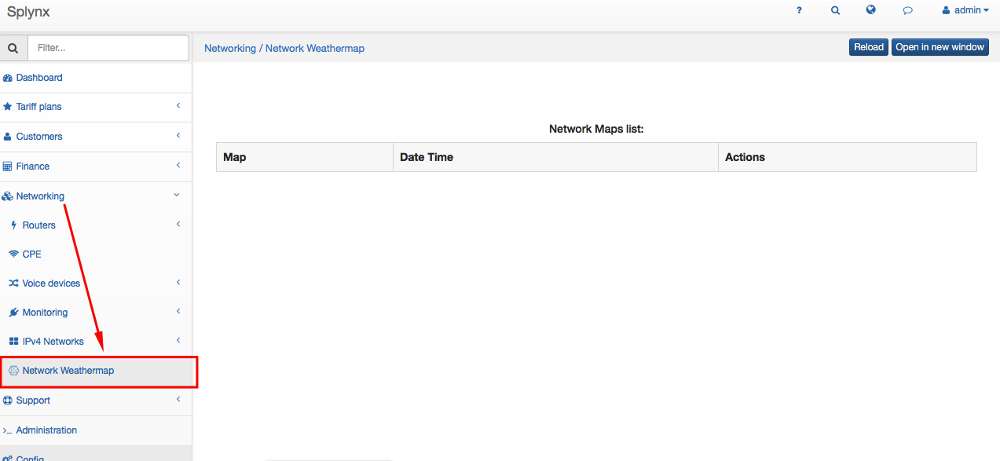


To create a new map, open the editor tool in Splynx under `Config → Networking → Network Weathermap Editor`.

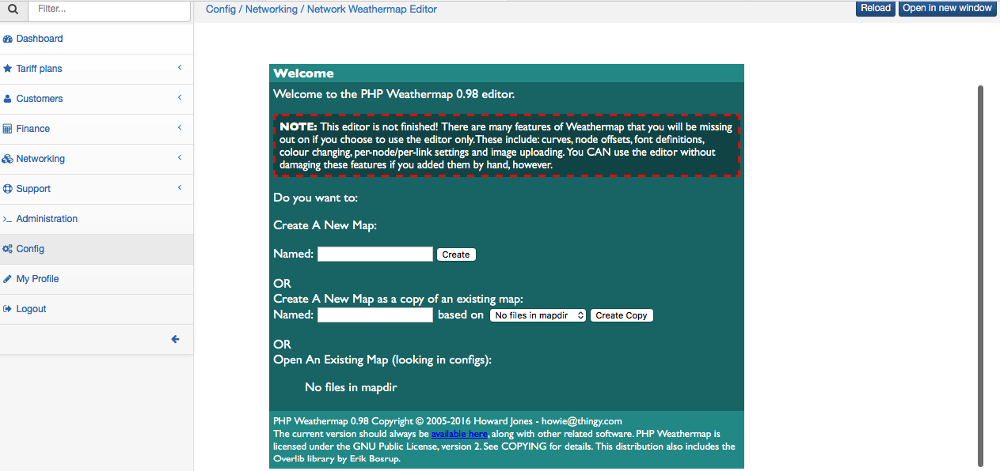


Choose a name for the new MAP and create it. The first map was created and it is now empty.

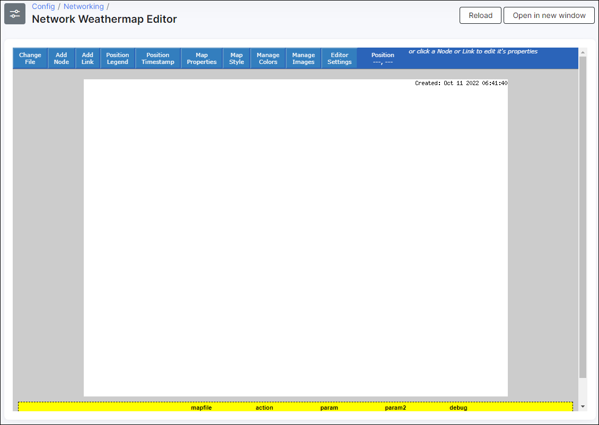


Let's add a device. Weathermaps works with the equipment which is added to `Networking → Hardware`. Therefore, to get a visualization of the network, we need to add devices to Hardware and configure their SNMP OIDs for interface traffic, CPU and similar values.

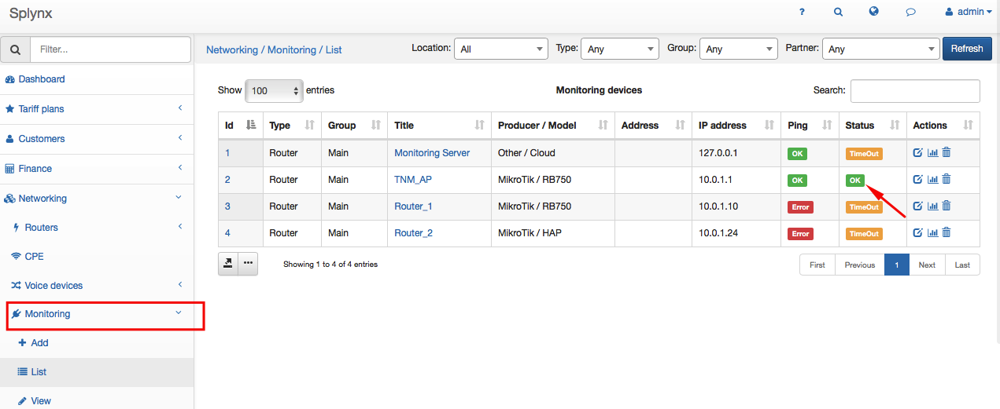

Once the device is added to Hardware, we can now add the SNMP OID values and configure values to create graphs in Splynx:

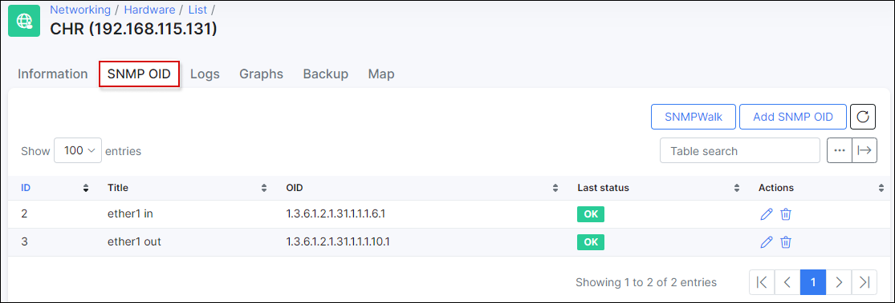

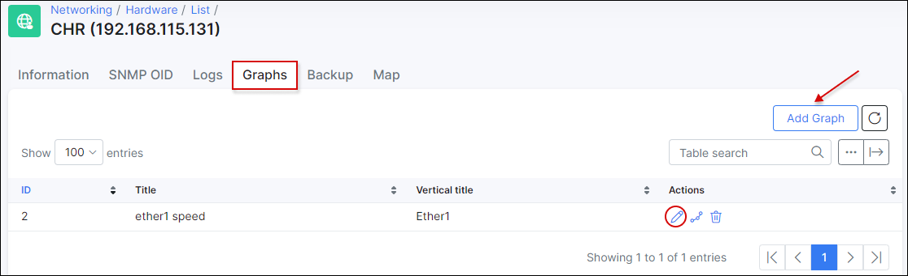

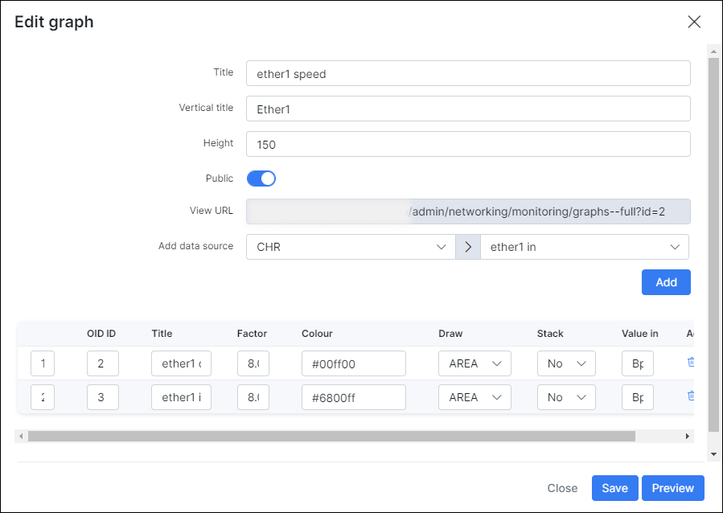


When all devices are properly configured in Hardware, we can add them to the Weathermap. All configurations in the editor is very simple and straightforward: simply drag and drop to place the routers/devices on the map and connect the links.

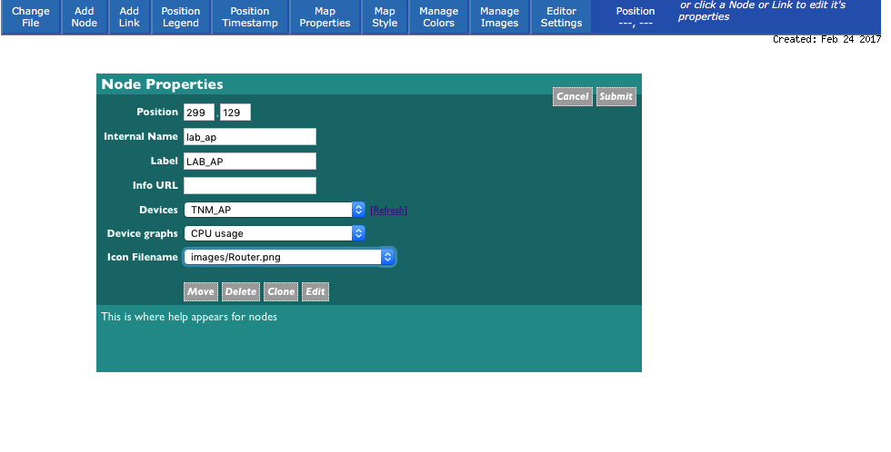


You can choose the device from the Splynx hardware list, define what will be shown as a main chart for the device and assign a picture for the element on the map.

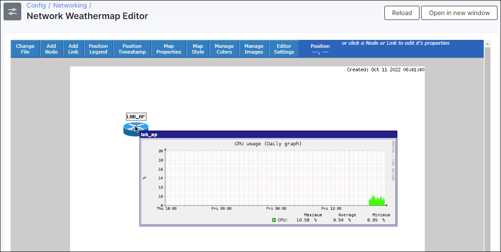


When the router is added, we can add a second device and configure a link between our two devices. We've added a device "Internet" and will configure the link WAN, OIDs of this link we have on our LAB_AP router.

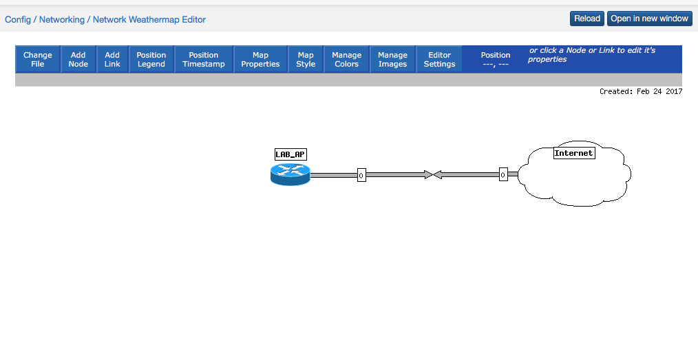


We do not have to look for OIDs. Simply choose the OID from the link, and setup the chart you want to display as hover chart of the link and the main chart which will show the complete usage of the link on a separate page.

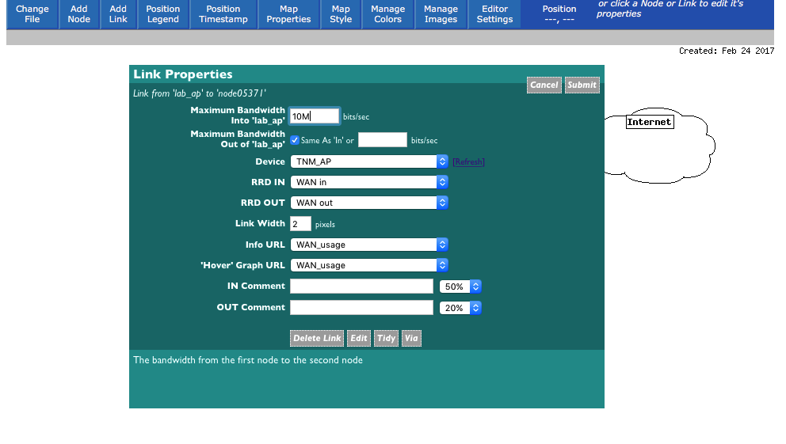


Once these steps have been completed, we can navigate back from configuration mode to view mode and check if the new picture was generated (please note that the topology map is generated every 5 minutes).

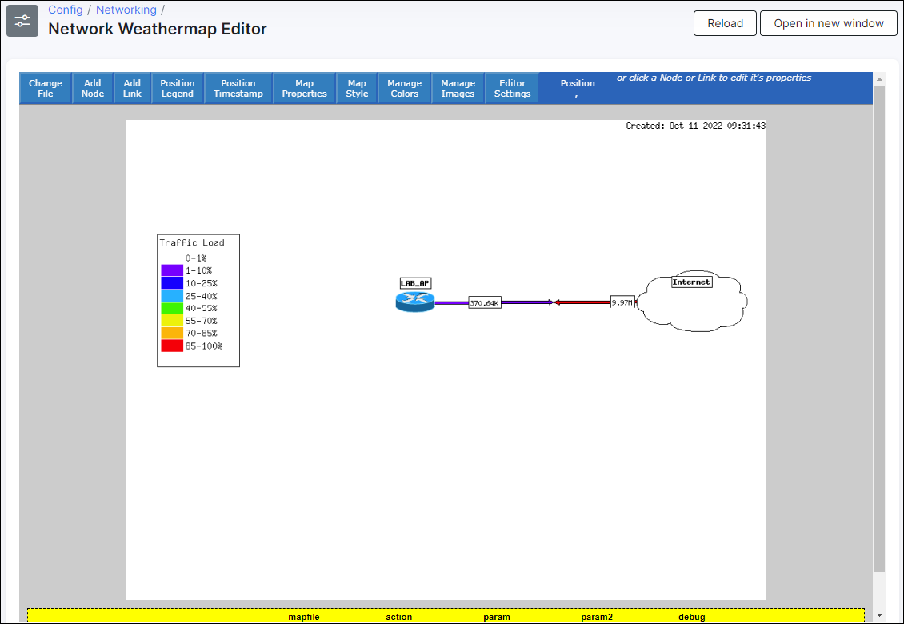


The legend shows the traffic loads. On the example, we can see that the Download on the LAB router is using almost all of the 10 Mbps available.

Charts are available in hover mode, topology can also be opened in a new window (which displays the usage for the last hour on the link):

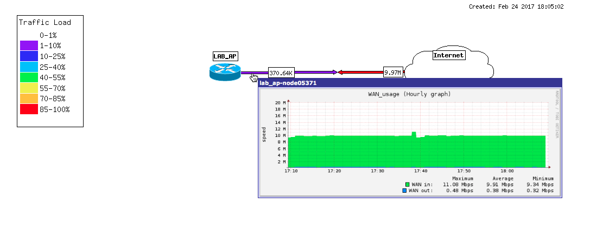


If we click on the link, a new window will open with historical charts, showing usage per week, month and year:

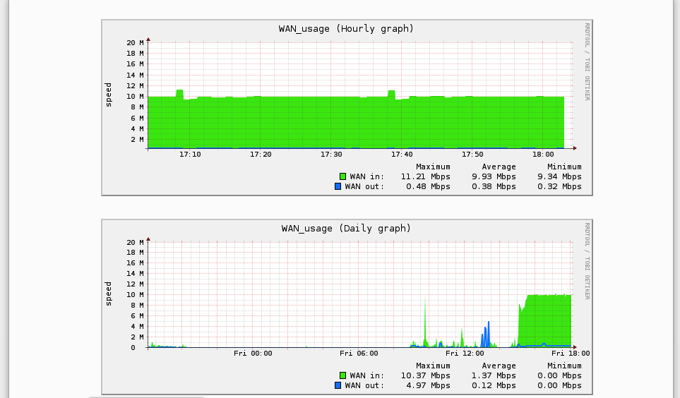
