TBK-WebPay
=================

TBK-WebPay is a Splynx add-on which allows refilling of customer balances and paying of invoices via the payment gateway -  http://www.transbank.cl

The add-on can be installed in two methods, via the CLI or the Web UI of your Splynx server.

To install the Splynx-TBK-Webpay add-on via CLI, the following commands can be used:

```
apt-get update
apt-get install splynx-tbk-webpay
```
To install it via the Web UI:

Navigate to `Config → Integrations → Add-ons`:

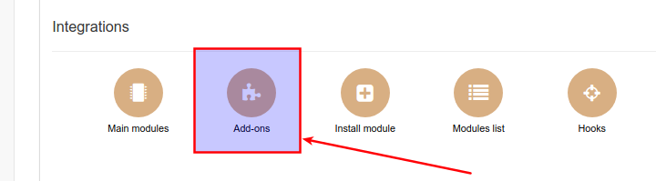

Locate or search for the "splynx-tbk-webpay" add-on and click on the install icon in the *Actions* column, you will be presented with a window to confirm or cancel the installation, click on confirm to begin the installation process

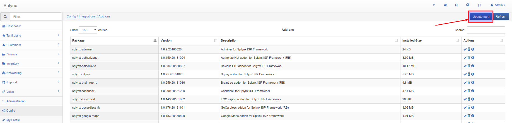

Therafter, the first step is to register in http://www.transbank.cl. After that, you have to obtain a Commercial Code on http://www.transbank.cl and set it in *Config/Integrations/Modules list/splynx_addon_webpay.* (you can also set fee parameters here)

Navigate to *Config/Integrations/Modules list*

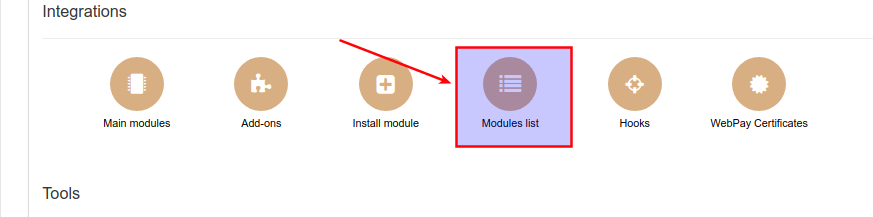

Locate or search for the "splynx-tbk-webpay" add-on and click on the edit icon in the *Actions* column


Enter the *Commercial Code* and save:

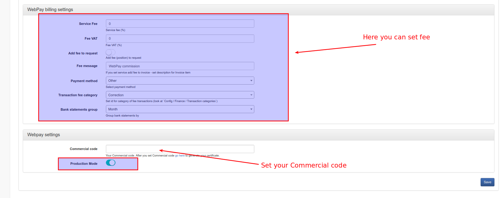

Then navigate to *Config/Integrations/WebPay Certificates* and generate a self-signed certificate

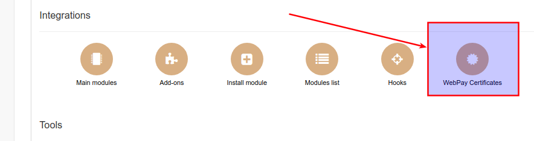

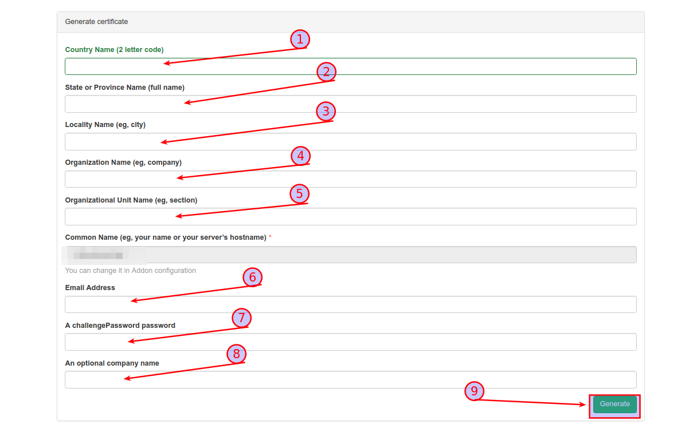

Once the configuration has been completed, customers can pay for their invoices and refill their balances using the transbank.cl system. Customers will see a new button _To Pay_ as depicted below:

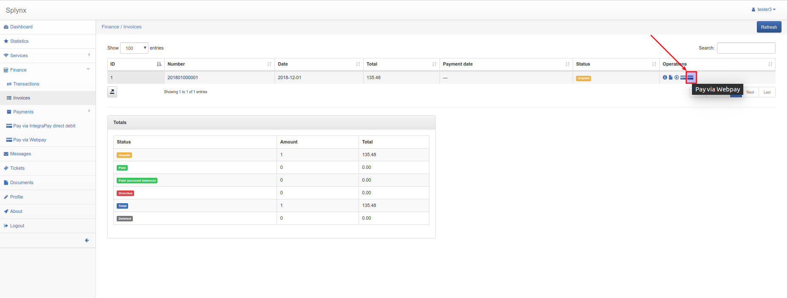

After customers press on the *Pay button*, they will have to confirm their payment:

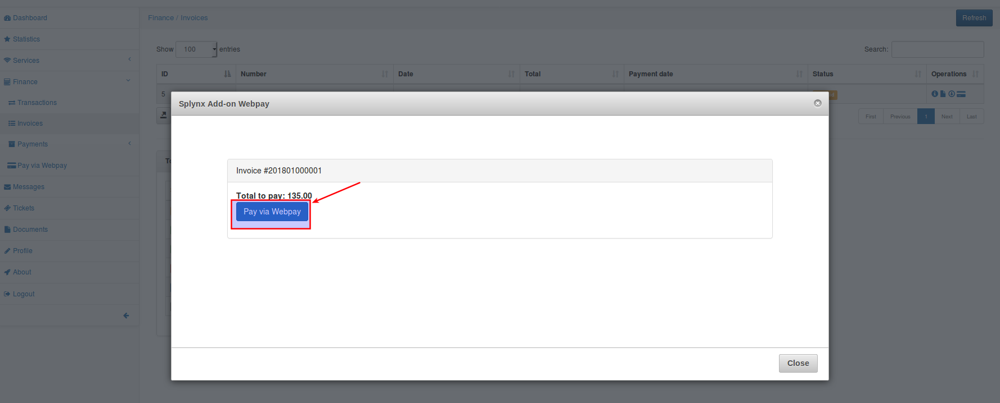

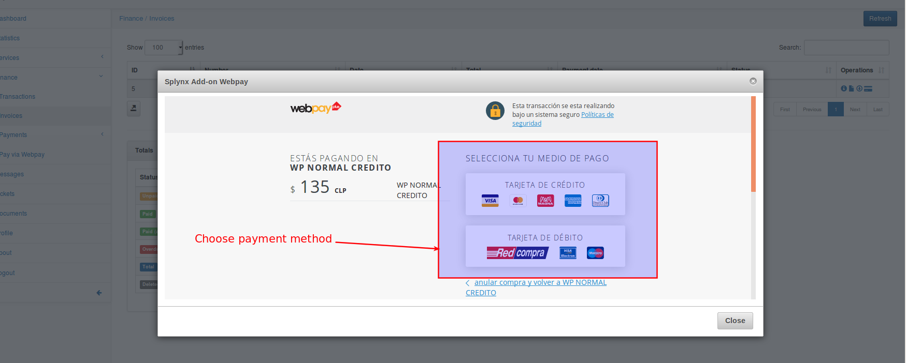

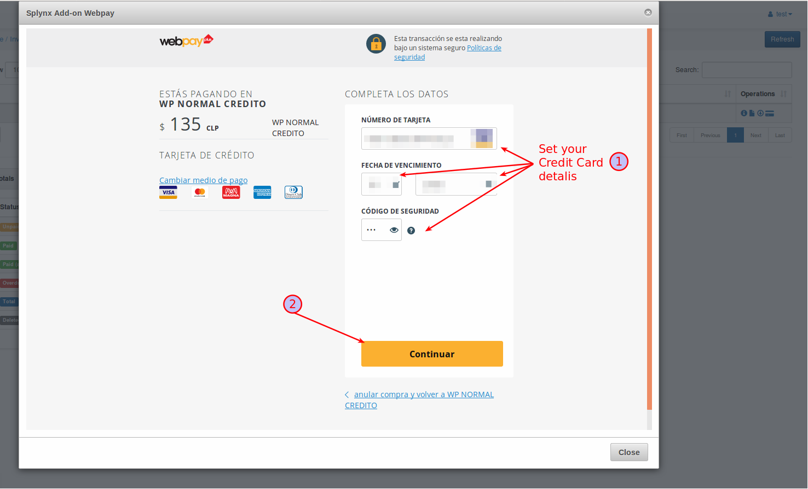

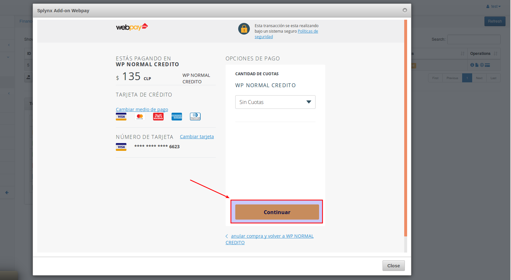

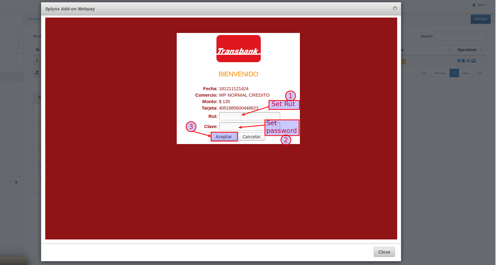

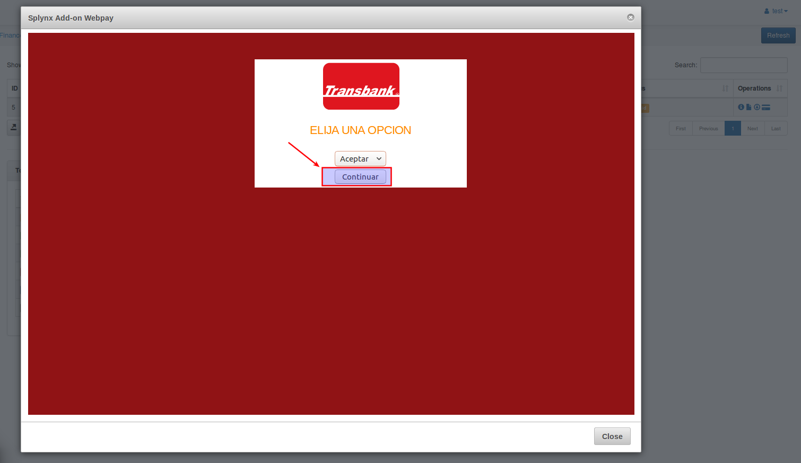

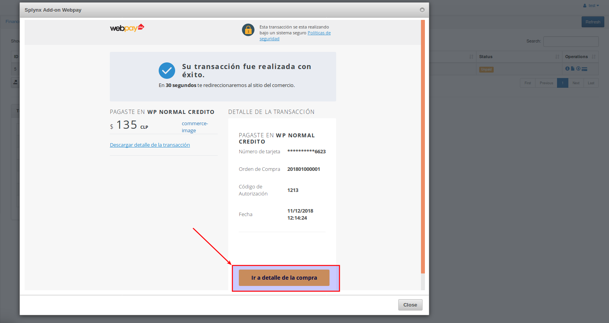

If everything went well, you will see the status of the invoice marked as "Paid" (in the customer and admin portal):

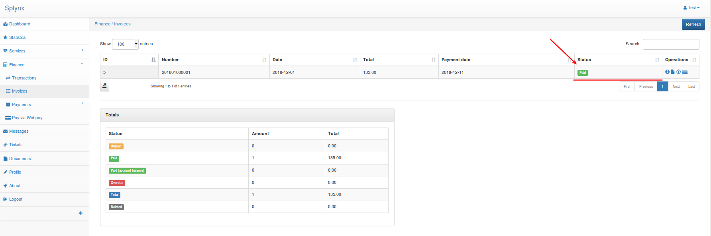

To refill balances, customers can use the following link - http://yoursplynxurl/webpay/ or navigate to *Finance/Pay via Webpay*.

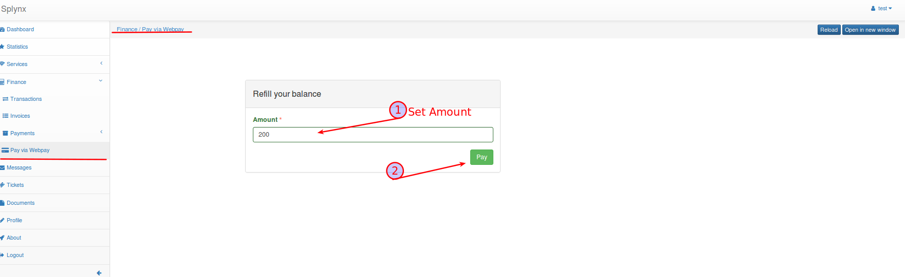

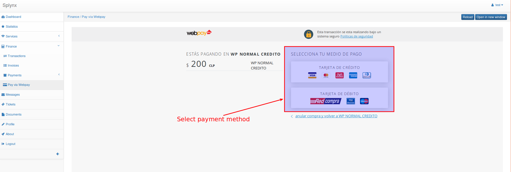

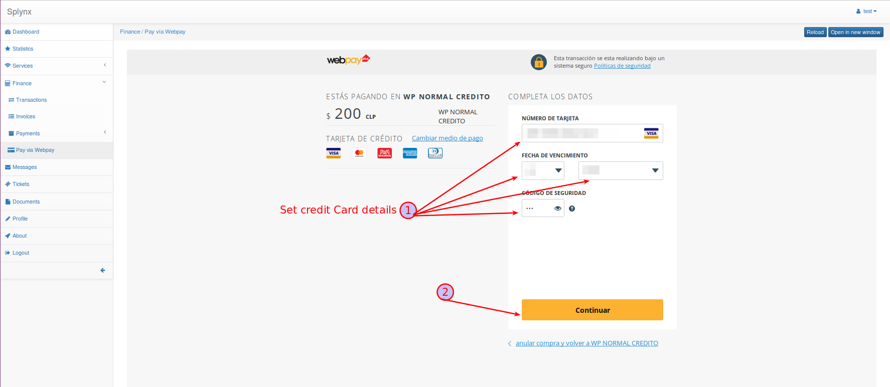

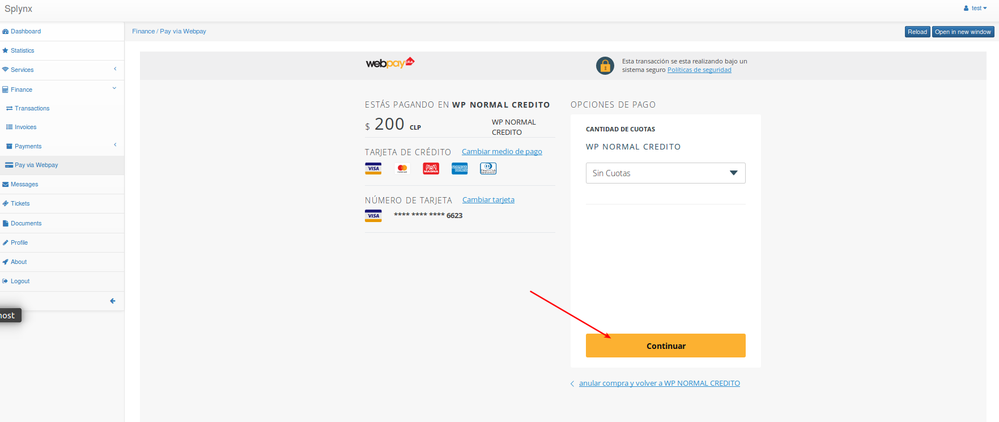

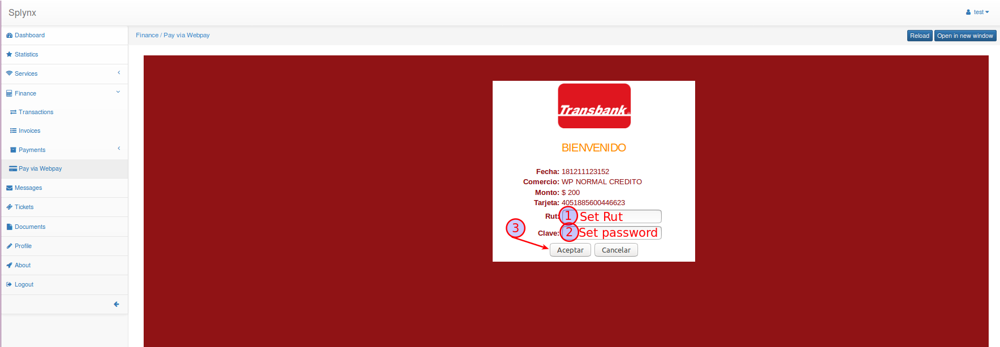

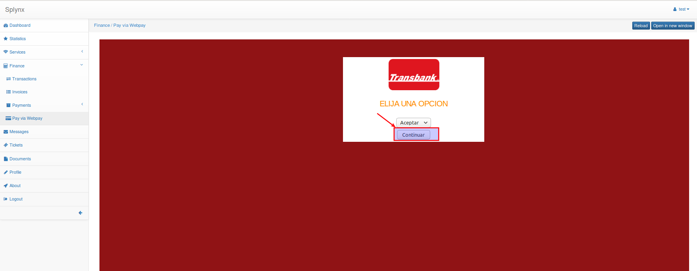

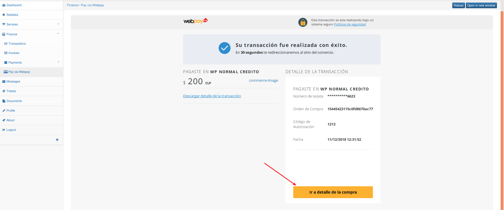
