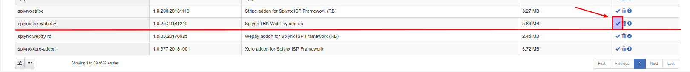

TBK-WebPay is a Splynx add-on. It allows to refill balance and pay invoices via payment gateway -  http://www.transbank.cl

To install Splynx-Integrapay add-on, use following commands:

```
apt-get update
apt-get install splynx-tbk-webpay
```
or you can install it from Web UI:

*Config → Integrations → Add-ons:*




Then first step - you should to register in http://www.transbank.cl. After that, you have to get Commercial Code on http://www.transbank.cl and set it at *Config/Integrations/Modules list/splynx_addon_webpay.* (And you can also set fee parameters here)


Then go to *Config/Integrations/WebPay Certificates* and generate self-signed certificate


After that, customers can pay their invoices and refill balances using transbank.cl system. They will see a new button _To Pay_ as on the screenshot:


After customers will press *Pay button* they will have to confirm their payment:


If everything went well, you will see status of invoice as "Paid" (portal and admin):


To refill balance customers can use the link - http://yoursplynxurl/webpay/ or go to the *Finance/Pay via Webpay*.


