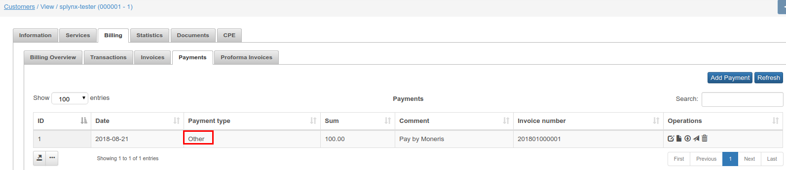
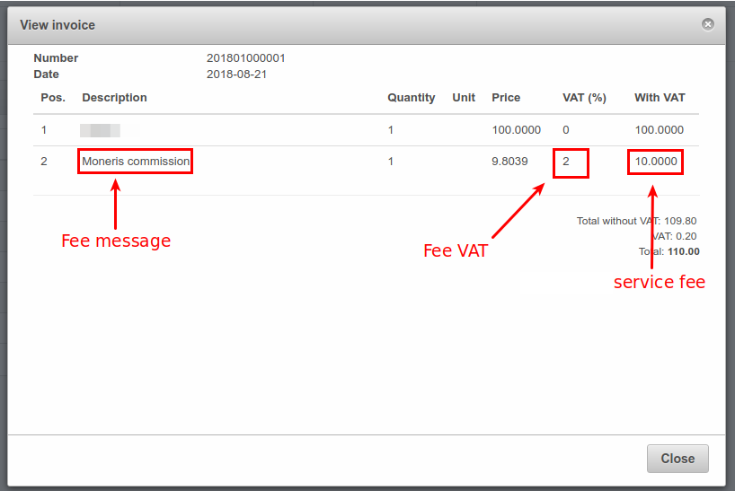

Authorize.net
=============

Authorize.net is a Splynx add-on. It uses to synchronize customers, invoices and payments with Authorize.net payment gateway - [https://www.authorize.net](https://www.authorize.net/).

To install Authorize.net add-on use next commands:

```bash
apt-get update
apt-get install splynx-authorizenet
```

After installation, you have to configure add-on under _Config / Integrations / Modules list / Splynx AuthorizeNet Recurring Billing Add-On / ._ Look at the screenshot:


**API domain** - Splynx URL.  
**API key**, **API secret** - default values. Don't change them without need.
**Payment account** -  
**Payment method** - when customer pays by using this add-on, the payment will be with this payment type.  

**Transaction fee category** - [transaction category](https://doc.splynx.com/display/SPL/Transaction+categories) of _service fee_. It is used only for [proforma invoices](https://doc.splynx.com/display/SPL/Proforma+invoices). For [invoices](https://doc.splynx.com/display/SPL/Invoices) _service fee_ category is always _Service._  
**Service fee** - service fee (in %).
**Fee VAT** - _service fee_ VAT percent.  
**Fee message** - _service fee_ description.  

**Add fee to request** -  
**Bank statements group** - Group bank statements (_Finance / Bank Statements / History_) monthly or daily.  
**Language** - language.  
**API login id**, **Transaction key** - described on support page - [https://support.authorize.net/s/article/How-do-I-obtain-my-API-Login-ID-and-Transaction-Key](https://support.authorize.net/s/article/How-do-I-obtain-my-API-Login-ID-and-Transaction-Key)

After that, customers can pay their invoices and refill balances using Authorize.net system. They will see a new button _To Pay_ as on the screenshot:


To refill balance customers can use the link - http://yoursplynxurl/authorizenet, where they have to enter registration details for the first time:


On portal main page, customers can also see the list of non-paid invoices and "_Pay_" button near each invoice:


