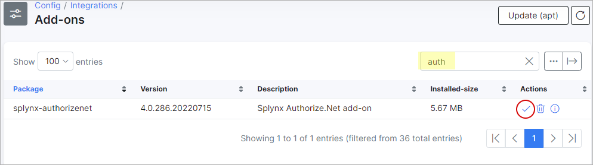

Authorize.net
=============

Authorize.net is a Splynx add-on used to synchronize customers, invoices and payments with the Authorize.net payment gateway - [https://www.authorize.net](https://www.authorize.net/).

The add-on can be installed in two methods, via the CLI or via the Web UI of your Splynx server.

To install the Authorize.net add-on via CLI, the following commands can be used:

```bash
apt-get update
apt-get install splynx-authorizenet
```

To install it via the Web UI:

Navigate to *Config -> Integrations -> Addons*:


Locate or search for the "splynx-authorize.net" addon and click on the install button in the *Actions* column:



Click on the "OK, confirm" button to begin the installation process:

  


After the installation process has completed, you have to configure the add-on under _Config / Integrations / Modules list_, locate or search for the "Splynx AuthorizeNet Recurring Billing Add-On", and click on the edit  <icon class="image-icon"></icon> icon the *Actions* column, as depicted in the images below:


  

**API domain** - your Splynx URL.  
**API key**, **API secret** - default values. Don't change this if it is not completely necessary.<br>
**Payment account** -  select AuthorizeNet.<br>
**Payment method** - when a customer pays using this add-on, the payment will be allocated as this payment type.  
**Transaction fee category** - transaction category of the _service fee_. It is only used for proforma invoices. For invoices _service fee_ category is always _Service._  
**Service fee** - service fee (in %).<br>
**Fee VAT** - _service fee_ VAT percent.  
**Fee message** - _service fee_ description.   
**Add fee to request** -  enable/disable adding fees to requests<br>
**Bank statements group** - Group bank statements (_Finance / Bank Statements / History_) monthly or daily.  
**Language** - language of the addon.  
**API login id**, **Transaction key** - described on the following page - [https://support.authorize.net/s/article/How-do-I-obtain-my-API-Login-ID-and-Transaction-Key](https://support.authorize.net/s/article/How-do-I-obtain-my-API-Login-ID-and-Transaction-Key)

Thereafter, customers can pay their invoices and refill balances using the Authorize.net system. They will see a new button _To Pay_ in the customer portal, as depicted below:

  

To refill customers balances, the following link can be used - http://yoursplynxurl/authorizenet, where they will have to enter registration details for the first time:

  

On the dashboard of the portal, customers will also see the list of un-paid invoices and a "_Pay_" button near each invoice:

  
