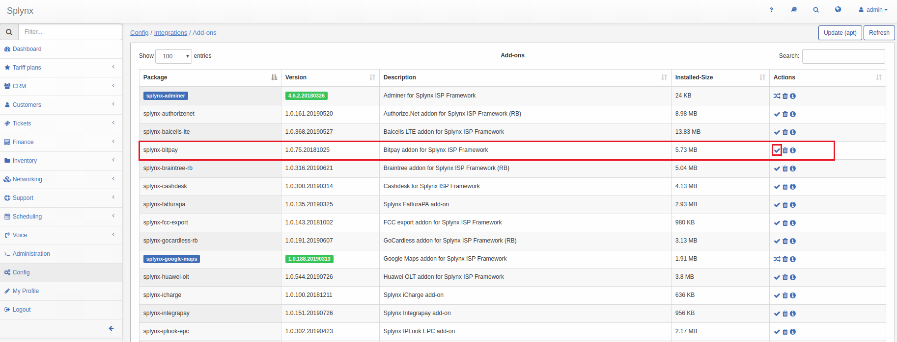
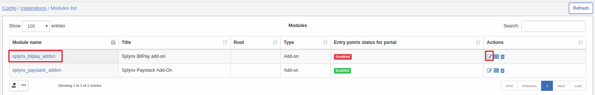
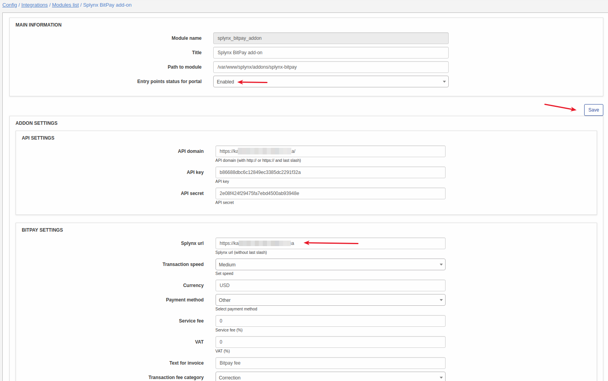
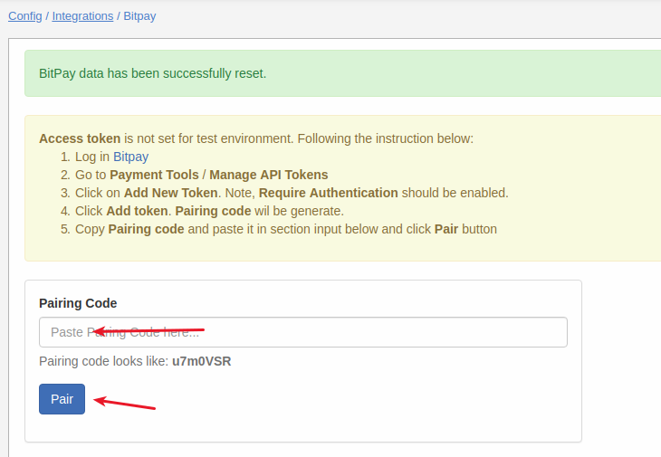
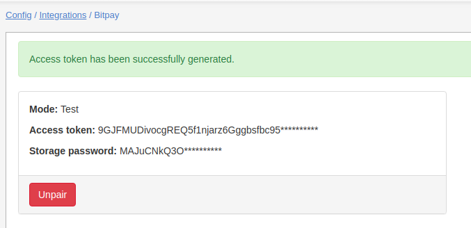
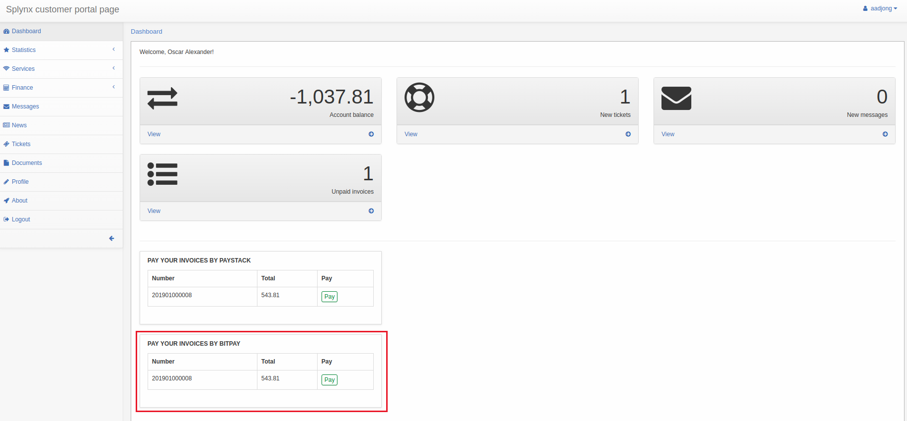
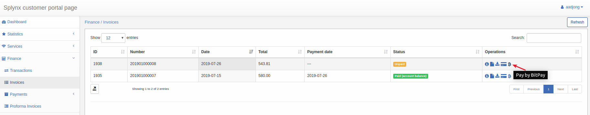

**Bitpay is a Splynx add-on. It allows to refill balance and pay invoices via Bitpay payment gateway - https://bitpay.com.**

To install splynx-bitpay add-on, use the following commands:

```
apt-get update
apt-get install splynx-bitpay
```
or you can install it from Web UI:

Config → Integrations → Add-ons:



After the installation you have to Enter your Splynx URL on the *Config -> Integrations -> Modules list:*






After that you need to receive **"Pairing Code"**. To receive **"Pairing Code"**, please open your *Bitpay dashboard → Payment Tools*, choose *Manage API Tokens* and *create New Token*, like on the screenshot:


Now you need to enter your pairing code in *Config → Integrations → Bitpay → Pairing code:*






After that customers can pay their invoices and refill balances using Bitpay system. They will see a new button "Pay" on Dashboard:



and new icon in Invoices as on a screenshot:



When customer will press pay button he will see new payment window.

After complete a payment customer will be redirected to Bitpay-page:


Then customer must choose currency:


Then customer has to confirm a payment:


If payment was successful, the status of invoice will  be "Paid".

To refill balance customers can use the link - “http://yoursplynxurl/bitpay” where they have to enter Amount of payment and click "Pay":


