Bitpay
===============

**Bitpay is a Splynx add-on which allows refilling of customer balances and paying of invoices via the Bitpay payment gateway - https://bitpay.com.**

The add-on can be installed in two methods, via the CLI or the Web UI of your Splynx server.

To install the splynx-bitpay add-on via CLI, the following commands can be used:

```
apt-get update
apt-get install splynx-bitpay
```
To install it via the Web UI:

Navigate to `Config → Integrations → Add-ons`:

Locate or search for the "splynx-bitpay" add-on and click on the install icon in the *Actions* column:

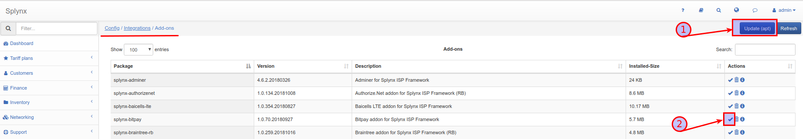

Click on the "OK, confirm" button to begin the installation process:

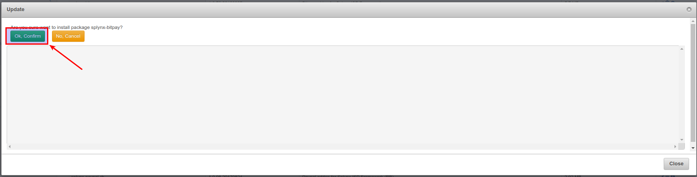


After the installation process has completed, we can configure the add-on under  *Config -> Integrations -> Modules list:*

Locate or search for the "splynx-bitpay" add-on and click on the edit icon in the *Actions* column:

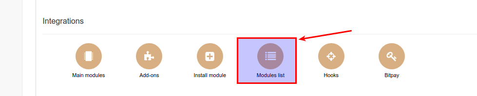

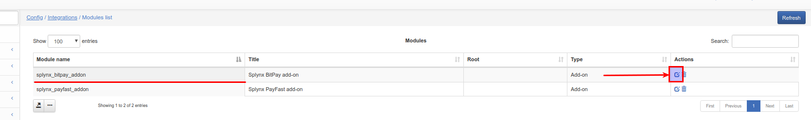

Enter your Splynx URL into the field provided:

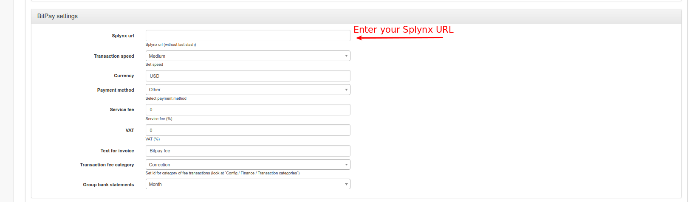

Thereafter, you need to retrieve a **"Pairing Code"** from BitPay. To retrieve the **"Pairing Code"**, please open your *Bitpay dashboard → Payment Tools*, select *Manage API Tokens* and *create a New Token*, as depicted below:

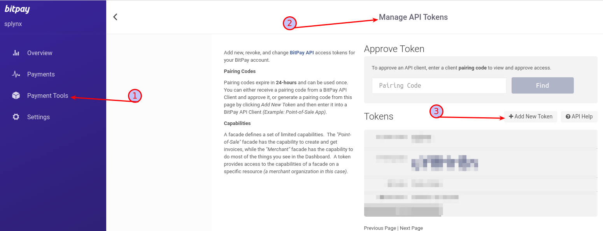

You can then enter your pairing code in *Config → Integrations → Bitpay → Pairing code:*

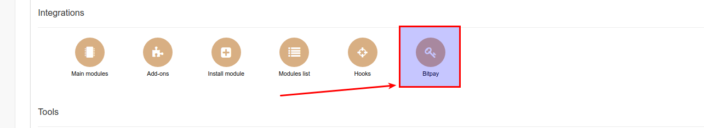

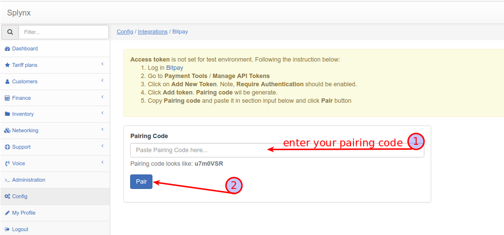

Thereafter, customers will be able to pay for their invoices and refill their balances using the Bitpay system. Customers will see a new button "Pay" on their customer portal Dashboard:

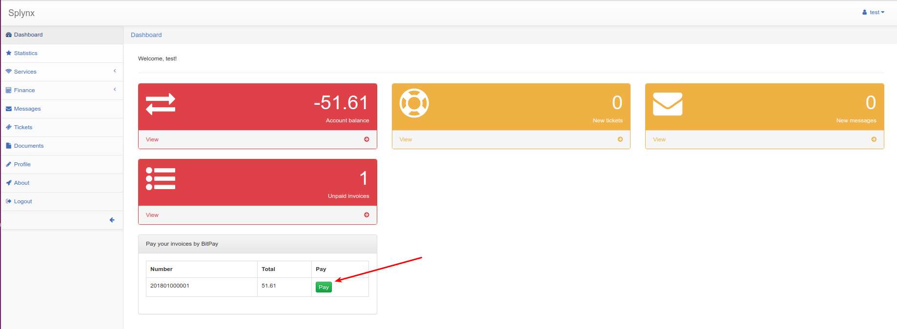

The new icon will also appear in the Invoices section as depicted below:

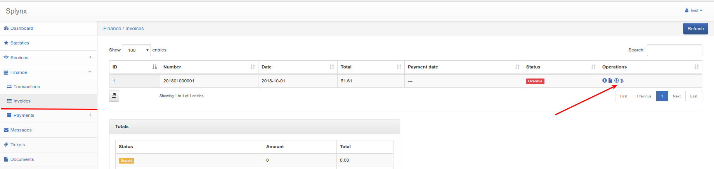

The following window will appear when a customer clicks on the new pay button:

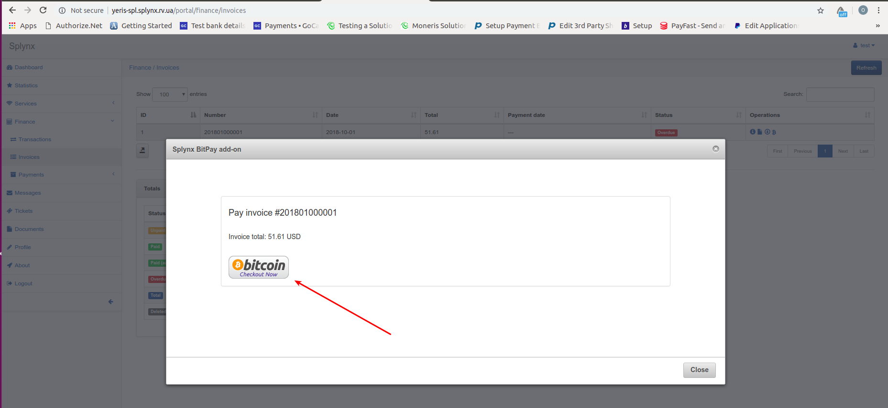

Customers will be redirected to Bitpay-page upon clicking the icon in the window:

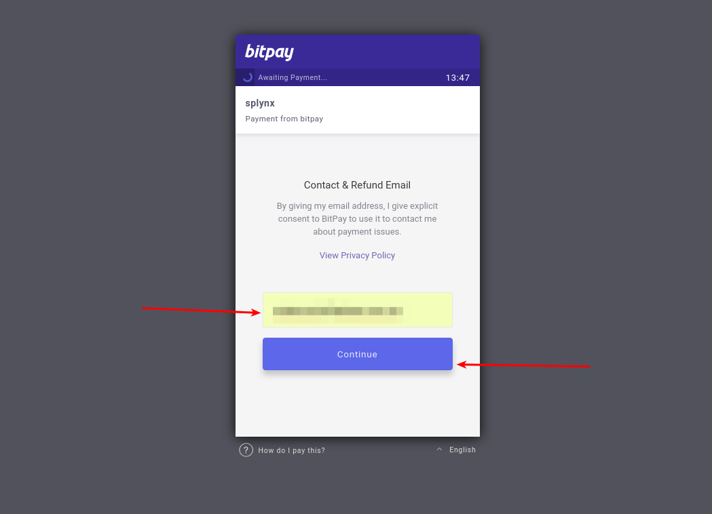

The customer will have to select a currency:

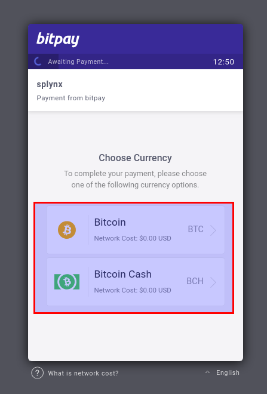

Then confirm the payment:

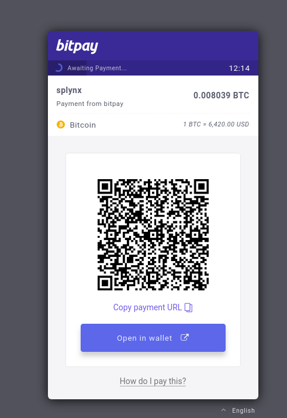

If the payment was successful, the status of invoice will be marked as "Paid":

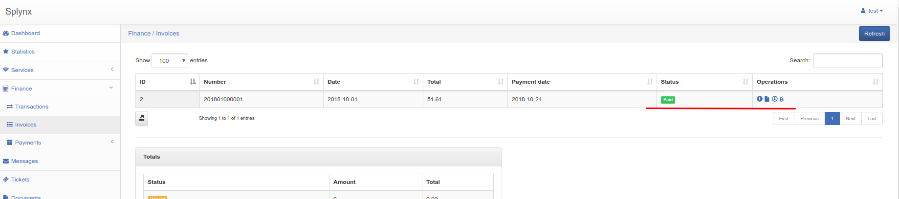

To refill balance, customers can use the link - “http://yoursplynxurl/bitpay” where they have to enter an Amount of the payment and click on "Pay":

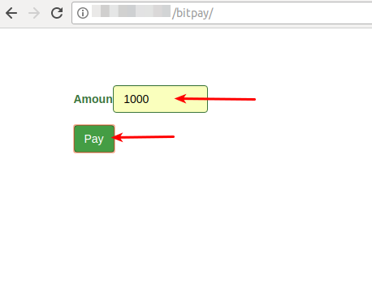
