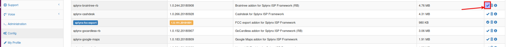

Braintree payments
==================

Braintree is a Splynx add-on. It allows to charge customer's credit cards via *Braintree payment gateway* - [https://www.braintreepayments.com](https://www.braintreepayments.com).

Add-on can work with different credit cards, if cards are saved, then addon allows to charge all customers using *Direct debit order*.

To install *splynx-braintree-rb* add-on, use following commands:


```bash
apt-get update
apt-get install splynx-braintree-rb
```
or you can install it from Web UI:

Config → Integrations → Add-ons:




After installation you have to configure addon:

Config → Integrations → Modules list:


Where:

* Public key: user-specific public identifier;


* Private key: user-specific secure identifier that should not be shared – even with us!


* Merchant ID: a unique identifier for your gateway account, which is different than your merchant account ID.

Login to your Account in [https://www.braintreegateway.com](https://www.braintreegateway.com) and:

* Select menu Account / My User;


* API Keys, Tokenization Keys, Encryption Keys;


* Click *“View Authorizations”*.


After that, customers can pay their invoices and refill balances using Braintree system. They will see a new button *"To pay"* as on the screenshot:


Customers can save pay-card details for the next payments:


To refill balance customers can use the link - *“http://yoursplynxurl/braintree-rb”*, and also they can set to remember pay-card:


At last, you can charge all customers using one button! Go to *Finance → Invoices*, set period and click "Charge" as on the screenshot:


