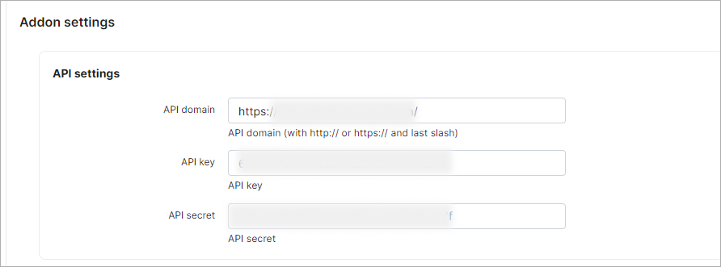
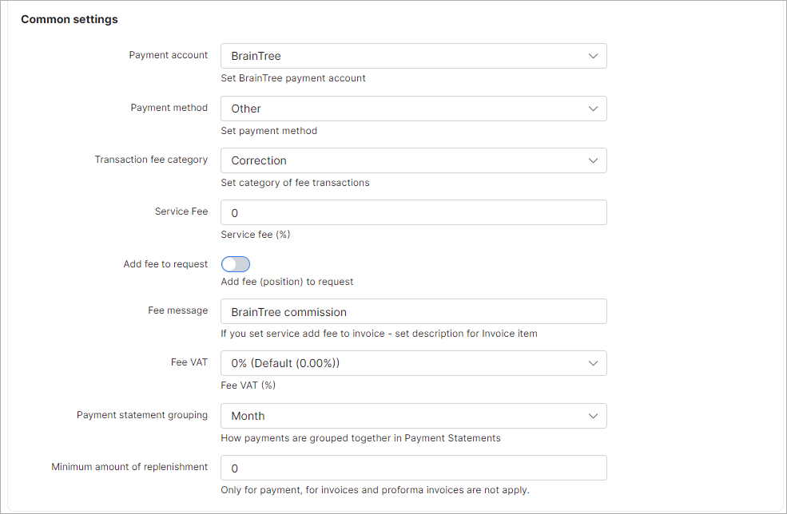
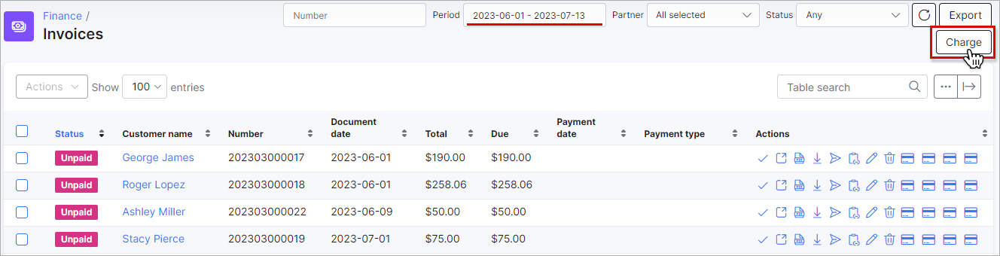

Braintree payments
==================

Braintree is a Splynx add-on that enables the recharging of customer credit cards through the *Braintree payment gateway* - [https://www.braintreepayments.com](https://www.braintreepayments.com).

The add-on can work with different credit cards if the cards are saved on customer profiles. The addon allows charging all customers using *Direct debit orders*.

## Installation

The add-on can be installed in two methods: via the CLI or Web UI of your Splynx server.

To install the *splynx-braintree-rb* add-onv via CLI, the following commands can be used:

```bash
apt-get update
apt-get install splynx-braintree-rb
```
To install it via the Web UI:

Navigate to `Config → Integrations → Add-ons`:


Locate or search for the "splynx-braintree-rb" add-on and click on the install icon in the *Actions* column. A window will appear for you to confirm the installation:


## Configuration

After the installation process has completed, you have to configure the add-on.

Navigate to `Config → Integrations → Modules list`:


Locate or search for the "splynx-braintree-rb" add-on and click the *Edit* icon in the *Actions* column:






**Partners settings**:

* **Merchant ID** - a unique identifier for your gateway account, which is different than your merchant account ID.

* **Public key** - a user-specific public identifier;

* **Private key** - a user-specific secure identifier that should not be shared – even with us!

To obtain these credentials, log in to your Braintree account at [https://www.braintreegateway.com](https://www.braintreegateway.com):

You can find the necessary credentials either at the **Home** page or in **API** section of your Braintree account:


__________________________

Customers can then pay their invoices and top up balances using the Braintree system. 

They will see a new button `To pay` as shown in the screenshot:


Customers can save their pay-card details for the next payments:


To top up balances, customers can use the link - *http://yoursplynxurl/braintree-rb*  

They can also choose *Save card for next payments*:


__________________________

Lastly, you can charge all customers with a single click.

To do this, navigate to *Finance → Invoices*, set the desired period, and click the `Charge` button, as shown below:




## Direct payments

You can add a direct payment link to your invoice (proforma invoice) template or include it in your invoice/proforma invoice email notification template, allowing your customers to pay an invoice without authorization.

**Invoices:**

http://yoursplynx.domain/braintree-rb/direct/direct-pay-invoice-by-id?item_id={{ invoice_id }}

http://yoursplynx.domain/braintree-rb/direct/direct-pay-invoice?item_id={{ invoice_number }}

**Proforma:**

http://yoursplynx.domain/braintree-rb/direct/direct-pay-request-by-id?item_id={{ invoice_id }}

http://yoursplynx.domain/braintree-rb/direct/direct-pay-request?item_id={{ invoice_number }}
