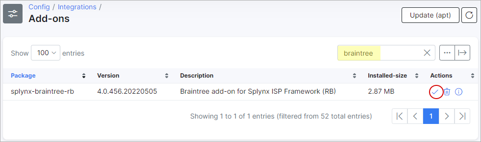
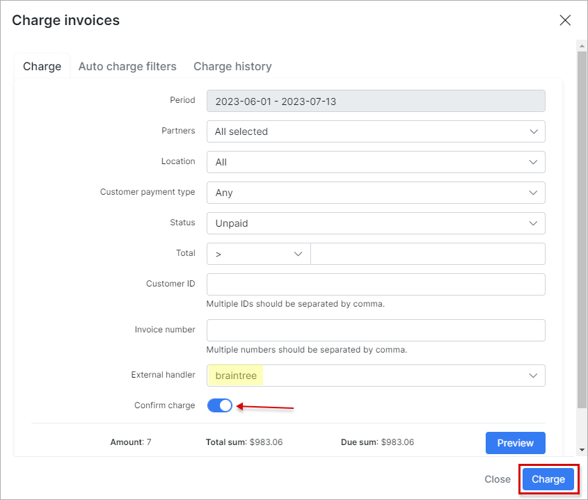

Braintree payments
==================

Braintree is a Splynx add-on which allows recharging of customer credit cards via the *Braintree payment gateway* - [https://www.braintreepayments.com](https://www.braintreepayments.com).

The Add-on can work with different credit cards, if cards are saved on customer profiles, the addon allows charging all customers using *Direct debit orders*.

The add-on can be installed in two methods, via the CLI or Web UI of your Splynx server.

To install the *splynx-braintree-rb* add-onv via CLI, the following commands can be used:

```bash
apt-get update
apt-get install splynx-braintree-rb
```
To install it via the Web UI:

Navigate to `Config → Integrations → Add-ons`:


Locate or search for the "splynx-braintree-rb" add-on and click on the install icon in the *Actions* column, a window will appear for you to confirm or the installation:



After installation process has completed, you have to configure the addon:

Navigate to `Config → Integrations → Modules list`:


Locate or search for the "splynx-braintree-rb" add-on and click on the edit icon in the *Actions* column


**Parameters**:

* Public key: user-specific public identifier;


* Private key: user-specific secure identifier that should not be shared – even with us!


* Merchant ID: a unique identifier for your gateway account, which is different than your merchant account ID.

Login to your Account in [https://www.braintreegateway.com](https://www.braintreegateway.com) and:

* Select the menu Account / My User;


* API Keys, Tokenization Keys, Encryption Keys;


* Click *“View Authorizations”*. and copy this into the provided fields of the module configuration in Splynx.


Thereafter, customers can pay their invoices and refill balances using the Braintree system. Customers will see a new button *"To pay"* as on the screenshot:


Customers can save their pay-card details for the next payments:


To refill balances, customers can use the link - *“http://yoursplynxurl/braintree-rb”*,  they also can choose to remember/save the pay-card:


Lastly, you can charge all customers using one button! Navigate to *Finance → Invoices*, set the period and click on the "Charge" button as below:



