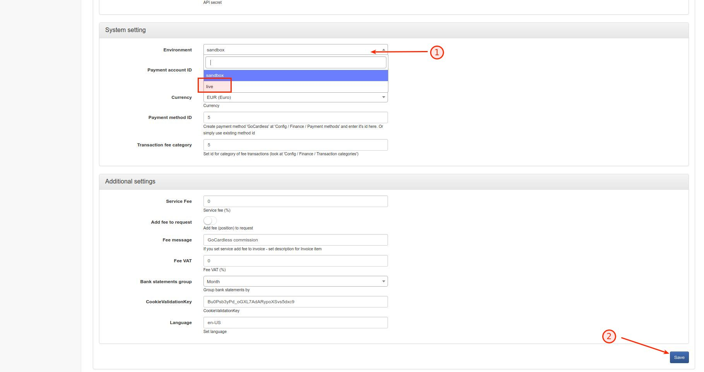
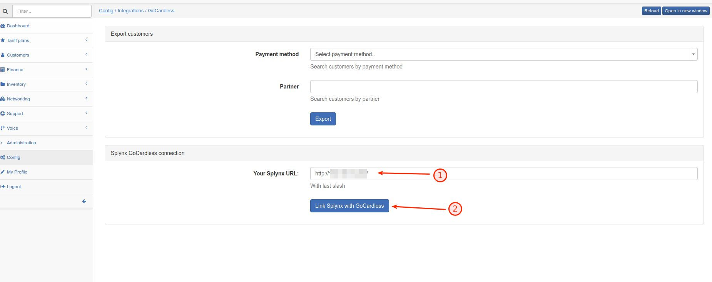
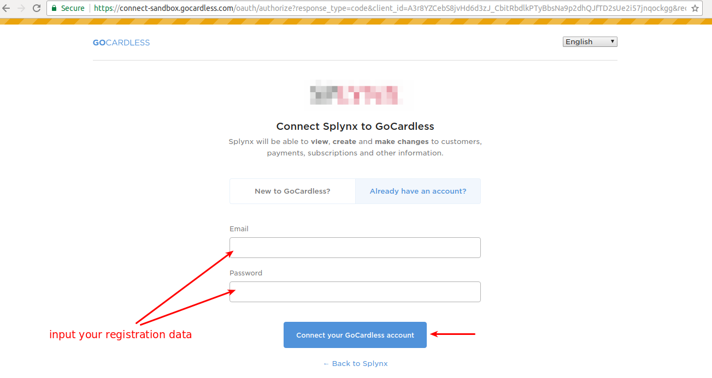
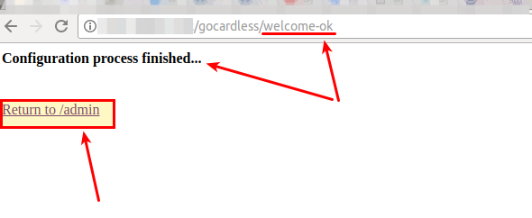
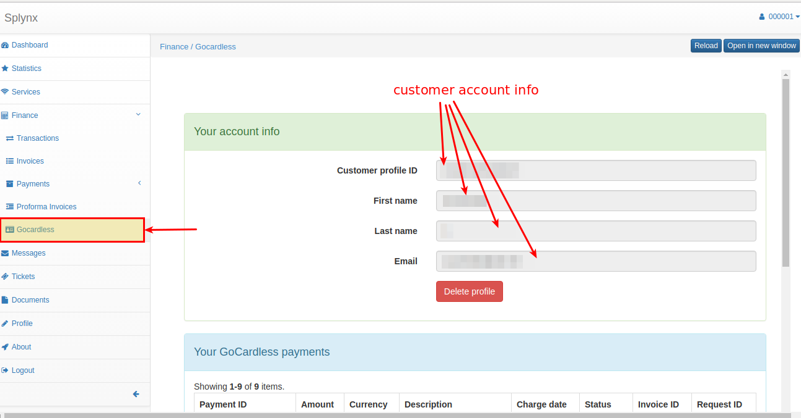
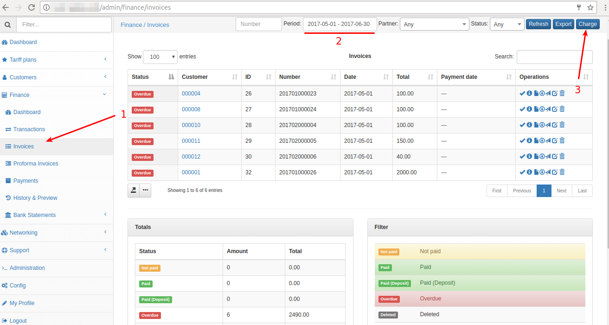
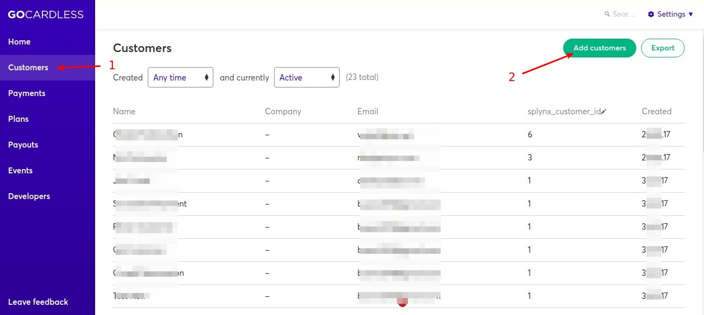
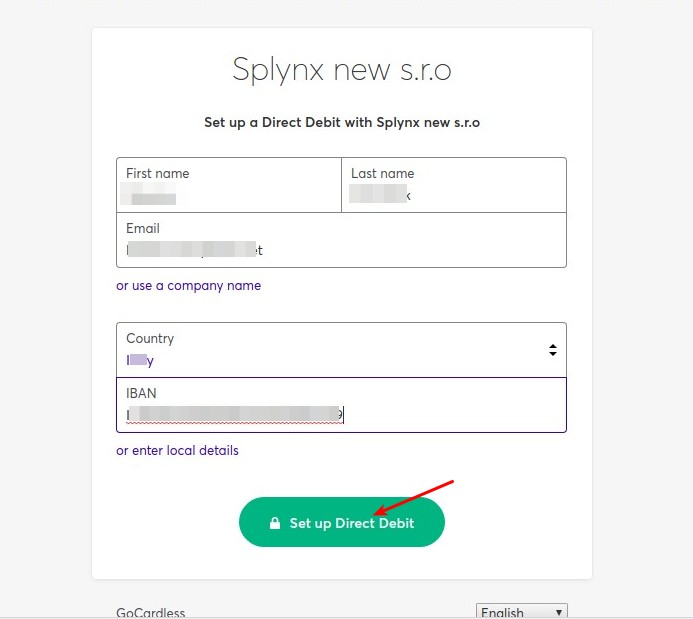

Gocardless.com
==============

Gocardless.com is a Splynx add-on. It uses to synchronize customers, invoices and payments with Gocardless.com payment software - [https://gocardless.com/](https://gocardless.com/). Customers using Gogardless.com can pay invoices through banks or you can charge your customers bank accounts by debit orders.

To install Gocardless.com add-on, use following commands:

```bash
apt-get update
apt-get install splynx-gocardless-rb
```

Then first step - you should to switch "sandbox" to "live" in the configuration:




Then go to the Config / Integrations and proceed configuration:




Please, check your Splynx URL and click button 'Link Splynx with GoCardless'. You will be redirect to registration page GoCardless:



And now, enter your registration data in registration form and click 'Connect' button. If everything is correct, you will be redirected to finish-page:



After that customers have to enter registration details in current fields in new Tab - "Gocardless" → Main menu "Finance" as on the screenshot:



That is all settings.

Now, customers will see a new icon in Invoices list:


and can click to receive a payment:


After some time ([https://gocardless.com/direct-debit/timings/](https://gocardless.com/direct-debit/timings/)) we can see the payment in portal and admin-side, as on screenshots:


Also, customer can refill balance using link - “http://yoursplynxurl/gocardless-rb”:


Besides, you can charge all customers, using one button! Go to _Finance → Invoices_, set the period and click "Charge" as at screenshot:




Next one option, you can sync all customer, just follow steps below:

open Config / Integrations / GoCardless :


then select Payment method, Partner and click export button:


You will receive customers list in csv-file. After that you should open dashboard on [https://gocardless.com/](https://gocardless.com/) and upload csv-file, as on next screenshots:




Now, all customers from list receive mails and will have to authorise:





