GoCardless
==========
Gocardless is a Splynx add-on used to synchronize customers, invoices and payments with Gocardless payment software - https://gocardless.com/.

Customers using Gogardless.com can pay for invoices through banks or you can charge your customers bank accounts by debit orders.

The add-on can be installed installed in two methods, via the CLI or Web UI of your Splynx server

To install the Gocardless add-on via CLI, the following commands can be used:

```
apt-get update
apt-get install splynx-gocardless-rb
```

To install it via the Web UI:

Navigate to `Config → Integrattions → Add-ons`:

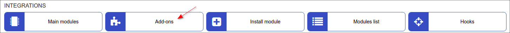

Locate or search for the "splynx-gocardless-rb" addon and click on the install icon in the *Actions* column, you will be presented with a window to confirm or cancel the installation

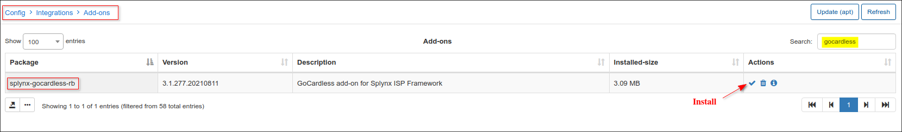


Once the installation process has completed, we can proceed to configuration the add-on under *Config / Integrations / GoCardless*:

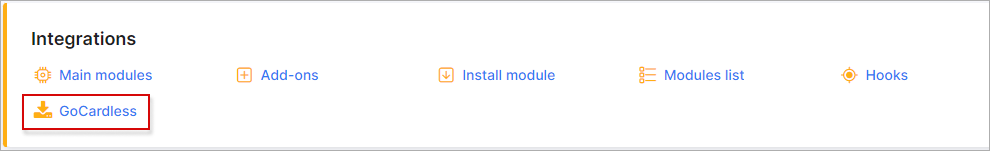

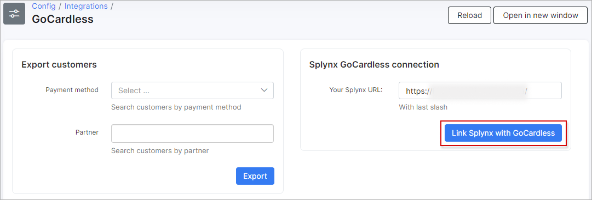

Please enter your Splynx URL in the field provided and click on the 'Link Splynx with GoCardless' button.  You will be redirected to the GoCardless registration page:

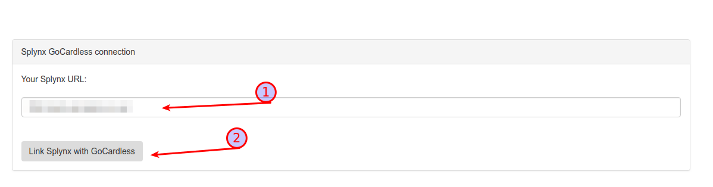

Enter your registration data in the registration form and click on the *'Connect'* button.

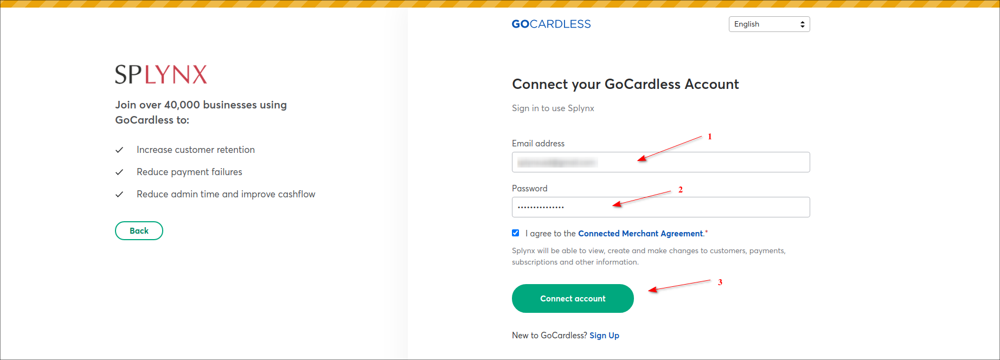

If everything is correct, you will be redirected to finish-page:

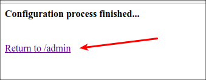

Thereafter, customers will have to enter their registration details in the provided fields of the new Tab:  *"Gocardless" → Main menu "Finance"*, as depicted below:


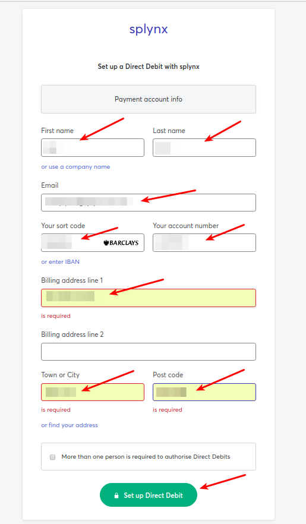

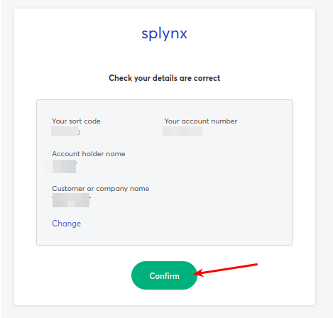


Once these settings have been configured, customers will see a new pay window on their customer portal *Dashboard*, and a new icon in the Invoices section:

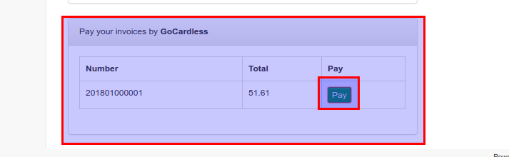

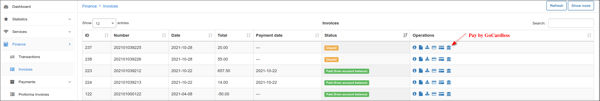

Customers can click  on the new icon to make a payment:

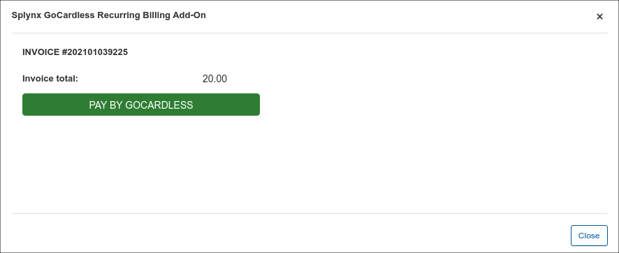

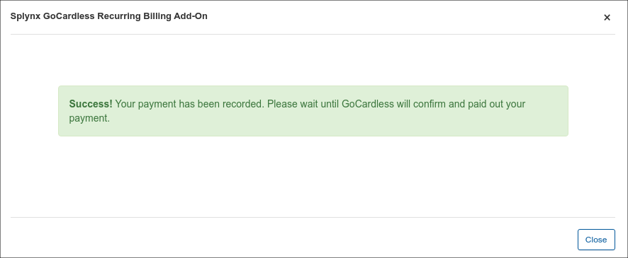

After a period of time, which can be view on the following page: https://gocardless.com/direct-debit/timings/, we can see the payment in the customer and admin-portal, as depicted below:

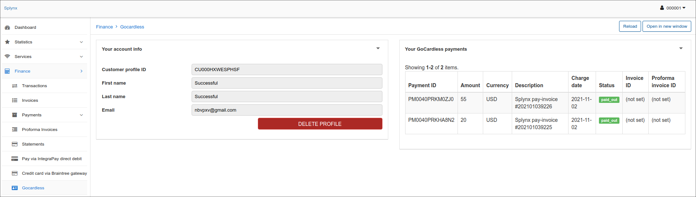

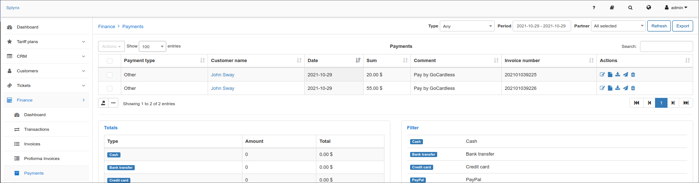

Customers can also refill their balances using the following link - “http://yoursplynxurl/gocardless-rb”:

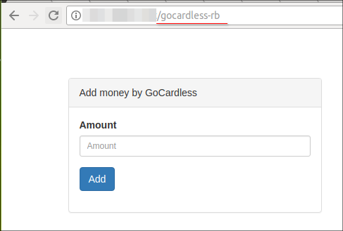

Additionally, you can **charge** all customers, using one button! Navigate to *Finance → Invoices,* set the period and click on the "Charge" button as depicted below:

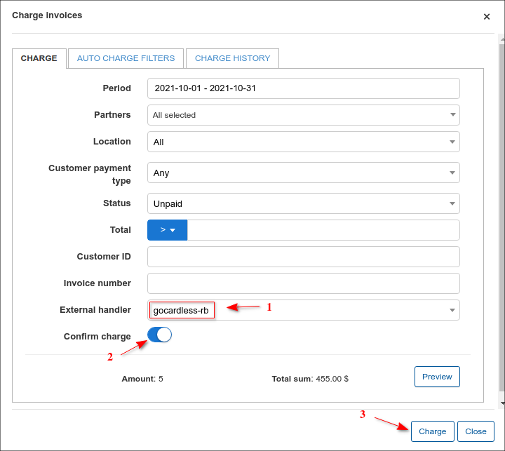

You can also sync all customers from Splynx to GoCardless, simply follow the steps below:

Navigate to *Config / Integrations / GoCardless* :

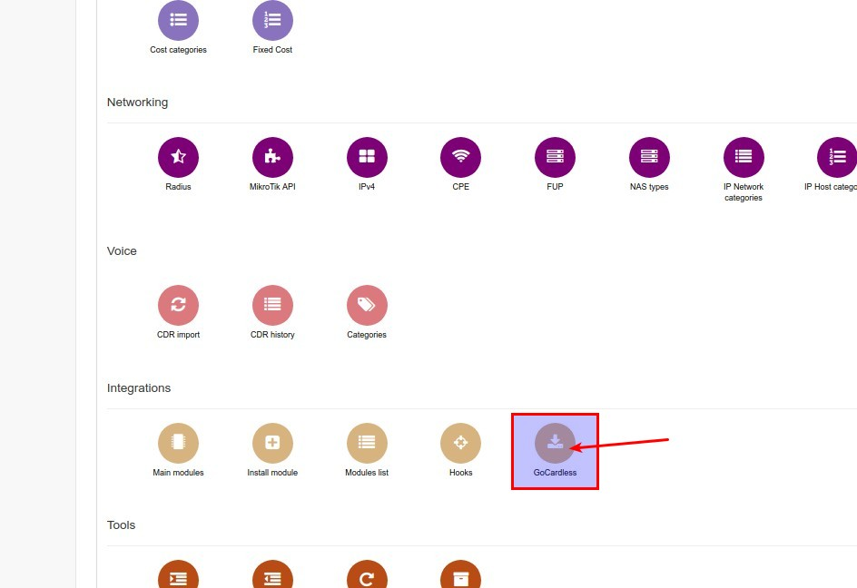

Select the Payment method and Partner, then click on the *export* button:

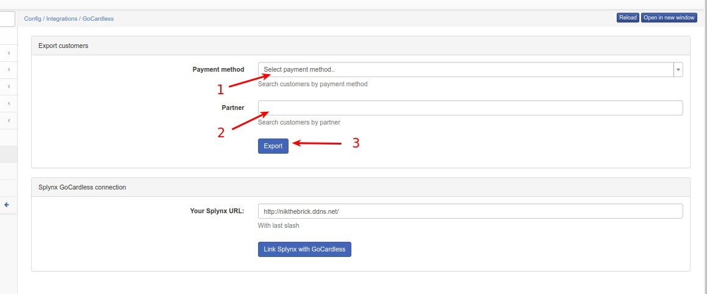

You will receive your customers list as a csv-file. Thereafter, you can open your GoCardless dashboard on https://gocardless.com/ and upload the csv-file, as depicted below:


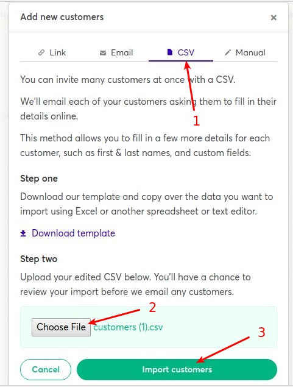

All customers on the list will receive emails to authorise the action:

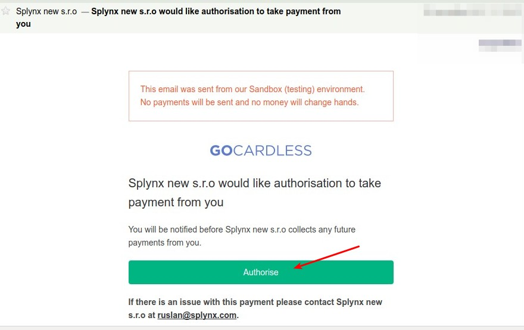

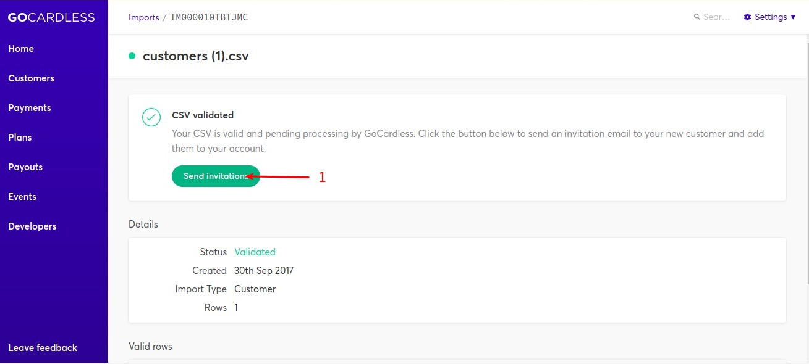


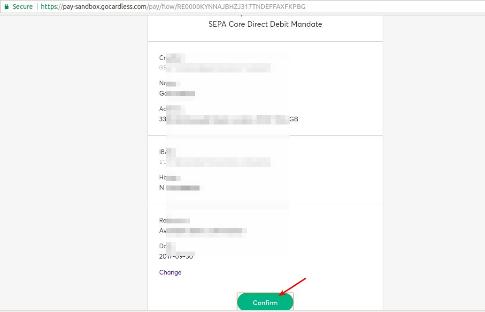

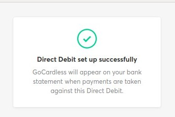
