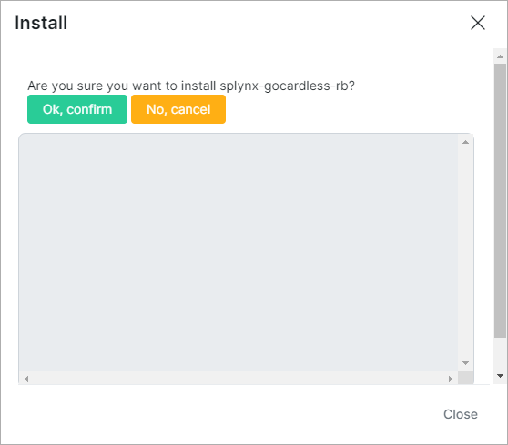
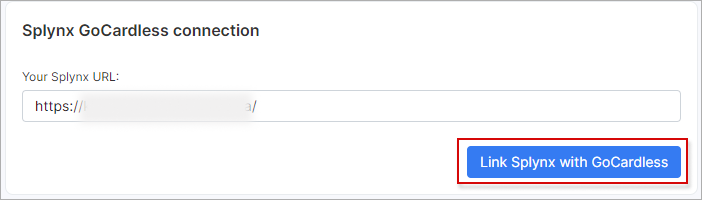
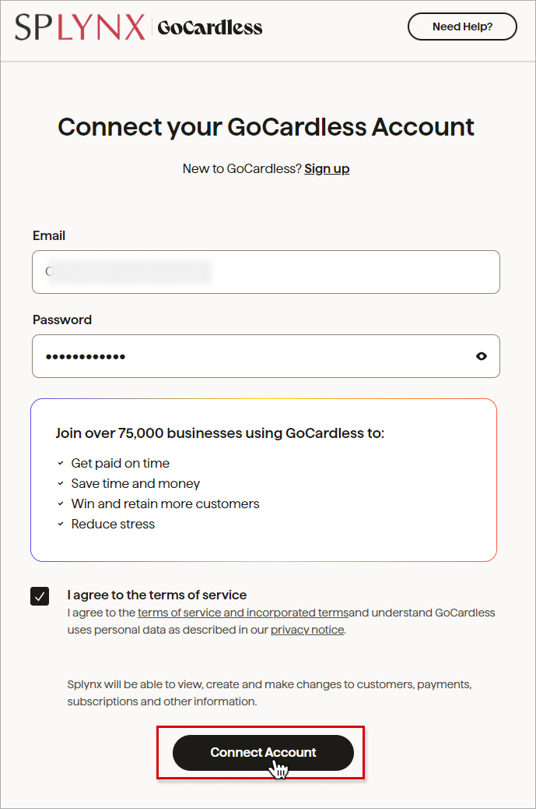
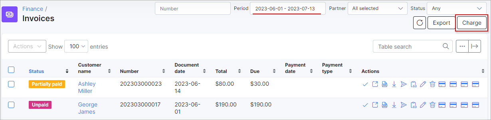
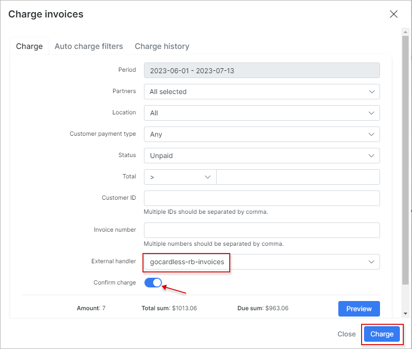

GoCardless
==========
Gocardless is a Splynx add-on which allows customers to pay for invoices via the payment gateway - https://gocardless.com/.

Customers using *Gogardless* platform  can pay for invoices through banks or you can charge your customers bank accounts by debit orders.

### Add-on installation

The add-on can be installed in two methods, via the CLI or Web UI of your Splynx server

To install the Gocardless add-on via CLI, the following commands can be used:

```
apt-get update
apt-get install splynx-gocardless-rb
```

To install it via the Web UI:

Navigate to `Config → Integrattions → Add-ons`:


Locate or search for the `splynx-gocardless-rb` add-on and click on the *Install* icon in the *Actions* column:


Click on the **OK, confirm** button to begin the installation process:



### Add-on settings

Once the installation process has completed, we can proceed to configuration the add-on in `Config → Integrations → GoCardless`:


Please enter your **Splynx URL** in the provided field and click on the **Link Splynx with GoCardless button**. You will be redirected to the *GoCardless* registration page:




Enter your registration data in the registration form and click on the **Connect account** button.



If everything is correct, you will be redirected to finish-page:


After that, the customer should enter the registration details in the provided fields, navigate to `Finance → Gocardless` and click on `Confirm and allow future charge` link.


Other *Gocardless* add-on settings are located in `Config → Integrations → Modules list`,


locate or search for the `splynx_go_cardless_rb_addon` add-on module and click on the
<icon class="image-icon"></icon> (*Edit*) icon in the *Actions* column to change the necessary settings:


**Main information & API settings**


**System settings**


**Additional settings**


- **Service Fee** - service fee in percent;

- **Add fee to request** - enable/disable adding fee to requests;

- **Fee message** - if the **Add fee to request** toggle is enabled, the current message will be added as description for fee item in invoice;

- **Fee VAT** - service fee [VAT](configuration/finance/taxes/taxes.md) in percent. Will be included into the service fee;

- **Create payments once they Confirmed** - create payment only when it has been confirmed by the customer’s bank as having been successfully collected from their account. Once the payment has been confirmed, GoCardless will arrange for it to be paid out to your registered account.;

- **Bank statements group** - choose how to group bank statements (`Finance → Bank Statements → History`) monthly or daily;

- **Pay invoice payment description pattern** - description of the payment when paying the invoice. By default is used: `Splynx pay-invoice #{number}`;

- **Pay proforma payment description pattern** - description of the payment when paying the proforma invoice. By default is used: `Splynx pay-proforma #{number}`;

- **Payment description** - text that is added to the payment description field;

- **Description of payment for customer** - text that will be displayed for customer while Direct Debit mandate creating;

- **Language** - select the language;

- **Intelligently retry payments** - toggle allows to enable/disable the automatic retry any payments that fail. Payments can fail for a number of reasons, the most common one being that the customer did not have the funds available. Once you’ve switched it on, your failed payments will be automatically retried according to the schedule you’ve configured in your GoCardless dashboard. By default the toggle is enabled.

<icon class="image-icon"></icon> **NOTE:**

To get Intelligent Retries running for payments that are created, you need to **make sure intelligent retries are enabled in your GoCardless control panel**:

1. Click on **Success+** in the left hand menu bar and select **Set up a retry schedule**;

  


2. Next you will have the option to choose which currencies to turn automatic retries on for. The Intelligent Retries feature is currently available for *Bacs (GBP), SEPA (EUR), Autogiro (SEK), Becs (AUD), Becs NZ (NZD), PAD (CAD)*, and *ACH (USD)* payments. Click the toggle next to the currency you wish to enable;

  


3. Once you have toggled it on, you will be able to select the settings for how many times you'd like to retry payments and for how long. The default configuration is: 3 retries within a 4 week period, it provides up to 76% successful recovery.

  You can also choose to enable a failure filter which will prevent retries if the likelihood of the payment failing is very high (90% or higher). You can find more information about this feature [here](https://support.gocardless.com/hc/en-gb/articles/360014132059). Then, click **Next** and **Confirm** the changes.

  


4. If you would like to change your retry settings in the future, just head to the **Success+** tab and click on **Manage retry settings**.

  


### Invoice payment

Once the configuration has been completed, customers can pay their invoices on the [Portal](customer_portal/customer_portal.md) using the *Gocardless* system in `Finance → Invoices`:


or directly from *Portal Dashboard* via *Gocardless* widget (entry point):


The configuration of add-on **Entry points** can be found in `Config → Integrations → Modules list`, near the `splynx_go_cardless_rb_addon` module item in *Actions* column, click on the <icon class="image-icon"></icon> (*Edit entry points*) icon. More information about *Modules list* can be found [here](configuration/integrations/modules_list/modules_list.md).


If everything goes well, you will see the status of the invoice marked as `Paid` (on the customer and admin portal).

After a period of time, which can be view on the following page: https://gocardless.com/direct-debit/timings/, we can see the payment in the customer and admin-portal, as depicted below:


Customers can also refill their balances using the following link - ```https://<splynx_domain_address>/gocardless-rb```:


Additionally, you can charge all customers using one button, navigate to `Finance → Invoices`, set the period and click on **Charge** button as depicted below:





### Export customers

To **sync all customers from Splynx to GoCardless**, follow the steps below:

Navigate to `Config → Integrations → GoCardless` :


Select the [Payment method](configuration/finance/payment_methods/payment_methods.md) and [Partner](administration/main/partners/partners.md), then click on the **Export** button:


You will receive your customers list as a csv-file. Then, you can open your *GoCardless* dashboard on https://gocardless.com/ and upload the csv-file, as depicted below:


All customers from the list will receive emails to authorize the action:


### Direct payments

Using the payments links is the simplest way to accept payments from customers. This feature is available in the *Gocardless* add-on to pay *Invoices* and *Proforma Invoices*. This provides convenience and simplicity for your customers, so the amount of on-time payments will increase. For example, you can add a payment link to the e-mail with the (proforma) invoice, as a result, the customer can make payment quickly by clicking onto such link instead of logging in to their *Portal* page. In case the customer has saved the payment credentials on the *Portal*, they do not need to add further details when using the direct payment link in the future. If the credit card in not linked on the *Portal*, the payment details need to be entered each time the payment link is used.

To create a direct payment link, please use the patterns below:

**To pay the Invoice:**

<details style="font-size: 15px; margin-bottom: 5px;">
<summary><b>by invoice ID</b></summary>
<div markdown="1">

```
https://<splynx_domain_address>/gocardless/direct-pay-invoice-by-id?item_id=<Invoice_id>

```
</div>
</details>

<details style="font-size: 15px; margin-bottom: 5px;">
<summary><b>by invoice number</b></summary>
<div markdown="1">

```
https://<splynx_domain_address>/gocardless/direct-pay-invoice?item_id=<Invoice_number>

```
</div>
</details>

<br>

**To pay the Proforma Invoice:**

<details style="font-size: 15px; margin-bottom: 5px;">
<summary><b>by proforma invoice ID</b></summary>
<div markdown="1">

```
https://<splynx_domain_address>/gocardless/direct-pay-proforma-by-id?item_id=<proforma_id>

```
</div>
</details>

<details style="font-size: 15px; margin-bottom: 5px;">
<summary><b>by proforma invoice number</b></summary>
<div markdown="1">

```
https://<splynx_domain_address>/gocardless/direct-pay-proforma?item_id=<proforma_number>

```
</div>
</details>
